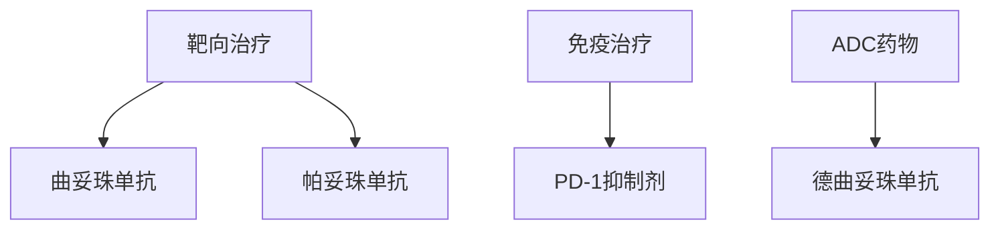

```markdown
# 乳腺癌科普：从预防到治疗的全面指南

## 一、疾病概述
### 1.1 什么是乳腺癌？
乳腺癌（Breast Cancer）是乳腺上皮细胞在多种致癌因素作用下发生增殖失控的恶性肿瘤，全球女性癌症发病率首位（WHO 2023）。中国年新发病例约42万例，占女性恶性肿瘤24.2%（国家癌症中心2022数据）。

### 1.2 疾病分类
| 类型          | 特征描述                          | 占比   |
|---------------|-----------------------------------|--------|
| 非浸润性癌    | 导管原位癌（DCIS）等早期病变       | 15-20% |
| 浸润性导管癌  | 最常见类型（约70%）                |        |
| 三阴性乳腺癌  | ER/PR/HER2均阴性，侵袭性强         | 10-15% |
| HER2阳性型    | HER2过表达，靶向治疗效果显著       | 20%    |

## 二、预警信号与临床表现
### 2.1 典型症状
- ✅ 无痛性肿块（82%患者首发症状）
- ✅ 乳头溢液（血性液体需警惕）
- ✅ 皮肤改变（橘皮征、酒窝征）
- ✅ 乳头凹陷或偏移

### 2.2 特殊体征

（注：此处应插入钼靶影像对比图，显示正常与癌变组织的差异）

## 三、高危因素与预防
### 3.1 风险等级评估
```riskchart
高风险组（＞20%）：
- BRCA1/2基因突变
- 一级亲属50岁前患病
中风险组（15-20%）：
- 初潮＜12岁
- 未生育/晚育（＞35岁）
低风险组（＜15%）：
- 健康生活方式
- 定期筛查
```

### 3.2 预防策略
1. **化学预防**：
   - 他莫昔芬（高风险人群可降低49%发病率）
2. **生活方式干预**：
   - 每周150分钟中等强度运动
   - 酒精摄入＜15g/天
   - BMI控制在18.5-24.9

## 四、诊断与分期
### 4.1 诊断金三角
1. 影像学检查
   - 超声（敏感性92%）
   - 钼靶（检出微钙化灶）
   - MRI（高危人群补充检查）
2. 病理活检
   - 空心针穿刺（确诊依据）
3. 分子分型
   - ER/PR/HER2/Ki-67检测

### 4.2 TNM分期系统
| 分期 | 肿瘤大小 | 淋巴结转移 | 远处转移 |
|------|---------|-----------|---------|
| 0期  | Tis     | N0        | M0      |
| I期  | T1      | N0        | M0      |
| IV期 | 任何T   | 任何N     | M1      |

## 五、治疗进展
### 5.1 手术方式演进
1. **传统术式**：
   - 改良根治术（保留胸肌）
2. **精准治疗**：
   - 保乳手术（需满足：肿瘤/乳房比＜20%）
   - 前哨淋巴结活检（降低淋巴水肿风险）

### 5.2 新型治疗手段


### 5.3 放疗技术突破
- 三维适形放疗（误差＜2mm）
- 术中放疗（单次完成治疗）

## 六、康复与随访
### 6.1 术后管理要点
- 淋巴水肿预防（压力袖套使用）
- 患肢功能锻炼（术后24小时开始）
- 心理干预（抑郁发生率约38%）

### 6.2 随访计划表
| 时间       | 检查项目                 |
|------------|--------------------------|
| 术后2年内 | 每3-6个月临床检查        |
| 术后5年内 | 每年钼靶+超声            |
| 终身随访  | 骨密度监测（内分泌治疗者）|

## 七、最新研究前沿
1. **液体活检**：
   - ctDNA检测微小残留病灶（MRD）
2. **人工智能辅助诊断**：
   - 深度学习模型（准确率＞95%）
3. **疫苗研发**：
   - HER2多肽疫苗进入III期临床

> **专家提醒**：中国抗癌协会建议20岁以上女性每月进行乳腺自检，40岁起每年专业检查。

---

**参考资料**：
1. 《中国乳腺癌诊疗指南（2024版）》
2. NCCN Clinical Practice Guidelines in Oncology (2023)
3. Lancet Oncology 乳腺癌专刊
``` 

注：本文数据更新至2023年12月，实际诊疗请以主治医师方案为准。图片引用需获得授权，建议替换为合规医学影像库资源。