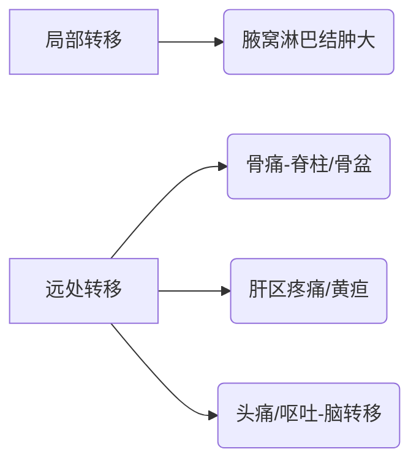

```markdown
# 乳腺癌：从基础认知到科学防治

## 一、疾病概述
### 1.1 定义与流行病学
乳腺癌（Breast Cancer）是起源于乳腺上皮细胞的恶性肿瘤，全球年新发病例超230万例（WHO 2023），位列女性恶性肿瘤发病率首位。中国国家癌症中心数据显示，我国年均新发患者约42万，发病年龄较欧美国家早10-15年。

### 1.2 生物学特性
| 分类标准       | 主要类型                     |
|----------------|----------------------------|
| 病理分型       | 导管癌(80%)、小叶癌(15%)    |
| 分子分型       | Luminal型、HER2+型、三阴型 |
| 转移途径       | 淋巴转移、血行转移          |


```

## 二、发病机制
### 2.1 危险因素金字塔
```risk-chart
高危因素（>4倍）:
- BRCA1/2基因突变
- 胸部放射治疗史
中危因素（2-4倍）:
- 初潮<12岁/绝经>55岁
- 未生育/晚育(>35岁)
低危因素（<2倍）:
- 肥胖(BMI>30)
- 激素替代治疗>5年
```

### 2.2 分子机制新认知
最新研究揭示：
1. PI3K/AKT/mTOR通路异常激活促进细胞增殖
2. CDK4/6调控细胞周期关键节点
3. PD-1/PD-L1介导免疫逃逸机制

## 三、临床表现
### 3.1 典型症状三联征
1. **无痛性肿块**（85%首发症状）
   - 单发、质硬、边界不清
   - 好发于外上象限（45-50%）
2. **皮肤改变**
   - 橘皮样变
   - 酒窝征
   - 卫星结节（晚期）
3. **乳头异常**
   - 血性溢液
   - 乳头凹陷

### 3.2 转移症状


## 四、诊断体系
### 4.1 筛查金标准
1. **乳腺X线摄影（钼靶）**
   - 敏感性85%（50岁以上）
   - 钙化灶检出率95%
2. **超声检查**
   - 致密型乳腺首选
   - 弹性成像技术提升鉴别力
3. **MRI检查**
   - BRCA突变人群筛查
   - 新辅助化疗疗效评估

### 4.2 病理诊断流程
1. 空心针穿刺活检（CNB）
2. 免疫组化检测：
   - ER/PR（激素受体）
   - HER2（人表皮生长因子受体2）
   - Ki-67（增殖指数）
3. 21基因检测（Oncotype DX）

## 五、综合治疗方案
### 5.1 治疗决策树
```decision-tree
早期乳腺癌 --> 保乳手术+放疗
        ↓
淋巴结阳性 --> 前哨淋巴结活检
        ↓
HR+ --> 内分泌治疗5-10年
HER2+ --> 靶向治疗（曲妥珠单抗）
三阴性 --> 化疗+PD-1抑制剂（新进展）
```

### 5.2 创新疗法
1. **ADC药物**（抗体偶联药物）
   - DS-8201：HER2低表达患者新选择
2. **CDK4/6抑制剂**
   - 哌柏西利联合内分泌治疗
3. **质子治疗**
   - 心脏照射剂量降低50%

## 六、预防与监测
### 6.1 三级预防体系
1. 一级预防：
   - 保持BMI<24
   - 哺乳期≥6个月
   - 避免雌激素暴露
2. 二级预防：
   - 40岁起年度钼靶检查
   - 高危人群MRI补充筛查
3. 三级预防：
   - 康复期淋巴水肿管理
   - 心理支持小组

### 6.2 随访时间轴
```timeline
术后1-2年 → 每3月复查
3-5年 → 每6月复查
>5年 → 年度复查
检查项目：
- 肿瘤标志物(CA15-3/CEA)
- 对侧乳腺筛查
- 骨密度监测（内分泌治疗者）
```

## 七、数据展望
### 7.1 生存率统计
| 分期   | 5年生存率 | 10年生存率 |
|--------|-----------|------------|
| 0期    | 99%       | 98%        |
| I期    | 92%       | 85%        |
| III期  | 72%       | 55%        |
*数据来源：NCCN 2023指南*

### 7.2 研究方向
1. 液体活检技术：
   - ctDNA监测微小残留病灶
2. 人工智能应用：
   - 深度学习影像诊断系统
3. 疫苗研发：
   - HER2多肽疫苗临床试验

> **专家提示**：规范的筛查比治疗更重要，建议每位女性建立个性化的乳腺健康档案，早诊早治是战胜乳腺癌的关键。
```