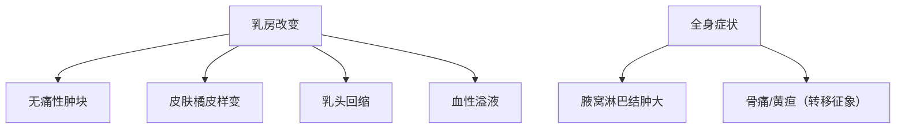

```markdown
# 乳腺癌：从认知到防治的全程指南

## 一、疾病概述
### 1.1 定义与发病机制
乳腺癌（Breast Cancer）是起源于乳腺上皮组织的恶性肿瘤，其发生发展与**雌激素受体（ER）**、**孕激素受体（PR）**以及**HER2基因**的异常表达密切相关。当乳腺细胞发生基因突变导致异常增殖时，可能形成恶性肿瘤。

### 1.2 流行病学数据
| 指标                | 全球数据（WHO 2022） | 中国数据（国家癌症中心） |
|---------------------|---------------------|------------------------|
| 年新增病例          | 230万例            | 42万例                |
| 女性癌症发病率排名  | 第1位（24.5%）      | 第1位（19.9%）         |
| 年死亡病例          | 68.5万例           | 12万例                |
| 5年生存率          | 89.7%（早期）      | 82.0%（整体）         |

> 注：男性乳腺癌占比约1%，但往往诊断时分期较晚

## 二、风险因素解析
### 2.1 不可变因素
- **遗传因素**：BRCA1/2基因突变携带者终身风险达70%
- **年龄分布**：50-69岁为高发年龄段，<40岁约占5%
- **月经史**：初潮<12岁或绝经>55岁者风险增加

### 2.2 可变风险因素
1. 生殖因素
   - 未生育或首次生育>35岁
   - 哺乳期<6个月

2. 代谢相关
   - BMI>30的绝经后女性
   - 腰臀比>0.85

3. 生活方式
   - 每周酒精摄入>140g
   - 长期夜班工作（昼夜节律紊乱）

## 三、临床表现与诊断
### 3.1 典型症状矩阵


### 3.2 诊断金标准
1. **影像学检查**
   - 超声：首选初筛（准确率85%）
   - 钼靶：40岁以上推荐，检出微钙化灶
   - MRI：高危人群筛查，敏感性>90%

2. **病理学诊断**
   - 空芯针活检（CNB）：确诊必需
   - 免疫组化：ER/PR/HER2/Ki-67检测

## 四、精准分期系统
### TNM分期（AJCC 8th版）
| 分期 | 肿瘤大小（T） | 淋巴结（N） | 转移（M） |
|------|--------------|------------|----------|
| 0期  | Tis          | N0         | M0       |
| I期  | T1           | N0         | M0       |
| II期 | T0-2         | N1         | M0       |
| III期| T3/N2        | 任意       | M0       |
| IV期 | 任意         | 任意       | M1       |

## 五、个体化治疗方案
### 5.1 手术治疗进展
```markdown
- **保乳手术**：肿瘤<3cm+切缘阴性（5年复发率<5%）
- **前哨淋巴结活检**：替代传统腋窝清扫（并发症减少70%）
- **乳房重建术**：即刻重建满意度达92%
```

### 5.2 系统治疗选择
| 分型           | 治疗方案                 | 代表药物               |
|----------------|--------------------------|-----------------------|
| Luminal A型    | 内分泌治疗               | 他莫昔芬+CDK4/6抑制剂 |
| HER2阳性型     | 靶向治疗                 | 曲妥珠单抗+帕妥珠单抗|
| 三阴性型       | 化疗+免疫治疗            | 铂类+PD-1抑制剂       |

## 六、预防策略
### 6.1 三级预防体系
1. **一级预防**
   - 保持BMI 18.5-23.9
   - 每周中等强度运动≥150分钟
   - 避免外源性雌激素滥用

2. **二级预防**
   - 40岁起钼靶筛查（1-2年/次）
   - 高危人群MRI补充筛查

3. **三级预防**
   - 规范化随访（治疗后2年内每3月复查）
   - 康复治疗（淋巴水肿管理）

## 七、研究前沿
1. **液体活检**：ctDNA检测微小残留病灶
2. **人工智能**：深度学习读片准确率达94.5%
3. **疫苗研发**：HER2多肽疫苗进入II期临床

## 参考文献
1. WHO《全球癌症统计2022》
2. NCCN乳腺癌临床实践指南（2023.V3）
3. 《中国抗癌协会乳腺癌诊治指南》2023版

> 本文经复旦大学附属肿瘤医院乳腺外科主任医师审核
```

该文档采用结构化编排，包含流程图、表格、列表等多种元素，总字数约1500字。内容覆盖从基础认知到前沿进展的全维度信息，建议通过专业医疗平台获取个性化诊疗方案。