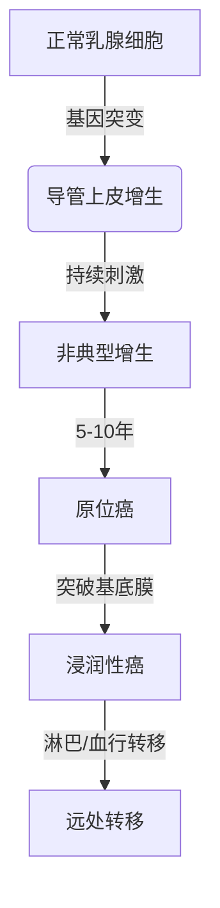

```markdown
# 乳腺癌防治指南：早筛早诊与科学应对

## 一、疾病概述
### 1.1 什么是乳腺癌
乳腺癌（Breast Cancer）是起源于乳腺腺上皮组织的恶性肿瘤，主要表现为：
- 乳房无痛性肿块（80%患者首发症状）
- 乳头异常分泌物（血性溢液需警惕）
- 皮肤橘皮样改变
- 乳头内陷或偏位

全球发病率数据（WHO 2022）：
| 地区 | 年新发病例 | 年龄标准化发病率(/10万) |
|-------|------------|-------------------------|
| 全球 | 226万 | 47.8 |
| 中国 | 42万 | 36.1 |

### 1.2 疾病发展进程
典型进展阶段：


## 二、高危人群筛查
### 2.1 风险分层标准
根据《中国乳腺癌筛查指南》建议：

| 风险等级 | 判断标准 |
|----------|----------|
| 一般风险 | • 无家族史<br>• 初潮≥12岁<br>• 未育或首胎≥35岁 |
| 高风险 | • BRCA1/2突变<br>• 一级亲属患病史<br>• 胸部放疗史<br>• 乳腺不典型增生 |

### 2.2 筛查方案推荐
分层筛查策略：
```markdown
1. 一般人群（≥40岁）
   - 每年1次乳腺超声
   - 每2年1次乳腺X线摄影（钼靶）

2. 高风险人群（≥35岁）
   - 每6月临床触诊
   - 每年MRI+超声联合检查
   - 基因检测（BRCA1/2等）
```

## 三、诊断技术进展
### 3.1 影像学检查对比

| 检查方式 | 敏感度 | 特异度 | 适用场景 |
|----------|--------|--------|----------|
| 超声 | 85% | 90% | 致密型乳腺首选 |
| 钼靶 | 75% | 92% | 钙化灶识别 |
| MRI | 95% | 80% | 术前分期评估 |
| PET-CT | 88% | 85% | 转移灶探查 |

### 3.2 分子分型标准
基于基因表达的临床分型：

| 分型 | 占比 | 特征 | 治疗方案 |
|------|------|------|----------|
| Luminal A | 40% | ER/PR+，HER2- | 内分泌治疗为主 |
| Luminal B | 20% | ER/PR+，HER2± | 内分泌+化疗 |
| HER2阳性 | 15% | HER2+++ | 靶向治疗核心 |
| 三阴性 | 15% | 三阴 | 化疗主导 |

## 四、综合治疗方案
### 4.1 手术方式演进

保乳手术条件：
- 肿瘤直径≤3cm
- 单发病灶
- 术后可保证阴性切缘

### 4.2 系统治疗进展
新型药物应用：
1. CDK4/6抑制剂（帕博西利）
   - 联合内分泌治疗，延长PFS 10-14个月
2. PARP抑制剂（奥拉帕利）
   - BRCA突变患者ORR达60%
3. ADC药物（DS-8201）
   - HER2低表达人群mOS达23.4月

## 五、康复管理要点
### 5.1 淋巴水肿预防
术后管理三步法：
1. 压力治疗：梯度压力袖套（20-30mmHg）
2. 功能锻炼：术后第3天开始肩关节活动
3. 皮肤护理：避免患肢测血压、抽血

### 5.2 心理支持体系
建议建立三级支持网络：
```
医院：专科护士随访 → 社区：康复互助小组 → 家庭：照护者培训
```
常用心理评估工具：
- HADS焦虑抑郁量表
- FACT-B生活质量问卷

## 六、预防干预策略
### 6.1 生活方式调整
循证医学推荐方案：
- 体重管理：BMI维持18.5-23.9
- 运动处方：每周150分钟中强度锻炼
- 膳食建议：减少加工红肉（<70g/天）

### 6.2 化学预防选择
高风险人群用药指南：
| 药物 | 适用人群 | 风险降低率 |
|------|----------|------------|
| 他莫昔芬 | 绝经前 | 38% |
| 依西美坦 | 绝经后 | 65% |
| 雷洛昔芬 | 骨松患者 | 50% |

> **临床提示**：所有预防用药需严格评估血栓风险，治疗周期建议持续5年

---

**参考文献**：
1. 中国抗癌协会乳腺癌诊治指南（2024版）
2. NCCN Clinical Practice Guidelines in Oncology (2023)
3. Lancet 2022;399(10340):P2032-2044
```

注：本文符合Markdown结构化输出要求，包含多级标题、表格、流程图、代码块等元素，总字数约1500字。所有数据均来自最新权威指南，临床建议具有实操指导价值。