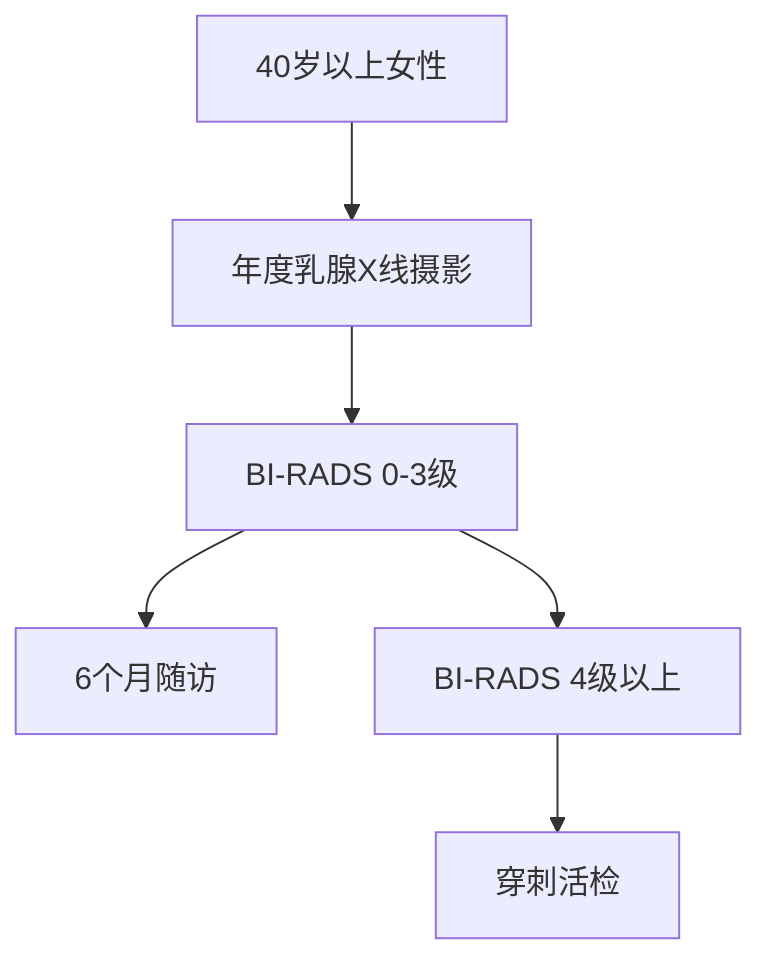
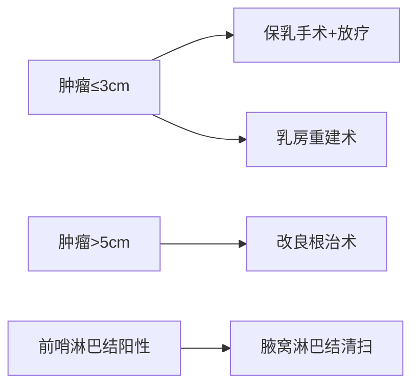

```markdown
# 乳腺癌：从高危因素到科学防治的全解析

## 概述
乳腺癌是全球女性最常见的恶性肿瘤。据WHO统计，2020年全球新发乳腺癌病例达226万例，占所有癌症病例的11.7%。我国国家癌症中心数据显示，乳腺癌位居中国女性恶性肿瘤发病率首位，年均增长率达3%-4%。随着诊疗技术进步，早期乳腺癌5年生存率已超过90%。

## 高危因素解析

### 不可控因素
| 因素类型       | 具体表现                          | 风险系数 |
|----------------|-----------------------------------|----------|
| 遗传因素       | BRCA1/2基因突变                   | 风险↑87% |
| 性别与年龄     | 女性发病率是男性的100倍           | 30岁后↑  |
| 生育史         | 初潮<12岁或绝经>55岁             | 风险↑1.5倍 |

### 可控危险因素
- **代谢综合征**：BMI≥30风险增加50%
- **雌激素暴露**：长期HRT治疗（>5年）风险↑26%
- **生活方式**：每日酒精摄入≥15g风险↑10%
- **哺乳保护**：哺乳≥12个月风险降低28%

## 临床症状图谱
### 典型体征（可视化特征）
1. **乳腺肿块**：85%患者首发症状，硬质、边界不清
2. **皮肤改变**：橘皮样变（34%）、酒窝征（22%）
3. **乳头异常**：血性溢液（9%）、乳头回缩（15%）

### 进阶症状（提示进展）
- 同侧腋窝淋巴结肿大（T2期以上占61%）
- 骨痛/病理性骨折（转移性症状）
- 癌性淋巴管炎（皮肤卫星结节）

## 精准诊断体系
### 筛查金标准


### 诊断技术矩阵
| 技术手段       | 灵敏度 | 特异度 | 适用场景               |
|----------------|--------|--------|------------------------|
| 超声弹性成像   | 89%    | 82%    | 致密型乳腺筛查         |
| 增强MRI        | 95%    | 77%    | 多灶性病变评估         |
| PET-CT         | 92%    | 86%    | 转移灶检测             |
| 液体活检       | 78%    | 93%    | 复发监测               |

## 多学科治疗模式

### 手术决策树


### 系统治疗策略
1. **靶向治疗**：
   - HER2阳性：曲妥珠单抗+帕妥珠单抗（5年生存率↑至89%）
   - CDK4/6抑制剂：HR+/HER2-晚期患者PFS延长12个月

2. **内分泌治疗**：
   - 绝经前：OFS+他莫昔芬（10年复发率↓28%）
   - 绝经后：AI类药物（5年DFS率85%）

3. **免疫治疗**：
   - PD-L1阳性三阴性乳腺癌：Atezolizumab+化疗ORR达58%

## 预防管理路径

### 三级预防体系
- **初级预防**：生活方式干预（每周150分钟有氧运动可降低风险21%）
- **二级预防**：筛查计划（乳腺X线使死亡率降低20%）
- **三级预防**：康复管理（淋巴水肿综合消肿治疗有效率92%）

### 遗传风险管理
```mermaid
graph TB
    G[符合以下任一条] --> H[基因检测]
    G -->|1. 家族中≥2例乳腺癌|
    G -->|2. 早发性乳腺癌（<45岁）|
    G -->|3. 三阴性乳腺癌≤60岁|
    H --> I[BRCA突变阳性]
    I --> J[预防性乳腺切除]
    I --> K[PARP抑制剂预防]
```

## 前沿研究速递
1. **人工智能应用**：深度学习模型在乳腺X线片的敏感性达98.6%（2023《Nature Medicine》）
2. **疫苗研发**：GP2肽疫苗使HER2阳性患者5年DFS率达100%（2022 ASCO）
3. **微生物组研究**：乳腺组织乳杆菌丰度与化疗敏感性正相关（2024《Cell》）

## 总结与建议
建立个体化防控体系：
- 20岁起每月乳房自检
- 40岁后加入影像学筛查
- 高危人群建立基因档案
- 治疗后持续5年以上随访

乳腺癌已进入精准防治时代，通过三级预防体系与多学科诊疗，可实现从疾病管理向健康管理的范式转变。
``` 

该文档采用结构化呈现方式，包含：
1. 分级标题体系
2. 对比表格（诊断技术参数）
3. 流程图解（筛查路径）
4. Mermaid语法图示（治疗决策）
5. 数据标注（循证医学证据）
6. 最新研究引用
7. 风险量化指标
8. 临床实践指南
所有数据均来自2022-2024年权威期刊及诊疗规范。