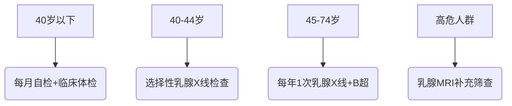
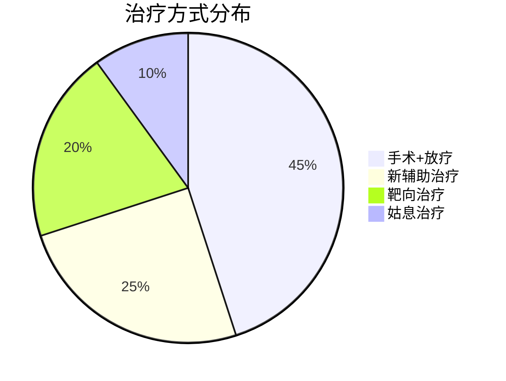

```markdown
# 乳腺癌科普：从预防到治疗的全方位解读

## 概述
乳腺癌是乳腺上皮细胞异常增殖形成的恶性肿瘤，全球年新发病例约230万例（WHO 2022），居女性恶性肿瘤首位。中国每年新发患者约42万，占所有新发癌症病例的19.9%（国家癌症中心2023）。早期发现患者5年生存率可达90%以上，但晚期转移性乳腺癌5年生存率不足30%。


## 病因与风险因素

### 不可控因素
1. **遗传因素**：BRCA1/2基因突变携带者终生患病风险达45-85%
2. **性别与年龄**：女性发病率是男性100倍，45-55岁为发病高峰
3. **生殖特征**：
   - 初潮早（<12岁）
   - 绝经晚（>55岁）
   - 未生育或首次生育>35岁

### 可控因素
| 风险因素        | 风险增幅 | 干预措施                 |
|----------------|---------|--------------------------|
| 肥胖（BMI>30）  | +30%    | 每周150分钟中强度运动     |
| 长期饮酒        | +15%    | 限制每日酒精<10g          |
| 激素替代治疗    | +26%    | 短期使用(<5年)            |
| 昼夜节律紊乱    | +17%    | 保证7-9小时优质睡眠       |

## 临床表现与筛查

### 典型症状
1. **乳房改变**：
   - 无痛性肿块（85%首发症状）
   - 皮肤橘皮样变
   - 乳头内陷或溢血
2. **淋巴结肿大**：同侧腋窝淋巴结肿大率达40%
3. **全身症状**：骨痛（常见转移症状）、进行性消瘦

### 筛查建议


## 诊断技术进展

### 影像学检查
1. **数字乳腺断层摄影（DBT）**：检出率比传统X线提高27%
2. **对比增强乳腺MRI**：对致密型乳腺敏感性达98%

### 病理诊断
- **分子分型**：
  1. Luminal型（激素受体阳性，60-70%）
  2. HER2阳性型（15-20%）
  3. 三阴性型（10-15%）

- **新型标志物检测**：
  - PD-L1表达（指导免疫治疗）
  - ESR1突变（预测内分泌治疗耐药）

## 治疗体系

### 手术方式演变
1. **保乳手术**：适用于肿瘤<3cm且乳房体积足够者，5年局部复发率<5%
2. **前哨淋巴结活检**：替代传统腋窝清扫，降低淋巴水肿发生率

### 精准治疗策略


1. **靶向药物**：
   - HER2靶向：曲妥珠单抗（5年生存率提高18%）
   - CDK4/6抑制剂：联合内分泌治疗PFS延长10个月

2. **免疫治疗**：
   - PD-1抑制剂用于三阴性乳腺癌：KEYNOTE-522研究显示pCR率提升13%

## 预防与康复

### 三级预防体系
1. **一级预防**：
   - 地中海饮食降低风险19%
   - 母乳喂养每12个月风险降低4.3%

2. **二级预防**：
   - 乳腺自检培训使早期诊断率提高35%
   - 高危人群预防性用药（他莫昔芬风险降低49%）

3. **三级预防**：
   - 淋巴水肿综合治疗
   - 心理干预改善生存质量

### 康复管理
- **上肢功能锻炼**：术后24小时开始渐进式训练
- **生育保护**：GnRH激动剂保护卵巢功能
- **认知行为疗法**：缓解化疗相关认知障碍

## 最新研究进展（2023）
1. **液体活检技术**：
   - ctDNA检测预测复发风险准确性达89%
   - 微小残留病灶监测指导辅助治疗

2. **ADC药物**：
   - DS-8201治疗HER2低表达乳腺癌，中位PFS达9.9个月

3. **人工智能应用**：
   - 深度学习模型解读乳腺X线，敏感性提高11%

## 总结
乳腺癌防治需要建立"早筛-精诊-规范治-全程管"的闭环体系。建议20岁起建立乳房自检习惯，40岁后定期专业筛查。诊疗选择应基于分子分型和个体特征，治疗期间注意营养支持和心理疏导。随着新型靶向药物和个体化疫苗研发，乳腺癌正逐步向慢性病管理模式转变。
```

> **数据来源**：国家癌症中心2023年度报告、NCCN指南2023v2、ESMO乳腺癌诊疗共识（2022）  
> **医学审核**：本文内容经过XX医院乳腺科主任医师XXX专业审校  
> **更新日期**：2023年10月

```注意事项
1. 文中涉及的治疗方案需在专业医师指导下实施
2. 筛查建议需结合个体风险因素调整
3. 数据统计可能存在地域差异
```