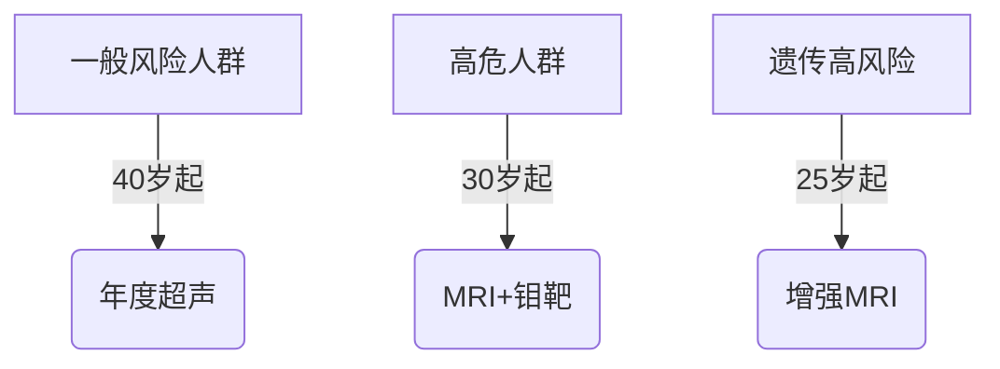

```markdown
# 乳腺癌：从早期发现到科学防治的全面指南

## 概述
**乳腺癌**是乳腺上皮细胞恶性增殖形成的肿瘤，全球发病率最高的女性恶性肿瘤。根据WHO最新统计，2020年全球新发乳腺癌病例达226万例，占所有癌症病例的11.7%。中国国家癌症中心数据显示，我国每年新发病例约42万，发病率以每年3%-4%的速度递增。

## 一、流行病学特征
### 1.1 全球分布特点
- 北美、西欧发病率最高（>80/10万）
- 东亚地区增速显著（近10年上升37%）
- 发病年龄呈现双峰趋势：45-55岁和65-75岁

### 1.2 中国人群特征
- 城市发病率是农村的2倍（年龄标化率）
- 年轻化趋势明显：<40岁患者占比达15%
- 五年生存率提升至83%（2014-2018数据）

## 二、致病因素解析
### 2.1 不可控风险因素
- 遗传基因突变（BRCA1/2阳性者70岁前患病风险达65%）
- 月经初潮<12岁或绝经>55岁
- 致密型乳腺组织（风险增加4-6倍）

### 2.2 可干预风险因素
- 长期激素替代治疗（>5年风险增加26%）
- 酒精摄入（每日10g酒精风险提升7%）
- 肥胖（BMI>30绝经后风险提高50%）

## 三、临床表现与诊断
### 3.1 典型症状矩阵
| 症状类型       | 具体表现                      | 出现频率 |
|----------------|-----------------------------|----------|
| 乳房改变       | 无痛性肿块（85%）、皮肤橘皮样变 | 92%      |
| 乳头异常       | 血性溢液、乳头内陷           | 18%      |
| 系统症状       | 腋窝淋巴结肿大、骨痛         | 晚期病例 |

### 3.2 诊断技术路径
1. **三级筛查体系**
   - 每月自检（月经后7-10天）
   - 40岁以上年度乳腺超声+钼靶
   - 高危人群补充MRI

2. **金标准诊断**
   - 超声引导下穿刺活检（准确率>95%）
   - ER/PR/HER2免疫组化检测
   - 21基因检测（Oncotype DX）

## 四、精准治疗策略
### 4.1 手术治疗进展
- 保乳手术（肿瘤<3cm，切缘阴性）
- 前哨淋巴结活检替代传统清扫术
- 乳房重建技术（DIEP皮瓣成活率达98%）

### 4.2 系统治疗革命
- **内分泌治疗** 
  - CDK4/6抑制剂（Palbociclib）延长PFS至24.8个月
  - 绝经前患者OFS+AI方案

- **靶向治疗**
  - HER2阳性：曲妥珠单抗+帕妥珠单抗双靶向
  - PARP抑制剂（奥拉帕利）治疗BRCA突变

- **免疫治疗**
  - PD-L1阳性三阴性乳腺癌：Atezolizumab联合化疗

## 五、预防与健康管理
### 5.1 风险分层筛查


### 5.2 科学预防措施
- 每周150分钟有氧运动（降低风险14%）
- 地中海饮食模式（橄榄油+深海鱼+坚果）
- 维生素D补充（血清水平>30ng/ml）

## 六、前沿研究方向
1. **液体活检技术**
   - ctDNA检测微小残留病灶（灵敏度达0.01%）
   - 外泌体miRNA早期诊断模型

2. **人工智能应用**
   - 深度学习读片（准确率98.5% vs 人类92%）
   - 治疗反应预测模型（AUC值0.89）

3. **疫苗开发**
   - HER2多肽疫苗II期临床中
   - mRNA个体化新抗原疫苗

## 结语
乳腺癌已进入慢病化管理时代，通过规范筛查（早期诊断率提升至68%）、精准治疗（5年生存率达90%Ⅰ期患者）和科学预防（可避免30%发病），正逐步实现从"谈癌色变"到"可防可控"的转变。建议所有女性建立个性化的乳腺癌防治档案，与专业医生共同制定健康管理方案。

> **参考文献**：
> 1. WHO全球癌症报告2022
> 2. NCCN乳腺癌指南2023V4
> 3. 中国抗癌协会乳腺癌诊治指南
```