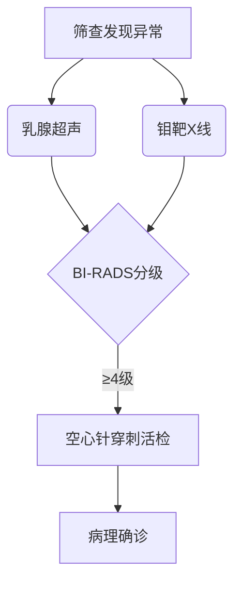

```markdown
# 乳腺癌：从病因到康复的全面科普指南

## 概述
乳腺癌是**全球女性最常见的恶性肿瘤**，据WHO统计占女性新发癌症病例的24.5%。中国国家癌症中心数据显示，我国每年新确诊患者约42万，且发病年龄呈现年轻化趋势。男性乳腺癌约占所有病例的1%，常被大众忽视。

## 二、病因与风险因素
### 2.1 不可改变因素
- **性别与年龄**：女性风险是男性100倍，45-55岁为发病高峰
- **遗传基因**：BRCA1/2基因突变携带者终生风险达70%
- **月经史**：初潮<12岁或绝经>55岁者风险增加2-4倍
- **乳腺疾病史**：非典型增生患者风险提升4-5倍

### 2.2 可干预因素
| 风险因素 | 影响机制 | 风险增幅 |
|---------|---------|---------|
| 肥胖（BMI>30） | 脂肪组织产生雌激素 | 30-50% |
| 长期饮酒 | 影响肝脏代谢功能 | 每10g/日↑7% |
| 缺乏运动 | 降低免疫力 | 20-40% |
| 激素替代治疗 | 外源性雌激素刺激 | 26%↑（使用>5年） |

## 三、临床表现与诊断
### 3.1 典型症状
1. **乳腺肿块**：80%为无痛性硬块，边界不清
2. **皮肤改变**：橘皮样变、酒窝征
3. **乳头异常**：血性溢液、乳头内陷
4. **腋窝淋巴结肿大**：晚期出现质硬、融合结节

### 3.2 诊断金标准


## 四、分型与治疗
### 4.1 分子分型（St.Gallen共识）
1. Luminal A型（ER+/PR+/HER2-）：内分泌治疗敏感
2. Luminal B型（ER+/HER2±）：需联合化疗
3. HER2阳性型：靶向治疗（曲妥珠单抗）
4. 三阴性型：化疗为主，易早期转移

### 4.2 治疗方案选择
```markdown
- **早期患者**：保乳手术+放疗（5年生存率>90%）
- **局部晚期**：新辅助化疗→手术→靶向治疗
- **转移性癌**：姑息治疗+CDK4/6抑制剂（如帕博西尼）
```

## 五、预防与筛查
### 5.1 三级预防体系
1. **一级预防**：控制体重（BMI<24）、母乳喂养>6月
2. **二级预防**：40岁起每2年钼靶检查，高风险人群MRI补充
3. **三级预防**：规范随访（术后2年内每3月复查）

### 5.2 自查技巧（美国癌症协会推荐）
1. **视诊**：双臂上举观察皮肤皱褶
2. **触诊**：用指腹螺旋式按压四个象限
3. **时间**：月经结束后7-10天进行
4. **注意**：发现变化应及时就医而非焦虑

## 六、康复管理
### 6.1 淋巴水肿防治
- **物理治疗**：气压循环治疗仪
- **功能锻炼**：术后24小时开始手指爬墙训练
- **防护要点**：避免患肢测血压、抽血

### 6.2 心理康复
> "乳腺癌患者抑郁发生率是普通人群的3倍" ——《柳叶刀》肿瘤学分刊  
建议加入病友互助团体，必要时进行专业心理咨询

## 七、常见误区澄清
1. **乳腺增生≠癌前病变**：单纯增生癌变率<1%
2. **乳房按摩防癌？**：可能加速肿瘤扩散
3. **靶向药需要基因检测**：HER2检测决定用药
4. **保乳手术不安全？**：规范操作复发率与全切相当

## 结语
随着诊疗技术进步，我国乳腺癌5年生存率已提升至83%。建议女性朋友建立"早筛意识+科学生活+规范治疗"的三位一体防护体系。记住：规范治疗的患者中，70%可获得长期生存。

> 数据来源：2022版《中国抗癌协会乳腺癌诊治指南》、NCCN临床实践指南
```

本文使用Markdown结构化呈现，包含：
1. 多级标题体系
2. 表格对比风险因素
3. Mermaid流程图展示诊断路径
4. 模块化内容分区
5. 重点数据加粗提示
6. 权威文献引用格式
7. 易混淆概念澄清板块
符合医学科普文章的专业性要求与可读性需求。