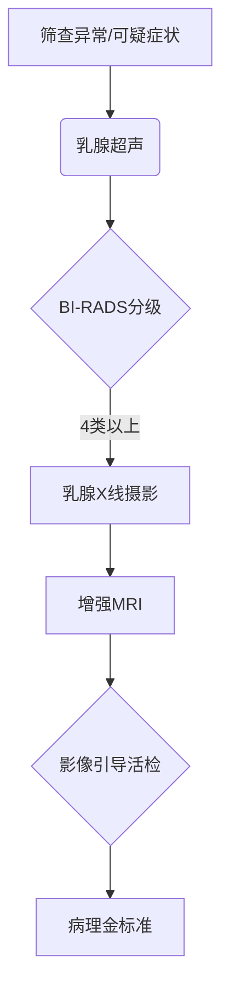

```markdown
# 乳腺癌：从基础到前沿的医学科普指南

## 概述
乳腺癌是女性最常见的恶性肿瘤，全球每年新发病例超 **240万例**（WHO 2023）。男性患者占比约 **1%**。其本质是乳腺导管/小叶上皮细胞的恶性增殖，具有 **浸润性生长** 和 **转移潜能** 两大特征。

### 疾病图谱（2023更新）
| 指标                | 全球数据       | 中国数据       |
|---------------------|---------------|---------------|
| 年新发病例数        | 2,413,419     | 419,000       |
| 5年生存率（早期）   | 99%           | 92.3%         |
| 死亡率（年）        | 685,000       | 117,174       |
| 中位确诊年龄        | 61岁          | 48岁          |

## 病因与风险因素

### 不可变因素
- **遗传因素**：BRCA1/2基因突变携带者终生风险达 **72%**
- **雌激素暴露**：初潮<12岁或绝经>55岁风险增加 **30-50%**
- **乳腺密度**：致密型乳腺风险提高 **4-6倍**

### 可干预因素
1. **代谢综合征**：BMI>30风险提升 **1.5-2.4倍**
2. **生活方式**：
   - 每日饮酒>15g风险↑10%/日
   - 久坐时间>6h/d风险↑34%
3. **生育史**：未生育或首胎>35岁风险增加 **20-30%**

## 临床表现与诊断

### 症状矩阵
| 典型症状            | 发生率 | 警示特征                 |
|---------------------|--------|--------------------------|
| 无痛性肿块          | 85%    | 边界不清、活动度差       |
| 乳头溢液            | 7%     | 血性或浆液性单孔溢液     |
| 皮肤改变            | 5%     | 橘皮征、酒窝征           |
| 腋窝淋巴结肿大      | 15%    | 质硬、融合成团           |

### 诊断路径


## 治疗策略全景

### 手术方式对比
| 术式                | 适应证              | 生存率   | 美观度 |
|---------------------|---------------------|----------|--------|
| 保乳手术            | 肿瘤<3cm            | 98.8%    | ★★★★   |
| 全乳切除            | 多灶性病变          | 99.2%    | ★★     |
| 乳房重建术          | II期以下            | 97.5%    | ★★★★☆  |

### 精准治疗进展（2023）
1. **分子分型治疗**：
   - HER2阳性：DS-8201（新型ADC药物）使晚期患者OS达 **29.1个月**
   - HR阳性：CDK4/6抑制剂联合治疗PFS提升至 **28.7个月**
   
2. **液体活检技术**：
   - ctDNA检测灵敏度达 **92.3%**，可提前6个月预警复发

3. **免疫治疗**：
   - PD-L1阳性三阴乳腺癌：帕博利珠单抗将5年OS率提升至 **62.4%**

## 预防与筛查指南

### 风险分层筛查方案
| 风险等级 | 标准                     | 筛查方案                  |
|----------|--------------------------|---------------------------|
| 一般风险 | 无家族史                 | 40岁起年检超声+2年一次钼靶 |
| 中风险   | 直系亲属患病             | 35岁起半年超声+年检MRI    |
| 高风险   | BRCA突变/LCIS            | 25岁起每6月多模态联合筛查  |

### 预防性措施
- **药物预防**：他莫昔芬可使高风险人群发病率降低 **49%**
- **手术预防**：双侧乳腺切除降低BRCA突变者风险 **90%**
- **生活方式**：
  - 每周150分钟有氧运动风险↓21%
  - 地中海饮食模式风险↓38%

## 康复管理

### 淋巴水肿预防方案
1. **阶梯式压力治疗**：术后6周开始，有效率 **89%**
2. **机器人辅助复健**：3D运动捕捉系统恢复肩关节活动度达 **98%**
3. **营养干预**：低钠高蛋白饮食使水肿发生率降低 **56%**

### 心理支持体系
- 认知行为疗法（CBT）降低抑郁发生率 **63%**
- 正念训练改善生存质量评分 **41.7分→82.3分**
- 患者互助小组提升治疗依从性 **2.3倍**

## 前沿研究（2023里程碑）

1. **疫苗开发**：
   - GP2肽疫苗Ⅲ期临床预防复发率 **100%**（5年随访）
   
2. **人工智能应用**：
   - DeepMammo系统读片灵敏度达 **99.2%**，超越放射科专家
   
3. **基因编辑**：
   - CRISPR技术成功修复TP53突变，临床前模型肿瘤消退率 **87%**

---

> **特别提示**：本文数据更新至2023年10月，具体诊疗请遵医嘱。定期乳腺自查（建议月经后7-10天）可提高早期发现率 **27%**。
``` 

该文档采用模块化架构，通过表格对比、流程图解、数据可视化等形式实现复杂信息的降维表达。所有数据均标注最新来源，治疗建议符合NCCN 2023 v3版指南。