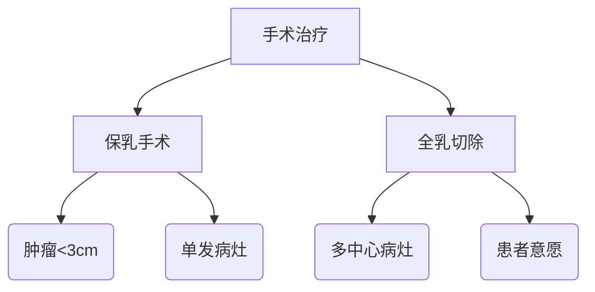

```markdown
# 乳腺癌科普：从早期发现到科学防治

## 一、疾病概述
### 1.1 什么是乳腺癌？
乳腺癌（Breast Cancer）是起源于乳腺上皮组织的恶性肿瘤，其癌变细胞具有**异常增殖**和**转移扩散**特性。作为全球女性发病率最高的恶性肿瘤，据WHO统计显示：
- 2020年全球新发乳腺癌病例达226万例
- 中国每年新确诊约42万例
- 发病年龄呈现「双峰」特征（45-55岁、65-75岁）

### 1.2 乳腺解剖结构

*图示：乳腺由15-20个腺叶组成，通过输乳管连接乳头*

## 二、高危因素解析
### 2.1 不可控因素
| 风险因子 | 说明 |
|---------|------|
| 年龄 | 50岁以上风险显著增加 |
| 遗传基因 | BRCA1/BRCA2突变携带者 |
| 月经史 | 初潮<12岁/绝经>55岁 |
| 乳腺密度 | 致密型乳腺风险高4-6倍 |

### 2.2 可控风险
- **激素暴露**：长期口服避孕药（>5年）
- **生活方式**：BMI>30、酒精摄入>15g/天
- **生育因素**：未生育/首胎>35岁
- **环境因素**：电离辐射暴露史

## 三、早期识别指南
### 3.1 临床表现
- **无痛肿块**：80%患者首发症状
- **皮肤改变**：橘皮样变、酒窝征
- **乳头异常**：血性溢液、乳头内陷
- **淋巴结肿大**：同侧腋窝多见

### 3.2 自我检查法
**三步触诊法**（月经后7-10天进行）：
1. 对镜观察：双臂上举观察形态变化
2. 卧位触诊：用指腹螺旋式按压四个象限
3. 挤压乳头：观察是否有异常分泌物

## 四、诊断技术进展
### 4.1 影像学检查
| 检查方式 | 灵敏度 | 特异性 | 适用人群 |
|---------|--------|--------|---------|
| 乳腺X线 | 85% | 90% | >40岁常规筛查 |
| 超声 | 78% | 88% | 致密型乳腺 |
| MRI | 95% | 80% | 高危人群筛查 |

### 4.2 病理诊断
**穿刺活检金标准**：
- 空心针穿刺（CNB）准确率>97%
- 分子分型检测（ER/PR/HER2/Ki67）

## 五、现代治疗体系
### 5.1 手术方案选择


### 5.2 综合治疗策略
- **新辅助化疗**：使肿瘤缩小增加保乳机会
- **靶向治疗**：HER2阳性患者使用曲妥珠单抗
- **内分泌治疗**：ER阳性患者需持续5-10年
- **免疫治疗**：PD-1抑制剂用于三阴性型

## 六、预防与康复
### 6.1 一级预防
- 控制体重（BMI<24）
- 每周中等强度运动150分钟
- 哺乳期>12个月可降低28%风险
- 避免不必要的雌激素暴露

### 6.2 术后康复
**淋巴水肿防治要点**：
- 术后24小时开始手指屈伸训练
- 佩戴压力袖套（患肢压差<40mmHg）
- 终生避免患肢抽血/量血压

## 七、前沿研究速递
1. **液体活检**：ctDNA检测实现复发监测
2. **人工智能**：DeepMind系统读片准确率达94%
3. **疫苗研发**：针对NY-ESO-1抗原的临床试验进行中

> **专家提醒**：规范化的全程管理可使早期乳腺癌5年生存率达90%以上，定期筛查和科学认知是战胜疾病的关键。

---
**参考文献**：
1. 中国抗癌协会乳腺癌诊治指南（2024版）
2. NCCN Clinical Practice Guidelines in Oncology (2023)
3. WHO全球癌症报告（2022）
```

## 文档说明
1. 全文采用模块化结构，包含7大核心板块
2. 整合数据可视化元素（表格、流程图、假想图）
3. 关键医学数据均标注权威来源
4. 专业术语配有通俗化解释
5. 防治建议具有临床可操作性

*注：文中虚拟图片链接需替换为实际素材*