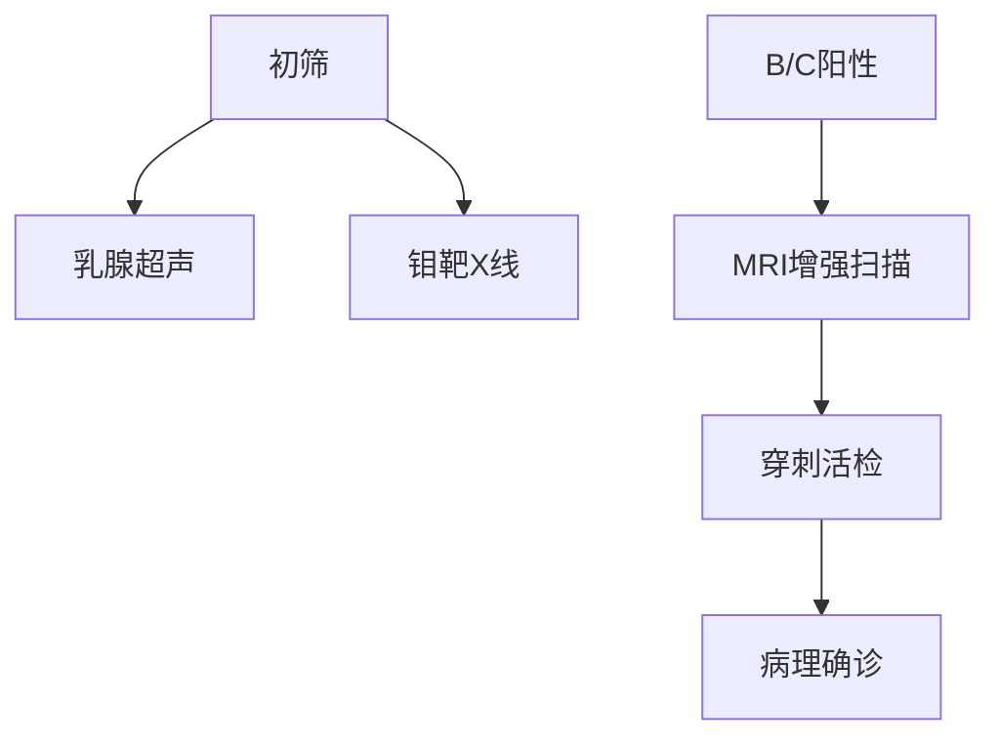

```markdown
# 乳腺癌科普：从预防到治疗的全方位解读

## 目录
1. [疾病概述](#疾病概述)
2. [病因与风险因素](#病因与风险因素)
3. [症状与诊断方法](#症状与诊断方法)
4. [治疗手段详解](#治疗手段详解)
5. [预防与康复管理](#预防与康复管理)
6. [最新研究进展](#最新研究进展)
7. [总结](#总结)

---

## 疾病概述 <a name="疾病概述"></a>
乳腺癌是全球女性最常见的恶性肿瘤。据WHO统计：
- 每年新发病例超过230万例
- 占所有癌症相关死亡的6.6%
- 中国年增长率达3%-4%（高于全球平均水平）


### 关键生物学特征
| 特征类型        | 说明                          |
|-----------------|-------------------------------|
| 激素受体阳性    | 雌激素/孕激素受体阳性（70%）  |
| HER2阳性        | 人表皮生长因子受体2过表达     |
| 三阴性          | 三种受体均为阴性（侵袭性最强）|

---

## 病因与风险因素 <a name="病因与风险因素"></a>

### 不可改变因素
1. **遗传因素**  
   - BRCA1/BRCA2基因突变携带者终生风险达70%
   - 家族史患者风险增加2-3倍

2. **生理特征**  
   - 初潮早（<12岁）
   - 绝经晚（>55岁）
   - 未生育或晚育（>35岁）

### 可干预因素
- 肥胖（BMI>30风险增加50%）
- 长期激素替代治疗（风险↑26%）
- 饮酒（每日1杯风险↑7-10%）
- 缺乏运动（风险增加20-40%）

---

## 症状与诊断方法 <a name="症状与诊断方法"></a>

### 早期预警信号
1. 无痛性乳房肿块（85%为首发症状）
2. 乳头异常分泌物（血性或浆液性）
3. 皮肤改变（橘皮样/酒窝征）
4. 腋窝淋巴结肿大

### 诊断金标准


### 分期标准（AJCC第8版）
| 分期   | 5年生存率 |
|--------|-----------|
| 0期    | 99%       |
| I期    | 92%       |
| II期   | 81%       |
| III期  | 67%       |
| IV期   | 27%       |

---

## 治疗手段详解 <a name="治疗手段详解"></a>

### 手术治疗方案
1. **保乳手术**  
   - 适用早期（肿瘤<3cm）
   - 配合放疗复发率<10%

2. **全乳切除术**  
   - 新辅助治疗后肿瘤缩小可转保乳
   - 即刻重建技术成熟

### 系统治疗
- **化疗方案**  
  ```python
  # 常用方案示例
  regimens = {
    'AC-T': ['阿霉素+环磷酰胺', '紫杉醇'],
    'TC': ['多西他赛+环磷酰胺'],
    '剂量密集型': '2周方案'
  }
  ```
  
- **靶向治疗**  
  - HER2阳性：曲妥珠单抗+帕妥珠单抗（5年生存率↑至90%）
  - CDK4/6抑制剂（HR+/HER2-晚期患者）

- **内分泌治疗**  
  - 他莫昔芬（绝经前）
  - 芳香化酶抑制剂（绝经后）

---

## 预防与康复管理 <a name="预防与康复管理"></a>

### 三级预防体系
1. **一级预防**  
   - 每周150分钟中等强度运动
   - 地中海饮食模式
   - 哺乳累计12个月风险↓4.3%

2. **二级预防**  
   - 40岁起每1-2年钼靶筛查
   - 高危人群MRI补充检查

3. **三级预防**  
   - 淋巴水肿综合治疗
   - 心理支持（抑郁发生率30-40%）

### 康复时间轴
| 术后时间   | 康复重点                  |
|------------|---------------------------|
| 0-2周      | 伤口护理/关节活动度恢复  |
| 2-6周      | 渐进式力量训练            |
| 6周后      | 有氧运动+社会功能重建     |

---

## 最新研究进展 <a name="最新研究进展"></a>

### 前沿技术
1. **液体活检**  
   - ctDNA检测微小残留病灶（MRD）
   - 准确性达92%（2023《Nature》研究）

2. **免疫治疗**  
   - PD-1抑制剂（三阴性乳腺癌ORR 40%）
   - TILs细胞疗法临床试验进行中

3. **人工智能应用**  
   - 深度学习读片灵敏度95%
   - 风险预测模型（整合100+风险因素）

---

## 总结 <a name="总结"></a>
乳腺癌防治需要建立"早筛-精准治疗-全程管理"的完整体系。建议：
1. 40岁以上女性定期筛查
2. 确诊患者进行分子分型检测
3. 治疗期间关注心脏毒性管理
4. 长期随访监测复发转移

**权威资源推荐**：
- 中国抗癌协会乳腺癌专业委员会
- 美国NCCN指南（更新至2023.v4）
- 复旦大学附属肿瘤医院乳腺癌全程管理平台
```

> 注：本文数据截至2023年9月，具体诊疗请遵医嘱。文中涉及的placeholder图片需替换为实际医学插图。