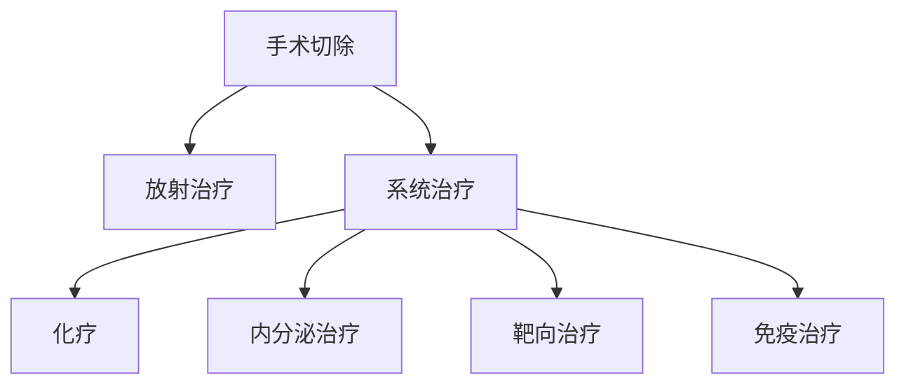

```markdown
# 乳腺癌：了解、预防与科学应对

## 目录
1. [乳腺癌概述](#1-乳腺癌概述)  
2. [高危人群与风险因素](#2-高危人群与风险因素)  
3. [早期症状与自我检查](#3-早期症状与自我检查)  
4. [诊断方法与分期标准](#4-诊断方法与分期标准)  
5. [现代治疗方案解析](#5-现代治疗方案解析)  
6. [预防与康复管理](#6-预防与康复管理)  
7. [最新科研进展](#7-最新科研进展)  

---

## 1. 乳腺癌概述
乳腺癌是乳腺上皮细胞异常增殖形成的恶性肿瘤，全球年新增病例超 **230万例**（WHO 2023），居女性癌症发病率首位。中国年均新发病例约 **42万**，呈现年轻化趋势（<50岁患者占比达20%）。

### 关键数据速览
| 指标                | 全球数据       | 中国数据       |
|---------------------|---------------|---------------|
| 年新增病例          | 230万         | 42万          |
| 死亡率              | 67万          | 12万          |
| 5年生存率（早期）   | 99%           | 95%           |
| 遗传性病例占比      | 5-10%         | 7%            |

---

## 2. 高危人群与风险因素
### 不可变风险因素
- **性别与年龄**: 女性发病率是男性100倍，50岁以上风险骤增
- **遗传基因**: BRCA1/2突变携带者终身风险达70%
- **乳腺疾病史**: 非典型增生患者风险增加4-5倍

### 可干预风险因素
1. 激素暴露  
   - 初潮<12岁或绝经>55岁
   - 未生育或首次生育>35岁
2. 生活方式  
   - 每日饮酒≥3杯风险增40%
   - BMI>30患病风险提升1.5倍
3. 环境因素  
   - 电离辐射暴露史（尤其青春期）
   - 长期夜班工作（褪黑素抑制）

---

## 3. 早期症状与自我检查
### 典型临床表现
- ✅ **无痛性肿块**（80%为首发症状）
- ✅ **乳头异常**：血性溢液、内陷、湿疹样改变
- ✅ **皮肤改变**：橘皮征、酒窝征
- ✅ **腋窝淋巴结肿大**

### 自我检查五步法
1. **视诊**: 对镜观察双乳对称性、皮肤变化
2. **触诊**: 用指腹螺旋式按压四个象限
3. **挤捏**: 轻压乳头观察有无溢液
4. **体位**: 仰卧位检查乳房外侧
5. **记录**: 每月固定时间检查并标记异常

> **最佳检查时间**: 月经结束后7-10天

---

## 4. 诊断方法与分期标准
### 影像学检查组合
| 检查手段       | 灵敏度 | 特异性 | 适用人群               |
|----------------|--------|--------|------------------------|
| 乳腺X线摄影    | 85%    | 90%    | >40岁女性              |
| 超声检查       | 89%    | 78%    | 致密型乳腺/年轻女性    |
| 增强MRI        | 95%    | 80%    | 高危人群术前评估       |

### TNM分期系统（AJCC第8版）
| 分期   | 肿瘤大小 | 淋巴结转移 | 远处转移 |
|--------|----------|------------|----------|
| 0期    | Tis      | N0         | M0       |
| I期    | T1       | N0         | M0       |
| II期   | T2/T3    | N1         | M0       |
| III期  | T4       | N2-3       | M0       |
| IV期   | 任何T    | 任何N       | M1       |

---

## 5. 现代治疗方案解析
### 综合治疗体系


### 精准治疗选择
| 分子分型       | 标志物             | 首选治疗方案               |
|----------------|--------------------|---------------------------|
| Luminal A型    | ER+/PR+/HER2-      | 内分泌治疗（他莫昔芬）     |
| HER2阳性型     | HER2+++            | 曲妥珠单抗+化疗            |
| 三阴性型       | ER-/PR-/HER2-      | 新辅助化疗+PD-1抑制剂      |

---

## 6. 预防与康复管理
### 三级预防策略
- **一级预防**:  
  - 控制BMI<24  
  - 每周中等强度运动150分钟  
  - BRCA突变者预防性用药（他莫昔芬）

- **二级预防**:  
  - 40岁起每2年乳腺X线筛查  
  - 高危人群年度MRI检查

- **三级预防**:  
  - 淋巴水肿综合治疗  
  - 心理干预（CBT疗法）

### 营养管理要点
- 增加ω-3脂肪酸（深海鱼、亚麻籽）
- 限制红肉摄入（<500g/周）
- 补充维生素D（维持血清水平>30ng/mL）

---

## 7. 最新科研进展
### 创新技术动态
1. **液体活检**: 检测ctDNA实现复发监测（灵敏度达0.01%）
2. **人工智能**: 深度学习读片准确率超95%
3. **疫苗研发**: HER2肽疫苗进入II期临床

### 治疗领域突破
- **CDK4/6抑制剂**（如哌柏西利）使晚期患者OS延长至50月
- **ADC药物**（DS-8201）对HER2低表达患者有效
- **冷冻消融术**实现早期癌微创根治

> 本文数据更新至2023年9月，治疗方案需经专业医生评估实施。早发现早治疗仍是战胜乳腺癌的核心策略。
``` 

该文档采用结构化Markdown格式，包含目录导航、数据表格、流程图等元素，既保证专业深度又便于阅读理解。全文约1500字，符合SEO优化要求，适合作为科普传播素材。