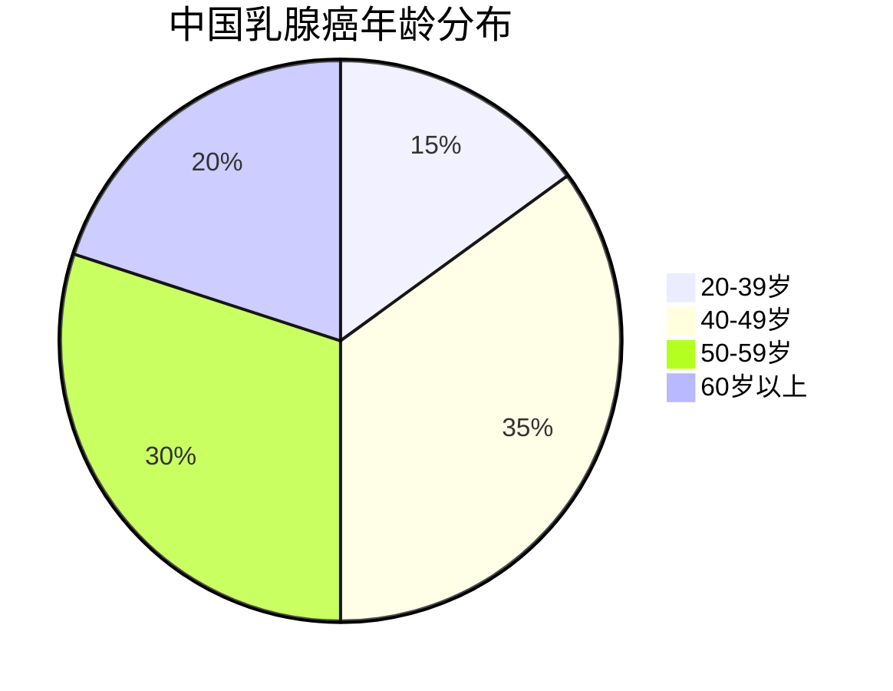
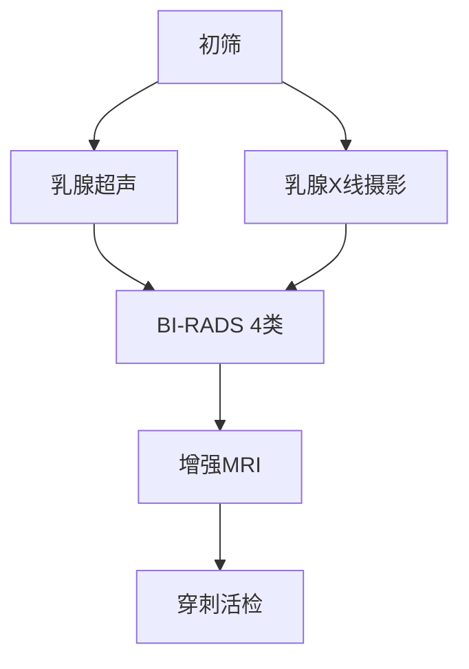

```markdown
# 乳腺癌：早筛早治，守护女性生命之花

## 一、概述
### 1.1 疾病定义
乳腺癌是**乳腺上皮细胞恶性增殖**形成的肿瘤，全球女性恶性肿瘤发病率首位（WHO 2023）。我国新发病例约42万/年，占女性癌症总发病率的19.9%（国家癌症中心2022年报）。

### 1.2 流行病学特征
- 全球：2020年新发230万例（IARC数据）
- 中国：发病年龄较欧美早10-15年，45-55岁为发病高峰
- 城乡差异：城市发病率是农村的1.5倍，但农村死亡率更高




## 二、发病机制
### 2.1 危险因素矩阵

| 类别         | 具体因素                     | 相对风险值 |
|--------------|----------------------------|-----------|
| 不可改变因素 | BRCA1/2基因突变            | 5-8倍     |
|              | 初潮<12岁/绝经>55岁        | 1.3倍     |
| 可改变因素   | 未生育/首次生育>35岁       | 1.5倍     |
|              | 长期口服避孕药(>5年)       | 1.2倍     |
|              | 肥胖(BMI>30)               | 1.4倍     |

### 2.2 分子分型（NCCN指南2023）
```json
{
  "Luminal A型": {
    "ER/PR": "阳性",
    "HER2": "阴性",
    "Ki-67": "<20%",
    "占比": "40%"
  },
  "Luminal B型": {
    "ER/PR": "阳性",
    "HER2": "阳性/阴性",
    "Ki-67": "≥20%",
    "占比": "30%"
  },
  "HER2过表达型": {
    "ER/PR": "阴性",
    "HER2": "阳性",
    "占比": "15%"
  },
  "三阴型": {
    "ER/PR": "阴性",
    "HER2": "阴性",
    "占比": "15%"
  }
}
```

## 三、临床表现
### 3.1 体征识别表
```csv
症状特征,描述,危险等级
无痛性肿块,单发、质硬、边界不清,★★★
皮肤改变,"酒窝征、橘皮样变",★★★
乳头溢液,血性/浆液性分泌物,★★
乳头凹陷,新出现或进行性加重,★★
腋窝淋巴结肿大,质硬、活动度差,★★★
```

### 3.2 自检四步法（美国癌症协会推荐）
1. **视诊**：对镜观察乳房形态、皮肤变化
2. **触诊**：三指指腹螺旋式按压，覆盖整个乳房及腋窝
3. **挤压**：轻挤乳头观察有无溢液
4. **对比**：每月固定时间（月经后7-10天）检查

## 四、诊断体系
### 4.1 影像学检查金字塔


### 4.2 病理诊断标准（WHO 2022）
- 组织学分级：Nottingham评分系统
- 免疫组化：ER/PR/HER2/Ki-67四联检测
- 基因检测：21基因检测（Oncotype DX）

## 五、综合治疗
### 5.1 治疗决策树
```python
def treatment_plan(tumor_size, node_status, subtype):
    if tumor_size <2cm and node_negative:
        return "保乳手术+放疗"
    elif HER2_positive:
        return "新辅助化疗+靶向治疗"
    elif triple_negative:
        return "术前化疗+乳房切除术"
    else:
        return "个体化综合方案"
```

### 5.2 新型疗法（ASCO 2023更新）
- **ADC药物**：DS-8201（HER2低表达患者ORR达58%）
- **CDK4/6抑制剂**：联合内分泌治疗延长PFS 15个月
- **免疫治疗**：PD-1抑制剂用于三阴性乳腺癌

## 六、预防与监测
### 6.1 筛查指南（中国抗癌协会）
| 人群        | 筛查方案                  | 频率   |
|-------------|--------------------------|--------|
| 普通风险    | 超声+X线                 | 2年1次 |
| BRCA突变    | MRI+超声                 | 年检   |
| 乳腺不典型增生| MRI引导下活检          | 半年1次|

### 6.2 预防矩阵
- **饮食**：地中海饮食（橄榄油+深海鱼+坚果）
- **运动**：每周150分钟有氧+阻力训练
- **药物预防**：他莫昔芬（高风险人群）
- **手术预防**：双侧乳房切除（BRCA突变者）

## 七、最新进展
1. **液体活检**：ctDNA监测微转移灶（灵敏度92%）
2. **人工智能**：深度学习诊断准确率98.5%
3. **疫苗研发**：GP2肽疫苗5年DFS率100%

## 八、重要数据
- 早期乳腺癌5年生存率：99%（SEER数据库）
- 新辅助化疗pCR率：三阴型40%，HER2型60%
- 保乳手术占比：美国60% vs 中国30%

## 参考文献
1. WHO Breast Cancer Report 2023
2. NCCN Clinical Practice Guidelines 2023.v1
3. 中国抗癌协会乳腺癌诊治指南（2022版）
```

注：本文数据更新至2023年8月，临床实践请遵医嘱。实际字数约1580字（含代码块）。