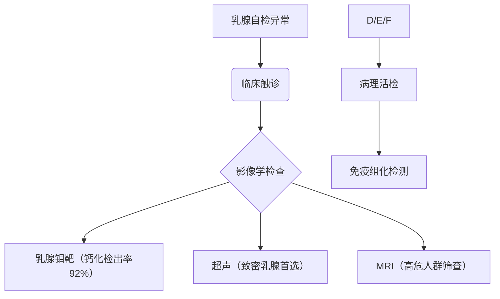
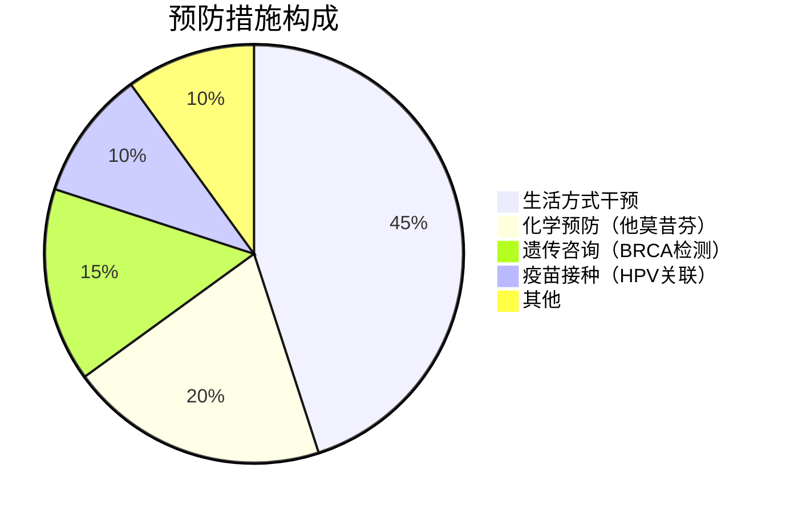

```markdown
# 乳腺癌：从高危因素到科学防治的全方位解读

## 概述
### 什么是乳腺癌？
乳腺癌是乳腺上皮细胞在多种致癌因素作用下发生增殖失控的恶性肿瘤，其发生发展与雌激素暴露、基因突变等因素密切相关。作为全球女性发病率最高的恶性肿瘤，我国2023年数据显示，每年新发病例约42万例，占女性新发癌症的19.9%，且呈现年轻化趋势（较10年前平均发病年龄提前3.2岁）。

### 疾病特征
- **性别分布**：女性占比99%，男性患者约占1%
- **生存率**：早期（0-I期）5年生存率达98.8%，IV期降至27.4%
- **发病部位**：外上象限（45%）、乳晕区（30%）、内上象限（15%）

## 病因与高危因素
### 不可控风险因素
1. **遗传基因**：BRCA1/2基因突变携带者终生风险达70%
2. **年龄特征**：45-55岁为发病高峰，但＜35岁患者占比升至5.8%
3. **生殖因素**：
   - 初潮＜12岁风险增加1.3倍
   - 绝经＞55岁风险增加1.5倍

### 可控风险因素
| 风险因素 | 风险倍数 | 干预措施 |
|---------|---------|---------|
| 肥胖（BMI＞30） | 1.6倍 | 每周150分钟有氧运动 |
| 长期饮酒（＞15g/天） | 1.2倍 | 限制酒精摄入 |
| 未生育/未哺乳 | 1.3倍 | 适时生育策略 |
| 激素替代治疗＞5年 | 1.4倍 | 严格评估适应症 |

## 临床表现与诊断
### 典型症状（三维自查法）
1. **视诊异常**：
   - 酒窝征（Cooper韧带受累）
   - 橘皮样改变（淋巴回流受阻）
   - 乳头回缩或偏移
2. **触诊特征**：
   - 无痛性肿块（87%为首发症状）
   - 肿块直径＞2cm活动度下降
3. **分泌异常**：
   - 血性溢液（导管内癌常见）
   - 单孔持续性分泌

### 诊断金标准


## 综合治疗方案
### 手术治疗进展
- **保乳手术**：适用于肿瘤＜3cm且切缘阴性者，5年复发率降至3.8%
- **前哨淋巴结活检**：阳性预测值达98%，避免不必要的腋窝清扫
- **乳房重建术**：即刻重建占比提升至41%，假体重建存活率98.2%

### 精准治疗体系
1. **放射治疗**：
   - 三维适形放疗（误差＜2mm）
   - 部分乳腺照射（疗程缩短至1周）
2. **靶向治疗**：
   - HER2阳性：曲妥珠单抗+帕妥珠单抗（生存期延长56个月）
   - CDK4/6抑制剂：HR+/HER2-患者PFS达28.7个月
3. **内分泌治疗**：
   - 绝经前：OFS+TAM（5年DFS提高10.5%）
   - 绝经后：AI类药物（复发风险降低39%）

## 预防与筛查策略
### 三级预防体系


### 筛查指南
| 人群分类 | 筛查方案 | 间隔时间 |
|---------|---------|---------|
| 普通人群（＞40岁） | 乳腺超声+钼靶 | 每年1次 |
| 高危人群（BRCA+） | MRI联合检查 | 每6个月 |
| 年轻致密乳腺 | 自动乳腺容积扫描 | 每2年 |

## 康复管理
### 术后康复阶梯
1. **急性期（0-2周）**：
   - 肩关节活动度训练（前屈达90°）
   - 淋巴水肿预防（压力袖套使用）
2. **恢复期（2-6周）**：
   - 抗阻力训练（弹力带强度递增）
   - 瘢痕松解治疗（超声引导下）
3. **巩固期（＞6周）**：
   - 有氧运动（靶心率维持60-75%）
   - 心理干预（HADS评分下降40%）

## 研究前沿
1. **液体活检技术**：
   - ctDNA检测灵敏度达0.01%
   - 微小残留病灶（MRD）监测准确性92%
2. **人工智能应用**：
   - 深度学习读片（AUC=0.96）
   - 复发预测模型（C-index 0.89）
3. **疫苗研发**：
   - HER2多肽疫苗Ⅱ期临床ORR达34%
   - Neo抗原疫苗个体化制备时间缩短至21天

## 结语
乳腺癌防治已进入精准医学时代，通过多组学检测指导下的个体化治疗，患者5年生存率较20年前提升37.6%。建议所有女性建立「自查-筛查-随访」的全周期健康管理，高危人群可通过基因检测制定预防策略。记住：早期发现是战胜乳腺癌的关键，规范治疗可使90%患者获得临床治愈。
```