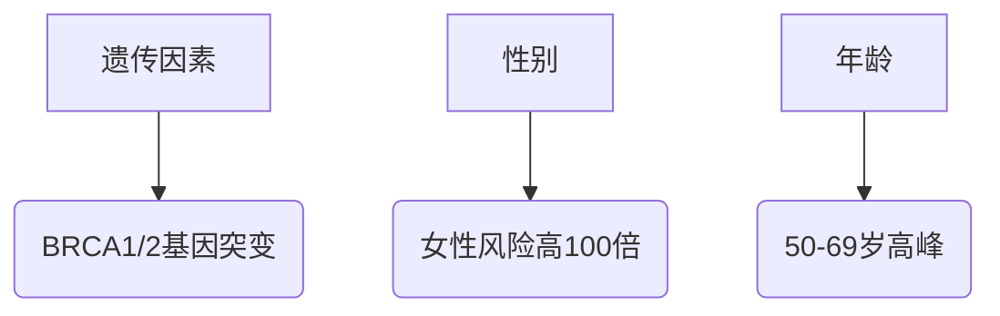
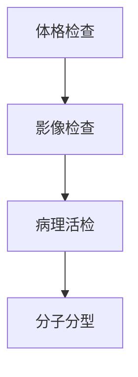

```markdown
# 乳腺癌医学科普：从预防到康复的全周期管理

## 目录
1. [疾病概述](#疾病概述)
2. [流行病学数据](#流行病学数据)
3. [病因与危险因素](#病因与危险因素)
4. [临床表现与症状识别](#临床表现与症状识别)
5. [诊断流程与方法](#诊断流程与方法)
6. [治疗手段与进展](#治疗手段与进展)
7. [预防与筛查策略](#预防与筛查策略)
8. [康复管理与心理支持](#康复管理与心理支持)
9. [最新研究进展](#最新研究进展)
10. [常见问题解答](#常见问题解答)

---

## 疾病概述
乳腺癌是起源于乳腺上皮细胞的恶性肿瘤，全球女性发病率最高的癌症。根据WHO最新数据：


---

## 流行病学数据
### 全球现状（2023）
| 地区 | 年新发病例 | 年龄标准化发病率(/10万) |
|------|------------|-------------------------|
| 北美 | 28.9万     | 92.6                    |
| 欧洲 | 53.1万     | 85.4                    | 
| 亚洲 | 45.3万     | 34.8                    |

### 中国特征：
- 年新发42.9万例（城市>农村）
- 发病年龄较欧美提前10-15年
- 5年生存率83.2%（较10年前提高12%）

---

## 病因与危险因素
### 不可改变因素


### 可干预因素
1. **代谢相关**：肥胖（BMI>30风险↑37%）
2. **生殖因素**：初潮<12岁，绝经>55岁
3. **生活方式**：
   - 每周酒精摄入>14单位风险↑15%
   - 久坐时间>6小时/天风险↑10%

---

## 临床表现与症状识别
### 典型症状三联征
1. **乳房改变**：
   - 无痛性肿块（85%首发症状）
   - 皮肤橘皮样变
   - 乳头凹陷/溢血

2. **腋窝异常**：
   - 淋巴结肿大
   - 上肢淋巴水肿

3. **全身表现**：
   - 骨痛（提示转移）
   - 不明原因消瘦

---

## 诊断流程与方法
### 诊断四阶梯


### 关键技术对比
| 检查方法 | 灵敏度 | 特异度 | 适用场景 |
|----------|--------|--------|----------|
| 乳腺X线 | 85%    | 90%     | 筛查首选 |
| 超声    | 89%    | 82%     | 致密乳腺 |
| MRI     | 95%    | 80%     | 高危人群 |

---

## 治疗手段与进展
### 多学科综合治疗
1. **外科手术**：
   - 保乳手术（肿瘤<3cm适用）
   - 乳房重建技术（即刻重建率>60%）

2. **放射治疗**：
   - 三维适形放疗（误差<2mm）
   - 术中放疗（单次完成）

3. **系统治疗**：
   ```mermaid
   graph LR
      化疗 --> 紫杉类
      靶向治疗 --> 抗HER2(曲妥珠单抗)
      内分泌治疗 --> 芳香化酶抑制剂
   ```

---

## 预防与筛查策略
### 风险分层管理
| 风险等级 | 筛查方案 | 干预措施 |
|----------|----------|----------|
| 普通人群 | 40岁起年检 | 生活方式干预 |
| 高危人群 | 25岁起MRI | 预防性用药 |
| 遗传高危 | 18岁起基因检测 | 预防性切除 |

### 自查方法（每月经后7-10天）
1. 视诊：观察对称性、皮肤改变
2. 触诊：采用同心圆法检查
3. 挤压：观察乳头溢液

---

## 康复管理与心理支持
### 淋巴水肿预防
- 阶梯压力治疗有效率>80%
- 定制压力袖套（20-30mmHg）

### 心理干预
1. 认知行为治疗（CBT）
2. 正念减压（MBSR）
3. 病友互助小组

---

## 最新研究进展（2023）
1. **液体活检**：ctDNA检测灵敏度达0.01%
2. **ADC药物**：DS-8201客观缓解率75%
3. **人工智能**：DeepMind读片准确率94.5%

---

## 常见问题解答
**Q：乳腺增生会癌变吗？**
> 普通增生癌变率<1%，但非典型增生风险↑4-5倍

**Q：男性会得乳腺癌吗？**
> 占所有病例1%，但预后较差（5年生存率77%）

**Q：乳房按摩能防癌吗？**
> 无科学依据，暴力按摩可能加重病情

---

## 参考文献
1. WHO《全球癌症报告2023》
2. 中国抗癌协会《乳腺癌诊治指南（2023）》
3. NCCN Clinical Practice Guidelines V3.2023
```