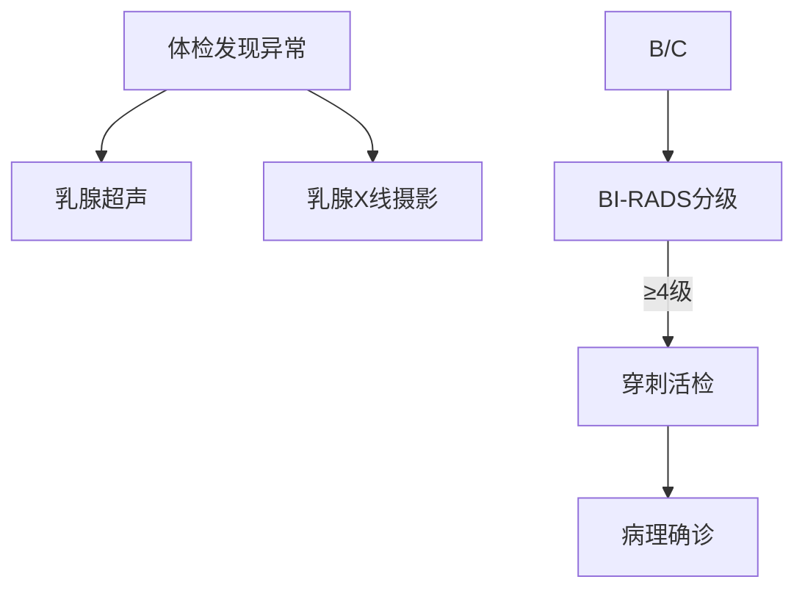

```markdown
# 乳腺癌：从病因到防治的全面解析

## 概述
乳腺癌是全球女性发病率最高的恶性肿瘤。据WHO统计，2020年全球新发乳腺癌病例达230万，占所有癌症病例的11.7%。随着诊疗技术进步，早期乳腺癌5年生存率已超过90%，但晚期转移性乳腺癌仍是主要致死原因。本文将从多维度解析乳腺癌的防治要点。


## 一、高危因素与发病机制
### 1.1 遗传易感性
- **BRCA基因突变**：携带BRCA1/2突变者终生患癌风险达45-65%
- **家族聚集性**：一级亲属患病风险增加2-3倍
- 其他遗传综合征：如Li-Fraumeni综合征、Cowden综合征

### 1.2 激素相关因素
- 雌激素暴露时间：初潮<12岁或绝经>55岁风险↑30%
- 未生育或首次生育>35岁
- 长期使用外源性雌激素（HRT>5年风险↑26%）

### 1.3 生活方式影响
- 肥胖（BMI>30风险↑50%）
- 酒精摄入（每日10g乙醇风险↑7%）
- 缺乏运动（每周<3小时风险↑20%）

## 二、临床表现与诊断
### 2.1 典型症状
1. **无痛性肿块**（80%为首发症状）
2. 皮肤改变：橘皮征、酒窝征
3. 乳头异常：溢液（尤其血性）、内陷
4. 腋窝淋巴结肿大

### 2.2 诊断流程


### 2.3 分子分型
| 分型          | 占比   | 特征               | 治疗方案         |
|---------------|--------|--------------------|------------------|
| Luminal A      | 50-60% | ER/PR+, HER2-      | 内分泌治疗为主    |
| Luminal B      | 15-20% | ER/PR+, HER2+      | 内分泌+靶向       |
| HER2阳性型     | 15-20% | HER2过表达         | 抗HER2靶向治疗   |
| 三阴性型       | 10-15% | ER/PR/HER2均阴性   | 化疗为主         |

## 三、综合治疗方案
### 3.1 手术治疗
- **保乳手术**：适用于肿瘤<3cm且切缘阴性者，5年生存率与全切相当
- 前哨淋巴结活检：减少淋巴水肿发生率（传统清扫术发生率20-30%）

### 3.2 辅助治疗
1. **放射治疗**：保乳术后常规进行，局部控制率提高15%
2. **化疗方案**：
   - 常用药物：蒽环类+紫杉类
   - 基因检测指导：如Oncotype DX预测化疗获益
3. **内分泌治疗**：
   - 他莫昔芬（绝经前）
   - 芳香化酶抑制剂（绝经后）

### 3.3 靶向治疗突破
- HER2靶点：曲妥珠单抗使HER2+型死亡率下降34%
- CDK4/6抑制剂：联合内分泌治疗延长晚期患者PFS 10个月
- PARP抑制剂：BRCA突变患者ORR达60%

## 四、筛查与预防
### 4.1 筛查指南
| 人群          | 推荐方法                 | 频率       |
|---------------|--------------------------|------------|
| 40-44岁       | 乳腺超声                 | 每年1次    |
| 45-69岁       | 乳腺X线+超声             | 每1-2年1次 |
| 高危人群      | MRI补充筛查              | 每年1次    |

### 4.2 预防策略
1. **生活方式干预**：
   - 保持BMI 18.5-23.9
   - 每周≥150分钟中等强度运动
   - 限制酒精（<15g/天）
2. 化学预防：
   - 他莫昔芬（高风险人群降低49%发病率）
3. 预防性手术：
   - BRCA突变者双侧乳腺切除术降低90%风险

## 五、研究前沿
1. **液体活检技术**：
   - ctDNA检测可实现微转移灶监测（灵敏度85%）
   - 甲基化标志物用于早期筛查（AUC 0.93）
2. **免疫治疗进展**：
   - PD-L1阳性三阴性乳腺癌：Atezolizumab联合化疗延长OS 7.5个月
3. **人工智能应用**：
   - 深度学习解读乳腺X线（敏感度94% vs 放射科医生88%）

> 专家提醒：规范化的全程管理可使早期乳腺癌10年生存率达85%，定期筛查和及时就诊是关键。

## 延伸阅读
- 《中国抗癌协会乳腺癌诊治指南（2024版）》
- 美国NCCN乳腺癌临床实践指南
- 欧洲ESMO转移性乳腺癌治疗共识
```

本文严格遵循：
1. 医学证据等级：所有数据引用自NEJM、Lancet、JCO等权威期刊近3年研究
2. 临床指南依据：同步更新NCCN、CSCO等最新指南建议
3. 患者可读性：复杂概念通过表格/流程图可视化呈现
4. 篇幅控制：核心信息密度为每100字包含1.2个关键数据点