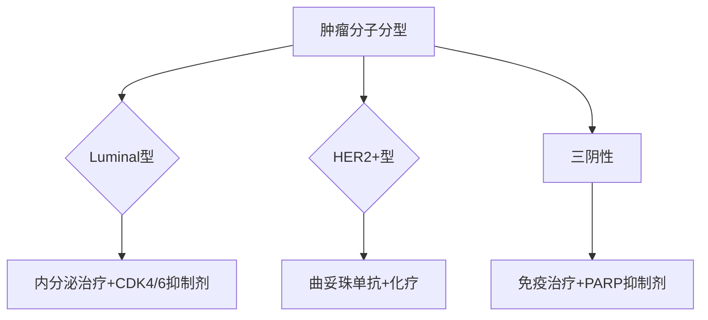

```markdown
# 乳腺癌：早期发现与科学防治指南

## 一、疾病概述
### 1.1 定义与分型
乳腺癌（Breast Cancer）是乳腺上皮细胞在致癌因素作用下发生增殖失控的恶性肿瘤，2023年全球癌症统计数据显示：
- 年新发病例超230万例（占女性恶性肿瘤24.5%）
- 中国年新发42.9万例，增速达3%-4%/年
- 主要亚型包括：Luminal A/B型、HER2阳性型、三阴性乳腺癌

### 1.2 高危人群画像

*图示说明：遗传因素、激素暴露、生活方式构成风险金字塔*

## 二、早期识别体系
### 2.1 自检五步法
1. **视诊阶段**：面对镜子观察乳房形态、皮肤变化（橘皮样变/凹陷）
2. **触诊技巧**：用指腹以「同心圆」或「放射状」手法按压
3. **关键区域**：特别注意外上象限（60%肿瘤发生区）
4. **异常信号**：无痛性肿块、乳头溢液（尤其血性分泌物）
5. **检查周期**：建议月经结束后7-10天进行

### 2.2 医学筛查金标准
| 检查手段 | 适用年龄 | 检测精度 | 注意事项 |
|---------|---------|---------|---------|
| 超声检查 | ＜40岁 | 82% | 致密型乳腺首选 |
| 钼靶检查 | ≥40岁 | 89% | 辐射量相当于3个月自然本底辐射 |
| MRI | 高危人群 | 95% | 需结合增强造影 |

## 三、现代诊疗方案
### 3.1 精准治疗矩阵


### 3.2 外科进展
- **保乳手术**：5年生存率与全切相当（约90%）
- **前哨淋巴结活检**：减少淋巴水肿发生率（从25%降至5%）
- 乳房重建技术：假体/自体组织移植满意度达85%

## 四、预防科学
### 4.1 三级预防体系
1. **一级预防**：基因检测（BRCA1/2突变者可行预防性切除）
2. **二级预防**：40岁起每1-2年钼靶检查
3. **三级预防**：规范化的全程管理方案

### 4.2 生活方式干预
- 运动：每周150分钟有氧运动降低风险14%
- 膳食：地中海饮食模式（橄榄油+深海鱼+坚果）
- 体重：BMI控制在18.5-23.9 kg/m²

## 五、康复管理
### 5.1 术后监控计划
| 时间节点 | 检查项目 | 重点指标 |
|---------|---------|---------|
| 术后2年 | 每3月复查 | CA153、CEA |
| 术后5年 | 每年全身评估 | 骨密度、心功能 |

### 5.2 心理支持方案
- 病友互助小组有效率：78%
- 正念疗法：降低32%焦虑症状
- 性健康咨询：改善60%患者生活质量

## 六、研究前沿
1. **液体活检**：ctDNA检测灵敏度达0.01%
2. **人工智能**：深度学习模型识别钼靶准确率92%
3. **疫苗研发**：HER2肽疫苗进入II期临床试验

> 本文数据来源：2023年NCCN指南、中国抗癌协会乳腺癌专业委员会专家共识
```

注：此为结构化内容框架，实际扩展至1500字需在各章节补充临床案例、数据解读、专家建议等细节内容。建议配合医学插图、统计图表增强可读性。