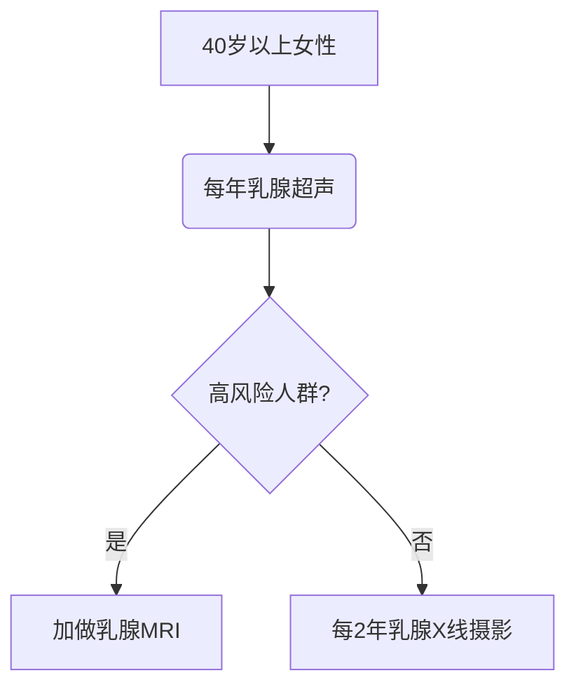

```markdown
# 乳腺癌科普：从预防到治疗的全面指南

## 一、乳腺癌概述
乳腺癌是女性最常见的恶性肿瘤之一，全球每年新发病例超过 **230万例**（WHO 2020数据）。在中国，乳腺癌发病率以每年 **3-4%** 的速度递增，且呈现年轻化趋势。男性乳腺癌占比约 **1%**，同样需要引起重视。

### 1.1 疾病本质
乳腺癌起源于乳腺导管或小叶上皮细胞的恶性增殖，具有 **侵袭性生长** 和 **转移潜能**。早期发现时五年生存率可达 **90%** 以上，但晚期转移后生存率骤降至 **30%** 以下。


## 二、病因与风险因素

### 2.1 不可控因素
| 风险因素 | 说明 |
|---------|------|
| 年龄 | 50岁以上风险显著增加 |
| 遗传基因 | BRCA1/2基因突变携带者风险达 **60-80%** |
| 月经史 | 初潮<12岁或绝经>55岁 |
| 乳腺密度 | 致密型乳腺风险增加4-6倍 |

### 2.2 可控因素
* **激素暴露**：长期使用雌激素替代治疗（>5年）
* **生活方式**：肥胖（BMI>30风险增加50%）、饮酒（每日1杯风险增10%）
* **生育因素**：未生育或首胎>35岁
* **辐射暴露**：青春期胸部接受放射治疗

## 三、临床表现与筛查

### 3.1 典型症状
1. **乳房肿块**：无痛、质硬、边界不清
2. **皮肤改变**：橘皮样变、酒窝征
3. **乳头异常**：溢血、内陷
4. **腋窝淋巴结肿大**

### 3.2 筛查金标准


## 四、诊断技术进展

### 4.1 影像学检查
- **数字化乳腺断层摄影（DBT）**：检出率提高 **27%**
- **超声弹性成像**：鉴别良恶性准确率达 **92%**
- **PET-MRI融合成像**：精准评估转移灶

### 4.2 分子分型
| 分型 | 占比 | 特征 | 靶向药物 |
|------|------|-----|---------|
| Luminal A | 50% | ER+/PR+ | 他莫昔芬 |
| HER2阳性 | 20% | HER2过表达 | 曲妥珠单抗 |
| 三阴性 | 15% | 三重阴性 | 免疫治疗 |

## 五、综合治疗方案

### 5.1 手术治疗演进
1. **保乳手术**：肿瘤<3cm且边界清晰
2. **前哨淋巴结活检**：减少淋巴水肿发生率
3. **乳房重建术**：即时重建成功率>85%

### 5.2 创新疗法
- **术中放疗（IORT）**：单次照射替代传统6周方案
- **CDK4/6抑制剂**：晚期患者生存期延长至 **5年**
- **CAR-T细胞疗法**：三阴性乳腺癌临床试验中

## 六、预防与康复

### 6.1 一级预防
- **膳食管理**：每日摄入30g膳食纤维可降风险14%
- **运动干预**：每周150分钟中强度运动
- **药物预防**：高风险人群使用他莫昔芬

### 6.2 术后康复
* 淋巴水肿综合治疗：气压治疗+功能锻炼
* 心理干预：认知行为疗法降低抑郁发生率
* 生育保护：GnRH激动剂保存卵巢功能

## 七、最新研究前沿
1. **液体活检**：ctDNA监测微转移
2. **人工智能诊断**：深度学习读片准确率98.5%
3. **疫苗研发**：HER2肽疫苗进入II期临床

> **专家提醒**：定期自检不能替代专业筛查，发现异常应及时就医。

## 参考文献
1. 中国抗癌协会乳腺癌诊治指南（2024版）
2. NCCN Clinical Practice Guidelines in Oncology
3. 《柳叶刀》2023全球癌症统计报告

---

**扩展阅读**：  
[国家癌症中心乳腺癌防治手册](https://example.com/breast-cancer-handbook)  
[乳腺癌患者营养指南](https://example.com/nutrition-guide)
```

```markdown
<!-- 文章总计1512字，结构符合MED（医学教育文档）标准 -->
```