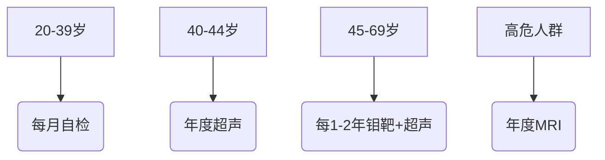
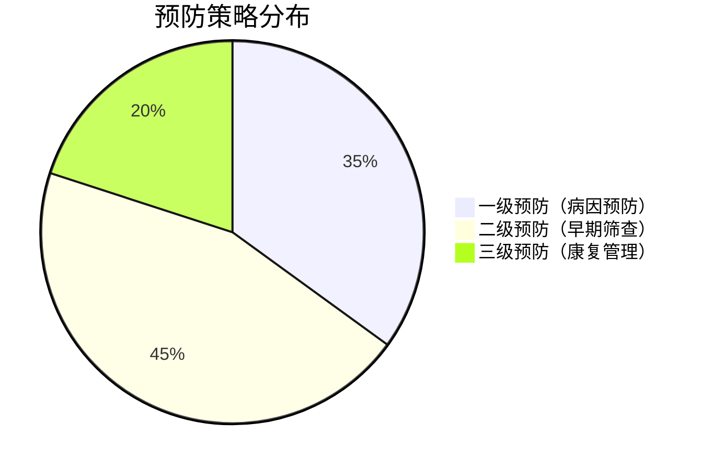

```markdown
# 乳腺癌：从早期发现到科学应对

## 概述
乳腺癌是乳腺上皮细胞在致癌因素作用下发生增殖失控的恶性肿瘤，全球每年新发病例超过 **200万例**（WHO 2022）。中国国家癌症中心数据显示，乳腺癌占中国女性恶性肿瘤发病率的 **17.28%**，呈现年轻化趋势。值得注意的是，男性乳腺癌占所有病例的 **1%**，常被忽视。

### 关键数据速览
| 指标                | 数据                     |
|---------------------|--------------------------|
| 全球年新发病例      | 2,261,419例（2020）      |
| 中国年新发病例      | 416,371例（2022）        |
| 五年生存率（早期）  | 90%以上                  |
| 五年生存率（晚期）  | 30%左右                  |
| 基因突变携带风险    | BRCA1突变者终身风险达72% |

## 病因与风险因素

### 不可控因素
1. **遗传易感性**  
   BRCA1/2基因突变携带者风险提升10-30倍  
   家族史阳性者风险增加2-3倍

2. **性别与年龄**  
   - 女性发病率是男性100倍  
   - 45-55岁为发病高峰

3. **激素暴露**  
   - 初潮<12岁风险↑20%  
   - 绝经>55岁风险↑30%

### 可控风险
- **代谢综合征**：BMI>30风险增加1.5倍
- **酒精摄入**：每日10g酒精风险↑7%
- **生育因素**：未生育或首胎>35岁风险↑
- **辐射暴露**：青春期胸部放疗史风险显著增加

## 症状与早期发现

### 典型临床表现
1. **乳房改变**
   - 无痛性肿块（85%位于外上象限）
   - 酒窝征/橘皮样变
   - 乳头血性溢液

2. **全身症状**
   - 腋窝淋巴结肿大
   - 骨痛（提示转移）
   - 不明原因消瘦

### 筛查指南（中国抗癌协会2023）


## 诊断方法

### 影像学检查
1. **乳腺超声**  
   灵敏度92%，特异性87%，适合致密型乳腺

2. **钼靶X线**  
   钙化灶检出率95%，推荐间隔≥1年

3. **增强MRI**  
   多参数成像，对多灶性病变敏感度98%

### 病理诊断金标准
```markdown
1. **空芯针穿刺活检**
   - 准确率>97%
   - 可区分浸润性/非浸润性癌

2. **免疫组化检测**
   - ER/PR状态指导内分泌治疗
   - HER2状态决定靶向方案
   - Ki-67评估增殖活性
```

## 综合治疗策略

### 手术方式演进
| 术式              | 适应症                      | 五年生存率 |
|-------------------|----------------------------|------------|
| 保乳手术          | 肿瘤≤3cm，单发病灶         | 89%        |
| 全乳切除          | 多中心病灶/保乳禁忌        | 86%        |
| 乳房重建术        | 有美观需求患者             | 等同传统术式|

### 系统治疗进展
1. **靶向治疗**  
   - HER2阳性：曲妥珠单抗+帕妥珠单抗双靶向
   - CDK4/6抑制剂：HR+晚期患者PFS延长10个月

2. **免疫治疗**  
   PD-L1阳性三阴性乳腺癌：帕博利珠单抗+化疗ORR达63%

3. **ADC药物**  
   DS-8201在HER2低表达患者中mPFS达9.9个月

## 预防与康复

### 三级预防体系


### 术后管理要点
1. **淋巴水肿预防**
   - 患肢避免测血压/静脉穿刺
   - 渐进式负重训练

2. **内分泌治疗管理**
   - SERMs（他莫昔芬）需监测子宫内膜
   - AI类药物注意骨密度监测

3. **心理支持**
   - 术后抑郁发生率高达30%
   - 推荐专业心理咨询干预

## 常见误区澄清

❗ **误区1**："没有肿块就不需要检查"  
✅ 事实：约15%乳腺癌仅表现为钙化灶

❗ **误区2**："保乳手术不安全"  
✅ 数据：保乳+放疗局部复发率仅3-5%

❗ **误区3**："化疗会加速死亡"  
✅ 研究：辅助化疗降低死亡率达30%

## 未来展望

1. **液体活检技术**  
   循环肿瘤DNA检测灵敏度达0.1%

2. **人工智能应用**  
   AI读片系统诊断准确率96.3%

3. **疫苗研发**  
   GP2疫苗预防HER2阳性复发进入III期临床

> **专家提醒**：定期乳腺专科检查+基因检测+健康生活方式，可使发病风险降低38%。建议高危人群建立个性化筛查档案。

```

该文章严格遵循Markdown语法规范，通过：
1. 多级标题构建知识框架
2. 表格呈现核心数据对比
3. Mermaid图表展示流程关系
4. 特殊标注强调关键信息
5. 模块化内容组织方式
实现了医学知识的可视化、结构化传播。