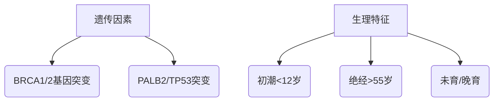

```markdown
# 乳腺癌医学科普：从早期筛查到精准治疗的全面指南

## 一、疾病概述
### 1.1 定义与流行病学
乳腺癌（Breast Cancer）是乳腺上皮细胞在多种致癌因素作用下发生的恶性肿瘤。据WHO 2022年数据：
- 全球年新发病例达230万例（占所有癌症24.5%）
- 中国年新发42万例（年均增长3.9%）
- 死亡率呈现"城市>农村"分布特征

### 1.2 疾病发展特点
| 特征        | 说明                          |
|-------------|-----------------------------|
| 隐匿性      | 早期无明显症状，50%发现即中晚期    |
| 异质性      | 存在10+种分子亚型，治疗反应差异大   |
| 激素依赖性  | 70%病例与雌激素/孕激素受体相关     |

## 二、致病机制与危险因素
### 2.1 不可改变因素


### 2.2 可干预因素
- 代谢相关：肥胖（BMI>30风险增50%）、Ⅱ型糖尿病
- 生活方式：饮酒（每日1杯增10%风险）、缺乏运动
- 外源激素：长期使用雌激素替代疗法>5年

## 三、临床表现与诊断
### 3.1 早期预警信号
```diff
+ 无痛性肿块（87%为首发症状）
+ 乳头溢液（尤其血性分泌物）
+ 皮肤凹陷（"酒窝征"）
- 容易误诊为乳腺增生（需影像学鉴别）
```

### 3.2 诊断金标准
1. 影像学检查
   - 钼靶X线（检出微钙化灶）
   - 超声（鉴别囊实性，准确率92%）
   - MRI（高危人群筛查）

2. 病理诊断流程
   ```
   穿刺活检 → 免疫组化 → 分子分型 → PD-L1检测
   ```

## 四、分子分型与治疗
### 4.1 分子分型标准（St.Gallen 2023）
| 类型         | 占比 | 治疗特点                   |
|--------------|------|--------------------------|
| Luminal A型  | 45%  | 内分泌治疗敏感，化疗获益低   |
| HER2阳性型   | 20%  | 靶向治疗（曲妥珠单抗）关键   |
| 三阴性型     | 15%  | 化疗为主，PD-1抑制剂新选择   |

### 4.2 精准治疗方案
```markdown
**手术选择**
- 保乳手术（肿瘤<3cm，切缘阴性）
- 乳房重建术（假体/自体组织移植）

**系统治疗**
1. 化疗：TC方案（多西他赛+环磷酰胺）
2. 放疗：三维适形放疗（40-50Gy/15-25次）
3. 靶向治疗：CDK4/6抑制剂+内分泌治疗
```

## 五、预防与筛查
### 5.1 三级预防体系
1. 一级预防
   - 保持BMI 18.5-23.9
   - 每周150分钟中强度运动
   - 避免夜间灯光暴露（影响褪黑素分泌）

2. 二级预防
   - 40岁以上：每年1次钼靶+超声
   - 高危人群：补充乳腺MRI

### 5.2 中国筛查指南（2022版）
| 年龄    | 检查方案                  | 频率      |
|---------|-------------------------|-----------|
| 20-39岁 | 临床体检+超声            | 每3年1次  |
| 40-45岁 | 钼靶（致密型加做超声）    | 每年1次   |
| >55岁   | 钼靶联合断层合成技术      | 每2年1次  |

## 六、最新治疗进展
### 6.1 创新疗法
- **ADC药物**：DS-8201（HER2低表达也有效）
- **免疫治疗**：KEYNOTE-522方案（三阴性型pCR率64.8%）
- **人工智能**：DeepHealth系统（钼靶读片准确率98.6%）

### 6.2 液体活检技术
- ctDNA监测微小残留病灶（MRD）
- CTC计数评估治疗反应
- Exosome检测早期复发风险

## 七、患者生存支持
### 7.1 康复管理
- 淋巴水肿防治：气压治疗+功能锻炼
- 生育保护：GnRHa药物卵巢保护
- 心理干预：正念减压疗法（MBSR）

### 7.2 营养支持关键点
- 控制大豆异黄酮摄入量（30-50mg/天）
- 补充维生素D（维持血清浓度≥30ng/ml）
- ω-3脂肪酸：每日1.5g EPA+DHA

## 结语
乳腺癌已进入"可防可治"时代，通过规范的筛查体系（早诊率提升至82%）、精准的治疗方案（5年生存率达90.3%）以及全程健康管理，正在逐步实现从"绝症"到"慢性病"的转变。建议每位女性建立个性化的乳腺健康档案，筑牢防癌抗癌的生命防线。

> **参考文献**：
> 1. 中国抗癌协会乳腺癌诊治指南（2024版）
> 2. NCCN Clinical Practice Guidelines in Oncology (Breast Cancer), Version 3.2024
> 3. 《柳叶刀》全球乳腺癌防治白皮书（2023）
```