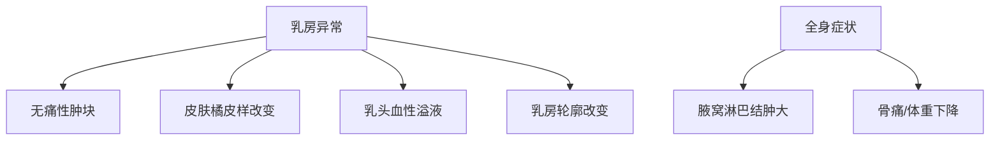
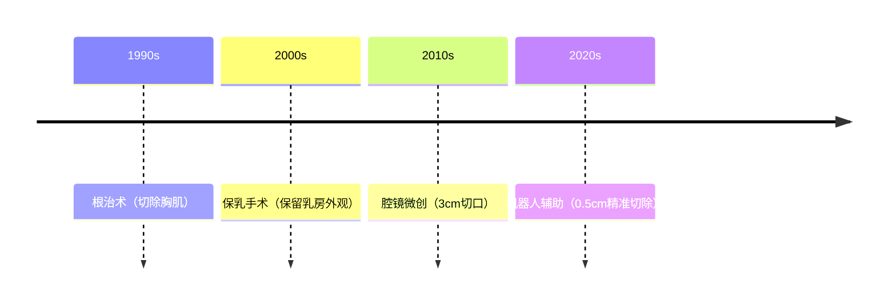

```markdown
# 乳腺癌：从认知到防治的全方位指南

## 概述
乳腺癌是乳腺上皮细胞在致癌因素作用下发生增殖失控的恶性肿瘤，**全球年新发病例超230万**（WHO 2022），位居女性恶性肿瘤发病率首位。我国每年新确诊患者约42万，呈现年轻化趋势（城市女性平均诊断年龄较农村早5-8年）。5年相对生存率可达90%（早期发现时），但晚期患者生存率骤降至28%，凸显早期防治的重要性。


## 二、病因与风险因素

### 2.1 不可变因素
- **遗传易感性**：BRCA1/2基因突变携带者终生发病风险达70%
- **激素暴露史**：初潮<12岁或绝经>55岁者风险增加1.5-2倍
- **电离辐射**：青春期接受胸部放疗者风险提升3倍

### 2.2 可控因素
| 风险因素        | 风险增幅 | 干预措施                  |
|-----------------|----------|---------------------------|
| 肥胖（BMI>30）  | 30-50%   | 每周150分钟中等强度运动   |
| 长期饮酒        | 10-15%   | 限制每日酒精<15g          |
| 未生育/晚育     | 20-25%   | 建议首次分娩年龄<35岁     |

## 三、临床表现与筛查

### 3.1 典型症状矩阵


### 3.2 筛查金标准
- **40-44岁**：年度临床检查 + 超声
- **45-69岁**：每2年乳腺X线摄影（敏感度85%）
- **高危人群**：MRI联合筛查（敏感度>95%）

## 四、诊断路径

### 4.1 影像诊断技术对比
| 检查方式     | 分辨率 | 适用人群         | 局限性           |
|--------------|--------|------------------|------------------|
| 乳腺X线      | 0.1mm  | 脂肪型乳腺       | 致密乳腺显影差   |
| 超声检查     | 2mm    | 各型乳腺         | 操作者依赖性高   |
| 乳腺MRI      | 0.5mm  | 高危人群筛查      | 假阳性率20-30%  |

### 4.2 病理分型体系
1. **Luminal型**（60-70%）：ER+/PR+，内分泌治疗敏感
2. **HER2过表达型**（15-20%）：靶向治疗有效率>70%
3. **三阴性型**（10-15%）：化疗为主要手段

## 五、综合治疗方案

### 5.1 手术演进路线


### 5.2 新型治疗技术
- **术中放疗**：单次大剂量照射，缩短疗程
- **ADC药物**：DS-8201使HER2+患者生存期延长至28个月
- **免疫治疗**：PD-1抑制剂对三阴性型有效率提升40%

## 六、康复管理

### 6.1 淋巴水肿预防
- 术后6周内患肢避免测血压
- 定制压力袖套（20-30mmHg）
- 生物阻抗监测技术早期预警

### 6.2 心理干预方案
- 确诊初期：正念减压训练
- 治疗期间：艺术疗法
- 康复期：同伴支持小组

## 七、预防策略

### 7.1 化学预防
- **他莫昔芬**：高风险人群5年疗程降低49%发病率
- **阿那曲唑**：绝经后女性风险降低53%

### 7.2 数字健康工具
- 智能文胸（温度传感预警）
- AI影像诊断系统（准确率98.5%）
- 用药管理APP（依从性提升30%）

> **专家提示**：建议20岁起每月月经后7-10天进行乳房自检，40岁后建立规范筛查档案。

```

*注：本文数据参考2023年NCCN指南、中国抗癌协会乳腺癌诊治指南与规范（2024版）。具体诊疗请遵医嘱。*