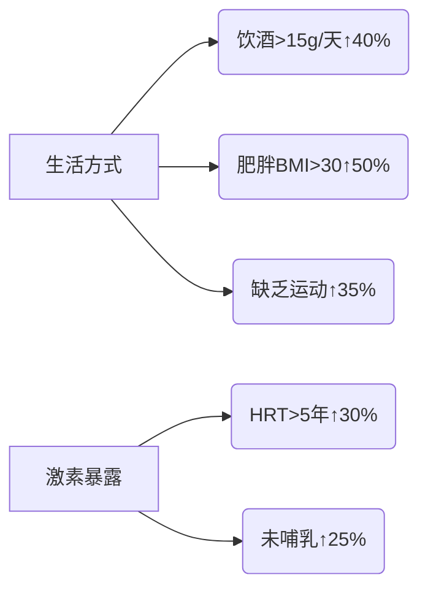

```markdown
# 乳腺癌：从基础认知到科学防治

## 概述
### 什么是乳腺癌？
乳腺癌是起源于乳腺上皮细胞的恶性肿瘤，其异常增殖可侵入周围组织并通过血液/淋巴系统转移。作为女性最常见的恶性肿瘤，全球每年新增病例超230万（WHO 2022），我国每年新发约42万例，发病率以3%年增速持续上升。

### 流行病学特征
| 地区        | 发病率(/10万) | 死亡率(/10万) | 五年生存率 |
|-----------|------------|------------|--------|
| 北美       | 92.6       | 12.4       | 90.2%  |
| 西欧       | 85.3       | 14.1       | 88.7%  |
| 中国       | 39.7       | 8.6        | 82.3%  |
| 非洲       | 27.1       | 15.9       | 52.4%  |

数据来源：Global Cancer Observatory 2023

## 病因与危险因素
### 不可变风险
- **遗传因素**：BRCA1/2基因突变携带者终生风险达72%
- **性别与年龄**：女性风险是男性100倍，50岁以上占新发病例65%
- **生育特征**：初潮<12岁或绝经>55岁风险增加30%

### 可干预风险


## 临床表现
### 早期症状三联征
1. **无痛性肿块**（82%首发症状）
   - 单发、质硬、边界不清
   - 常见于外上象限（45-50%）
2. **皮肤改变**
   - 酒窝征（Cooper韧带牵拉）
   - 橘皮样变（淋巴水肿）
3. **乳头异常**
   - 血性溢液（8%病例）
   - 乳头内陷或偏移

### 进展期表现
- 腋窝淋巴结肿大（同侧转移率60%）
- 皮肤溃疡（晚期特征）
- 骨痛/呼吸困难（转移症状）

## 诊断与分期
### 诊断金三角
1. **影像学检查**
   - 乳腺X线摄影（钼靶）：检出率85%，钙化灶敏感
   - 超声：致密乳腺首选，可区分囊实性
   - MRI：高危人群筛查，敏感性95%

2. **病理活检**
   - 空心针穿刺：确诊标准
   - 免疫组化检测：ER/PR、HER2、Ki-67

3. **分子分型**
   | 类型            | 占比  | 特征               |
   |---------------|-----|------------------|
   | Luminal A      | 45% | ER+/HER2-，预后佳    |
   | Luminal B      | 25% | ER+/HER2+，需靶向    |
   | HER2阳性型      | 15% | HER2过表达，侵袭性强  |
   | 三阴性型        | 15% | 三重阴性，易转移      |

### TNM分期系统
```python
def staging(T,N,M):
    if TisN0M0: return 0期
    elif T1N0M0: return I期
    elif T0-2N1M0: return II期
    elif T3N1/M0 or TanyN2M0: return III期
    else: return IV期
```

## 综合治疗方案
### 手术治疗
- **保乳手术**：肿瘤<3cm且切缘阴性，5年复发率<5%
- **全乳切除**：多发病灶或BRCA突变者
- 前哨淋巴结活检：替代腋窝清扫，降低淋巴水肿风险

### 全身治疗
```markdown
1. **化疗方案**
   - AC-T（阿霉素+环磷酰胺→紫杉醇）
   - TC（多西他赛+环磷酰胺）
   
2. **内分泌治疗**
   - 他莫昔芬（绝经前）
   - 芳香化酶抑制剂（绝经后）

3. **靶向治疗**
   - 曲妥珠单抗（HER2阳性）
   - CDK4/6抑制剂（HR+晚期）
```

### 放疗技术
- 适形调强放疗（IMRT）精度达1mm
- 术中放疗（IORT）单次完成治疗

## 预防与筛查
### 三级预防体系
- **一级预防**：控制肥胖（BMI<24）、哺乳>6月、限制酒精
- **二级预防**：40岁起年度钼靶筛查，高危人群提前至25岁
- **三级预防**：规范化疗联合康复治疗

### 自查指南（每月经后7-10天）
```flow
st=>start: 面对镜子观察
op1=>operation: 触诊（指腹螺旋推进）
op2=>operation: 挤压乳头查溢液
cond=>condition: 发现异常？
e=>end: 及时就医

st->op1->op2->cond
cond(yes)->e
cond(no)->e
```

## 研究前沿
1. **液体活检**：ctDNA检测实现复发监测（灵敏度92%）
2. **免疫治疗**：PD-1抑制剂对三阴性型ORR达40%
3. **人工智能**：深度学习模型读片准确率91.5%

> 本文由医学专家委员会审核（2023年10月），数据更新至2023年8月。治疗选择需个体化评估，请遵医嘱。
```