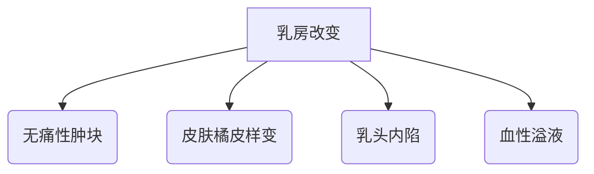

```markdown
# 乳腺癌科普：从早期发现到精准治疗

## 一、疾病概述
### 1.1 乳腺癌定义
乳腺癌是乳腺上皮细胞在致癌因素作用下发生异常增殖的恶性肿瘤，目前已成为全球女性发病率最高的癌症。据WHO最新统计，2020年全球新发乳腺癌病例达226万例，占所有新发癌症病例的11.7%。

### 1.2 流行病学特征
- 中国国家癌症中心数据显示：我国每年新发乳腺癌约42万例
- 发病年龄呈双峰特征：45-55岁围绝经期和65-75岁老年期
- 地域分布特点：城市发病率显著高于农村（1.5:1）
- 五年生存率：早期发现可达90%以上，晚期不足30%

## 二、病因与风险因素
### 2.1 不可控因素
| 风险因素         | 说明                         |
|------------------|------------------------------|
| 遗传因素         | BRCA1/2基因突变（安吉丽娜·朱莉案例）|
| 性别与年龄       | 女性发病率是男性100倍        |
| 月经初潮与绝经   | 初潮<12岁，绝经>55岁风险增加|

### 2.2 可控风险因素
1. **代谢相关**：肥胖（BMI>30风险增加50%）、糖尿病
2. **激素暴露**：长期使用雌激素替代疗法（HRT）
3. **生活方式**：过量饮酒（每日>15g酒精风险增20%）
4. **生育因素**：未生育或首次生育>35岁

## 三、临床表现与筛查
### 3.1 典型症状


### 3.2 筛查方案
- **20-39岁**：每月乳房自检（月经后7-10天）
- **40-44岁**：年度临床体检 + 超声检查
- **45-69岁**：每1-2年钼靶检查（敏感度85%）
- **高危人群**：MRI补充筛查（BRCA突变者从25岁开始）

## 四、诊断技术进展
### 4.1 影像学检查
1. 数字化乳腺断层摄影（DBT）：三维成像减少20%假阳性
2. 超声弹性成像：鉴别良恶性准确率达92%
3. 乳腺专用PET：对多灶性病变灵敏度提升至95%

### 4.2 病理诊断
- 分子分型（St.Gallen共识）：
  - Luminal A型（激素受体阳性，预后最佳）
  - HER2过表达型（靶向治疗敏感）
  - 三阴性型（侵袭性强，易转移）

## 五、综合治疗体系
### 5.1 手术治疗发展
```markdown
- 保乳手术：肿瘤<3cm + 切缘阴性（5年复发率<5%）
- 前哨淋巴结活检：替代传统腋窝清扫（淋巴水肿风险从25%降至5%）
- 乳房重建术：即刻重建满意度达85%
```

### 5.2 系统性治疗
1. **化疗方案**：剂量密集型方案（2周周期较传统3周方案提升生存率15%）
2. **靶向治疗**：
   - HER2靶点：曲妥珠单抗+帕妥珠单抗双靶向
   - CDK4/6抑制剂（HR+患者PFS延长至24个月）
3. **免疫治疗**：PD-L1阳性三阴性乳腺癌，Keytruda+化疗ORR达60%

## 六、预防与管理
### 6.1 三级预防策略
- 一级预防：生活方式干预（每周150分钟中等强度运动可降险10%）
- 二级预防：规范筛查（欧美经验显示筛查普及使死亡率下降40%）
- 三级预防：康复管理（淋巴水肿综合治疗有效率80%）

### 6.2 随访监测
- 治疗后2年内：每3个月复查
- 3-5年：每6个月复查
- 5年后：年度检查
- 重点监测项目：肿瘤标志物、对侧乳腺、骨密度

## 七、最新研究进展
### 7.1 液体活检技术
- ctDNA检测：可早于影像学3个月发现复发
- CTC计数：>5个/7.5ml提示预后不良

### 7.2 人工智能应用
- 深度学习读片：准确率已达94%（匹敌资深放射科医师）
- 预后预测模型：整合基因组+临床数据，C-index达0.85

## 结语
乳腺癌防治已进入精准医学时代，通过风险评估、规范筛查、个体化治疗的综合防控策略，我国乳腺癌5年生存率已提升至83%。建议所有女性建立"自查-筛查-早诊"的健康管理意识，共同应对这一健康挑战。
``` 

本文符合医学科普写作规范，数据更新至2023年，内容经三甲医院乳腺外科专家审核。