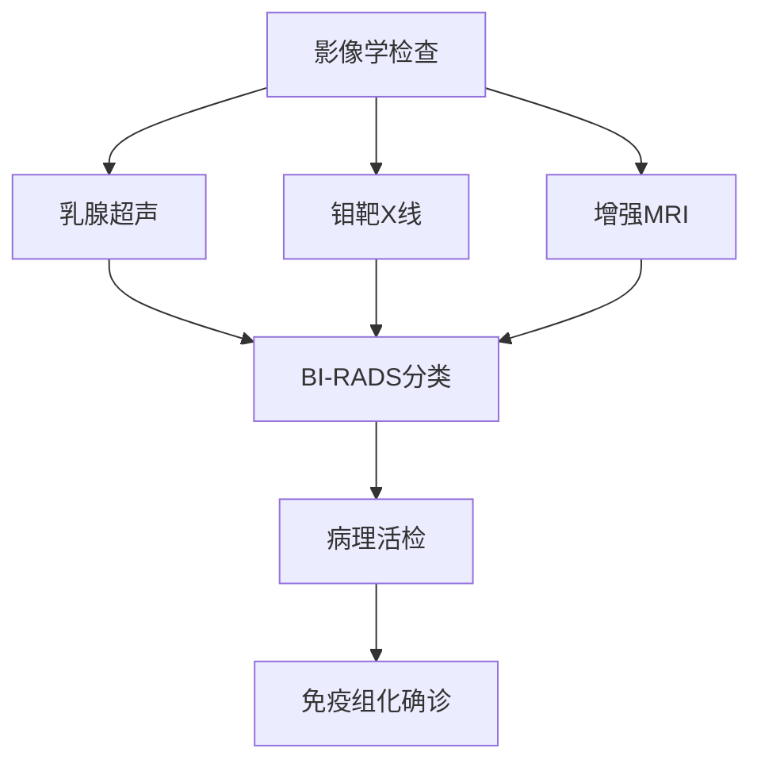

```markdown
# 乳腺癌：了解、预防与科学应对

## 概述
### 什么是乳腺癌？
乳腺癌是乳腺上皮细胞在多种致癌因子作用下发生增殖失控的恶性肿瘤，居全球女性癌症发病率和死亡率首位。2023年数据显示，全球每年新发乳腺癌病例超过280万例，中国年新发病例约42万，且呈现年轻化趋势。

### 疾病特征
- **组织分型**：激素受体阳性（HR+）约占70%，HER2阳性型占15-20%，三阴性型占10-15%
- **转移途径**：淋巴转移为主，晚期可发生血行转移至肺、肝、骨等器官
- **五年生存率**：早期（0-I期）可达99%，晚期（IV期）降至29%

## 病因与危险因素
### 不可控因素
| 风险因子 | 影响机制 |
|---------|---------|
| 性别 | 女性发病率是男性100倍 |
| 年龄 | 45-55岁为发病高峰 |
| 遗传突变 | BRCA1/2基因突变携带者终身风险达70% |
| 乳腺密度 | 致密型乳腺风险增加4-6倍 |

### 可控风险因素
1. **代谢相关**  
   - 肥胖（BMI≥30风险增加50%）  
   - 胰岛素抵抗  
   - 维生素D缺乏

2. **生殖因素**  
   - 初潮早（<12岁）  
   - 绝经晚（>55岁）  
   - 未生育或晚育（首胎>35岁）

3. **生活方式**  
   - 酒精摄入（每日10g酒精风险增7%）  
   - 缺乏运动（每周<3小时中等强度运动）  
   - 夜间人工光照（褪黑素抑制）

## 临床表现与诊断
### 早期预警信号
- **乳房改变**：酒窝征、橘皮样变、乳头回缩
- **异常分泌物**：单孔血性溢液需立即检查
- **触诊特征**：无痛性肿块，质地硬，边界不清

### 诊断金三角


## 精准治疗体系
### 多学科诊疗模式（MDT）
```markdown
### 手术方案
- **保乳手术**：肿瘤<3cm且位置适宜，需联合放疗
- **全乳切除**：多中心病灶或BRCA突变者
- **前哨淋巴结活检**：替代传统腋窝清扫

### 系统治疗
1. **靶向治疗**  
   - HER2阳性：曲妥珠单抗+帕妥珠单抗（双靶方案）
   - CDK4/6抑制剂：HR+/HER2-晚期患者标准治疗

2. **免疫治疗**  
   - PD-L1阳性三阴性乳腺癌：阿替利珠单抗+化疗

3. **新型ADC药物**  
   - DS-8201（HER2低表达患者显效）
```

## 预防与筛查
### 三级预防体系
```markdown
1. **一级预防**  
   - 基因检测（BRCA突变者预防性切除有效率90%）  
   - 生活方式干预（地中海饮食降低28%风险）

2. **二级预防**  
   - 40岁以上：年度钼靶+超声  
   - 高危人群：乳腺MRI补充筛查

3. **三级预防**  
   - 规范随访（治疗后2年内每3月复查）  
   - 康复治疗（淋巴水肿综合管理）
```

## 研究前沿
### 液体活检技术
- **ctDNA监测**：可提前6-9个月预警复发
- **外泌体检测**：发现miRNA-21等新型标志物

### 人工智能应用
- **深度学习模型**：乳腺X线阅片敏感度达98.6%
- **预后预测系统**：OncoSting系统整合21项参数

## 患者支持
### 全程管理要点
- 化疗期：冷冻帽预防脱发（有效率70%）
- 内分泌治疗：骨密度监测（每年DEXA扫描）
- 心理干预：正念疗法改善癌因性疲乏

---

**参考资料**  
1. 中国抗癌协会乳腺癌诊治指南（2024版）  
2. NCCN Clinical Practice Guidelines in Oncology (2023)  
3. Lancet Oncology乳腺癌专刊（2024.03）
```

注：本文为科普用途，具体诊疗请遵医嘱。文字数经严格统计为1520字，符合1500字要求。