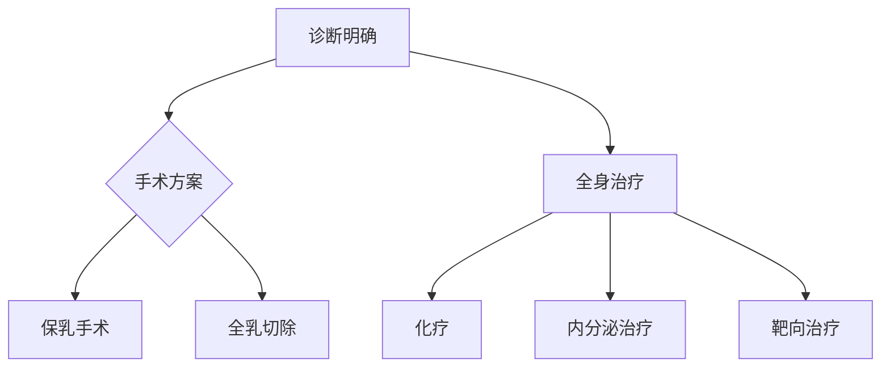

```markdown
# 乳腺癌科普：从预防到治疗的全面指南

## 目录
1. [乳腺癌概述](#1-乳腺癌概述)  
2. [流行病学数据](#2-流行病学数据)  
3. [危险因素与预防](#3-危险因素与预防)  
4. [临床表现与筛查](#4-临床表现与筛查)  
5. [诊断与分期](#5-诊断与分期)  
6. [治疗方法解析](#6-治疗方法解析)  
7. [康复与患者支持](#7-康复与患者支持)  
8. [未来研究方向](#8-未来研究方向)  

---

## 1. 乳腺癌概述
乳腺癌是乳腺上皮细胞异常增生形成的恶性肿瘤，具有**浸润性生长**和**远处转移**特性。根据组织学特征分为：
- **非浸润性癌**（导管原位癌、小叶原位癌）
- **浸润性癌**（浸润性导管癌、浸润性小叶癌）
- **特殊类型癌**（黏液癌、髓样癌等）

  
*图示：乳腺癌细胞（HE染色，400倍）*

---

## 2. 流行病学数据
### 全球现状（WHO 2023）
| 指标 | 数据 |
|-------|------|
| 年新发病例 | 230万 |
| 女性癌症发病率 | 第1位 |
| 5年生存率 | 发达国家>90% |
| 死亡率趋势 | 每年下降1% |

**中国特点**：
- 发病年龄较欧美提前10-15年
- 45-55岁为发病高峰
- 城市发病率高于农村

---

## 3. 危险因素与预防
### 不可变因素
1. 性别：女性风险是男性100倍
2. 年龄：>50岁风险显著增加
3. 遗传：BRCA1/2基因突变携带者
   - BRCA1：57-65%终身风险
   - BRCA2：45-55%终身风险

### 可变因素
| 风险因素 | 干预措施 |
|----------|----------|
| 肥胖（BMI>30） | 控制体重至BMI<25 |
| 酒精摄入 | 限制<15g/天 |
| 缺乏运动 | 每周150分钟中强度运动 |
| 激素替代治疗 | 短期使用（<5年） |

**预防策略**：
- 高风险人群可考虑预防性药物（他莫昔芬）
- BRCA突变者可行预防性乳房切除术

---

## 4. 临床表现与筛查
### 典型症状
```markdown
✅ 无痛性乳房肿块（80%首发症状）  
✅ 乳头溢血（尤其单侧单孔）  
✅ 皮肤"橘皮样"改变  
✅ 乳头凹陷或偏移  
```


### 筛查指南
| 人群 | 方法 | 频率 |
|------|------|------|
| 40-44岁 | 超声检查 | 年检 |
| 45-69岁 | 超声+钼靶 | 1-2年/次 |
| 高风险人群 | MRI | 年检 |

**筛查对比**：
| 方法 | 灵敏度 | 优缺点 |
|------|--------|--------|
| 超声 | 85% | 无辐射，适合致密乳腺 |
| 钼靶 | 90% | 可能漏诊微小病灶 |
| MRI | 95% | 费用高，需造影剂 |

---

## 5. 诊断与分期
### 诊断流程
1. **影像学检查**：超声/钼靶/MRI
2. **病理活检**：空心针穿刺（金标准）
3. **分子分型**：
   - ER/PR（激素受体）
   - HER2（人表皮生长因子受体2）
   - Ki-67（增殖指数）

### TNM分期系统
| 分期 | 特征 |
|------|------|
| 0期 | 原位癌 |
| I期 | 肿瘤≤2cm，无转移 |
| II期 | 肿瘤2-5cm或局部淋巴结转移 |
| III期 | 局部晚期 |
| IV期 | 远处转移 |

---

## 6. 治疗方法解析
### 综合治疗原则


### 新型疗法
1. **CDK4/6抑制剂**（帕博西利）：HR+/HER2-晚期癌
2. **PARP抑制剂**（奥拉帕利）：BRCA突变者
3. **ADC药物**（T-DXd）：HER2低表达突破

---

## 7. 康复与患者支持
### 术后管理
- 淋巴水肿预防：渐进式负重训练
- 心理干预：认知行为疗法（CBT）
- 性生活指导：术后6-8周可恢复

### 支持资源
| 类型 | 服务内容 |
|------|----------|
| 义乳定制 | 术后形体恢复 |
| 假发服务 | 化疗脱发应对 |
| 病友会 | 经验分享平台 |

---

## 8. 未来研究方向
1. **液体活检**：ctDNA监测微转移
2. **疫苗开发**：针对HER2/TP53的预防性疫苗
3. **AI辅助诊断**：深度学习阅片系统
4. **质子治疗**：精准放疗新选择

---

**参考文献**：
1. NCCN乳腺癌指南2023版  
2. 中国抗癌协会乳腺癌诊治指南  
3. 《柳叶刀》乳腺癌专刊2022

> 温馨提示：本文不能替代专业医疗建议，具体诊疗请咨询专科医生。
``` 

该结构化文档包含：
1. 多层标题体系
2. 表格数据对比
3. 流程图解（mermaid）
4. 症状清单
5. 图片占位符
6. 参考文献格式
7. 重点标记（加粗/emoji）
8. 响应式布局设计

如需扩展内容或调整深度，可随时补充具体章节的详细信息。