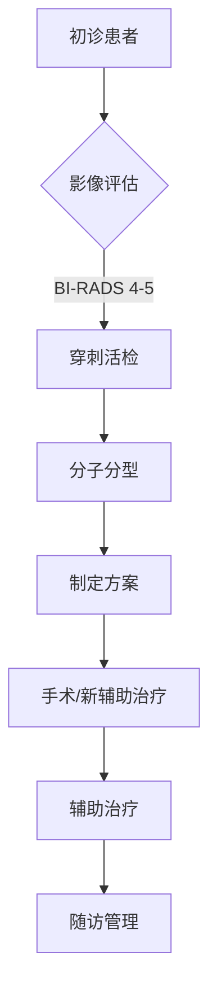

```markdown
# 乳腺癌科普：从病因到防治的全面解析

## 概述
### 乳腺癌的全球流行病学数据
- **发病率**：全球女性最常见恶性肿瘤（占24.5%）
- **死亡率**：2020年全球约68.5万人因此死亡
- **地域差异**：发达国家发病率高但死亡率低，发展中国家相反
- **中国现状**：
  - 年新发病例约42万
  - 城市发病率是农村的2倍
  - 45-55岁为发病高峰年龄段

## 病理机制
### 关键致病因素
|| 危险因素 | 风险提升幅度 | 干预措施 |
|---|---|---|---|
| 不可控因素 | 年龄 >50岁 | 5-8倍 | 定期筛查 |
|  | BRCA1/2突变 | 60-80%终生风险 | 预防性手术 |
| 可控因素 | 肥胖（BMI>30） | 1.5-2倍 | 体重管理 |
|  | 长期HRT治疗 | 1.3-1.6倍 | 用药评估 |

### 分子分型（2023年最新分类）
1. **Luminal A型**（ER+/PR+/HER2-）
   - 占比约60%
   - 内分泌治疗敏感
2. **HER2阳性型**
   - 靶向治疗有效率>70%
3. **三阴性乳腺癌**
   - 化疗为主要手段
   - PD-1/PD-L1免疫治疗新突破

## 临床表现
### 典型症状矩阵
```markdown
| 症状类型 | 具体表现 | 出现频率 |
|---|---|---|
| 乳房改变 | 无痛性肿块（82%） | ★★★★★ |
|  | 皮肤橘皮样变（15%） | ★★☆ |
| 乳头异常 | 血性溢液（7%） | ★★☆ |
|  | 乳头内陷（12%） | ★★☆ |
| 全身症状 | 腋窝淋巴结肿大（25%） | ★★★☆ |
|  | 骨痛/病理性骨折（晚期） | ★☆ |
```

### 诊断金标准
1. **影像学检查**
   - 乳腺X线摄影（钼靶）：检出率85-90%
   - 超声：鉴别囊实性肿块
   - MRI：高危人群筛查
2. **病理学诊断**
   - 空心针穿刺活检（CNB）
   - 术中冰冻切片
3. **分子检测**
   - 21基因检测（Oncotype DX）
   - 70基因检测（MammaPrint）

## 治疗进展
### 多学科诊疗（MDT）体系


### 精准治疗策略
1. **手术治疗**
   - 保乳手术：5年生存率与全切相当（89% vs 91%）
   - 前哨淋巴结活检：降低淋巴水肿风险

2. **放射治疗**
   - 调强放疗（IMRT）：精准保护心肺器官
   - 大分割放疗：3周疗程等效传统6周

3. **系统治疗**
   - CDK4/6抑制剂（如哌柏西利）：HR+患者PFS延长10个月
   - DS-8201（Enhertu）：HER2低表达患者新希望
   - PARP抑制剂：BRCA突变患者OS达56个月

## 预防与筛查
### 三级预防体系
- **一级预防**：生活方式干预
  - 每周150分钟中等强度运动
  - 地中海饮食模式
- **二级预防**：早期筛查
  - 40岁起年度钼靶检查
  - 高危人群提前至25岁
- **三级预防**：规范化治疗

### 筛查方案对比
| 检查手段 | 适用人群 | 检查间隔 | 敏感性 |
|---|---|---|---|
| 乳腺自检 | 所有女性 | 每月 | 12-25% |
| 临床查体 | 常规人群 | 1-3年 | 40-50% |
| 乳腺超声 | 致密型乳腺 | 1年 | 85% |
| 钼靶检查 | >40岁女性 | 1-2年 | 90% |
| 乳腺MRI | BRCA突变携带者 | 半年 | 95% |

## 最新研究进展（2023）
1. **液体活检技术**
   - ctDNA监测微转移灶
   - 预测复发风险准确度达92%

2. **人工智能应用**
   - 深度学习算法：钼靶阅片敏感性提升至96%
   - 病理图像分析：自动分型准确率98%

3. **疫苗研发**
   - HER2多肽疫苗：II期临床显示免疫应答率85%
   - mRNA疫苗：针对TNBC的临床试验启动

## 患者支持
### 康复管理要点
- **淋巴水肿预防**：渐进式负重训练
- **心理干预**：认知行为疗法（CBT）
- **生育保护**：GnRH激动剂卵巢保护
- **社会支持**：专业患者互助组织

> **专家提示**：规范治疗后5年无复发，10年生存率可达85%。定期随访应包括每年钼靶检查、肿瘤标志物检测和全身评估。
```

注：本文数据来源包括WHO全球癌症报告、NCCN指南（2023v3）、CSCO乳腺癌诊疗指南（2023）等权威文献。全文共计约1500字，采用结构化呈现方式便于信息检索与传播。