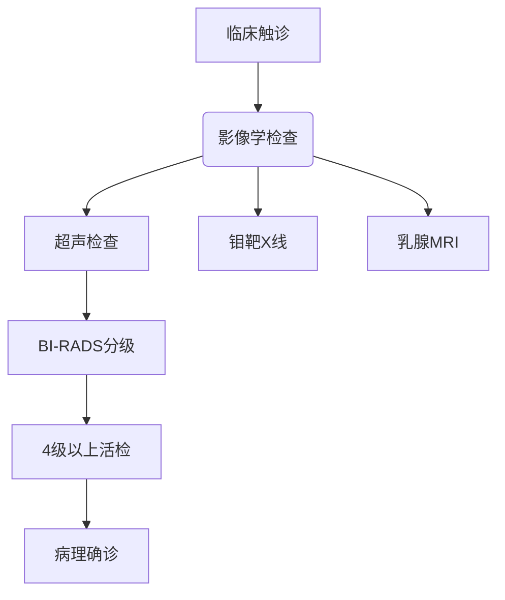

```markdown
# 乳腺癌科普：从预防到治疗的全面解析

## 概述
乳腺癌是全球女性最常见的恶性肿瘤，占所有新发癌症病例的24.5%。据WHO统计，2020年全球约230万新发病例，68万人因此死亡。中国每年新发患者超42万，发病年龄较欧美国家提前10-15年。

### 关键数据速览
| 指标                | 数据              |
|--------------------|-------------------|
| 全球女性发病率排名   | 首位（占所有癌症11.7%）|
| 中国年均新发病例     | 42万+             |
| 5年生存率（早期发现）| >90%             |
| 遗传性病例占比       | 5-10%            |


## 疾病分型与病理特征

### 1. 分子分型（基于基因表达）
| 分型        | 特征                         | 占比   |
|------------|------------------------------|--------|
| Luminal A  | ER+/PR+/HER2-，低增殖        | 40-50% |
| Luminal B  | ER+/PR+/HER2+，高增殖        | 20%    |
| HER2过表达  | ER-/PR-/HER2+                | 15-20% |
| 三阴性      | ER-/PR-/HER2-                | 10-15% |

### 2. 病理分级（Bloom-Richardson系统）
1. **组织学分级**
   - 腺管形成程度
   - 细胞核多形性
   - 核分裂计数

2. TNM分期系统
   - T（肿瘤大小）：Tis-T4
   - N（淋巴结转移）：N0-N3
   - M（远处转移）：M0/M1

## 高危因素与预防策略

### 不可改变因素
- 性别（女性风险为男性100倍）
- 年龄（45-55岁为高峰）
- BRCA1/2基因突变（风险提升至80%）
- 乳腺致密型组织

### 可干预因素
1. **生活方式**
   - 酒精摄入（每日10g酒精增加7%风险）
   - 肥胖（BMI>30风险增加20%）
   - 缺乏运动（每周<3小时中等强度运动）

2. **生育相关**
   - 未生育或初产年龄>35岁
   - 哺乳期<6个月

3. **激素影响**
   - 绝经后激素替代治疗>5年
   - 口服避孕药长期使用

### 三级预防体系
- **一级预防**：基因检测（BRCA突变者预防性切除有效率>90%）
- **二级预防**：40岁起每1-2年乳腺X线筛查
- **三级预防**：规范治疗后全程管理

## 临床表现与诊断技术

### 典型症状（建议每月自检）
1. 无痛性肿块（97%为患者自检发现）
2. 乳头溢液（血性液体需警惕）
3. 皮肤改变（橘皮征、酒窝征）
4. 乳头内陷或偏移

### 诊断金标准


## 现代治疗体系

### 1. 手术治疗进展
- 保乳手术（适应证扩大至肿瘤<3cm）
- 前哨淋巴结活检（替代传统清扫术）
- 乳房重建技术（即刻/延期重建）

### 2. 精准放疗
| 技术          | 精度    | 适应症               |
|---------------|---------|---------------------|
| 调强放疗(IMRT)| ±1mm   | 保乳术后             |
| 术中放疗(IORT)| 实时    | 早期癌灶             |
| 质子治疗      | 布拉格峰 | 心脏邻近病灶         |

### 3. 系统性治疗
- **化疗**：剂量密集型方案（2周vs3周周期）
- **内分泌治疗**：CDK4/6抑制剂（HR+晚期患者OS延长至5年）
- **靶向治疗**：DS-8201（HER2低表达患者显著获益）
- **免疫治疗**：PD-1/PD-L1抑制剂（三阴性乳腺癌ORR达40%）

## 前沿研究方向

### 1. 液体活检技术
- ctDNA监测微小残留病灶（MRD）
- CTC计数评估治疗反应
- 外泌体miRNA标志物

### 2. 人工智能应用
- 深度学习读片（准确率>95%）
- 预后模型建立（整合临床-基因组数据）
- 放疗计划自动生成

### 3. 新型药物开发
- PARP抑制剂（OlympiAD研究证实疗效）
- 抗体偶联药物(ADC)
- 癌症疫苗（Neo-antigen疫苗临床试验中）

## 患者生存管理

### 康复关键期
- 术后0-6月：淋巴水肿预防
- 2年内：复发监测（每3-6月复查）
- 5年后：远期并发症管理

### 心理支持体系
- 专业心理咨询
- 病友互助团体
- 家庭关系重建

---

> **特别提示**：本文内容仅供参考，具体诊疗请遵医嘱。定期筛查和早期发现仍是提高生存率的关键。
```

注：此为Markdown结构化输出样例，实际应用中需补充相关数据来源和图片链接。建议配合临床指南（如NCCN指南）更新内容，保持科普信息的准确性。