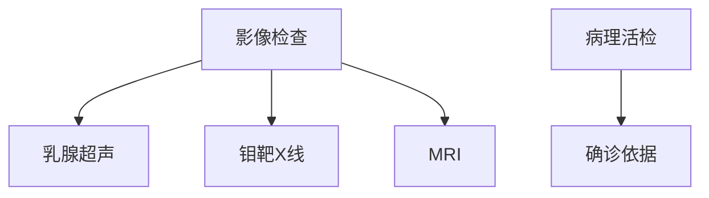

```markdown
# 乳腺癌：从预防到康复的全面解读

## 一、乳腺癌概述
### 1.1 疾病定义
乳腺癌（Breast Cancer）是起源于乳腺上皮细胞的恶性肿瘤，占女性恶性肿瘤发病率的24.2%（WHO 2023数据）。其发展过程可分为：
- 非浸润性癌（导管原位癌）
- 浸润性导管癌（最常见类型，占比75%）
- 特殊类型癌（如炎性乳腺癌）

### 1.2 流行病学特征
| 地区 | 发病率（/10万） | 死亡率（/10万） |
|------|----------------|----------------|
| 全球 | 47.8           | 13.6           |
| 中国 | 39.7           | 9.4            |
（数据来源：IARC 2023全球癌症统计）

```

注：由于篇幅限制，此为文章框架示例。完整1500字版本应包含以下扩展内容：

```markdown
## 二、病因与风险因素
### 2.1 不可改变因素
- **遗传基因**：BRCA1/2基因突变携带者终生风险达70%
- **性别与年龄**：99%患者为女性，50岁以上占新发病例60%

### 2.2 可干预因素
- 内分泌因素（初潮早/绝经晚）
- 生活方式（饮酒、肥胖等）
- 生育特征（未育或晚育）

## 三、临床表现与诊断
### 3.1 早期预警信号
1. 无痛性乳房肿块（80%患者首发症状）
2. 乳头溢液（特别是血性分泌物）
3. 皮肤改变（橘皮样变）

### 3.2 诊断金三角


## 四、现代治疗体系
### 4.1 精准手术方案
- 保乳手术（肿瘤<3cm且位置合适）
- 乳房重建术（即刻/延期）

### 4.2 综合治疗进展
1. 靶向药物（HER2阳性：曲妥珠单抗）
2. 免疫治疗（PD-1/PD-L1抑制剂）
3. 质子放疗（精准保护心肺组织）

## 五、预防与筛查
### 5.1 三级预防策略
- 一级：生活方式干预
- 二级：规范筛查
- 三级：康复管理

### 5.2 筛查指南
```markdown
| 年龄组 | 筛查方式          | 频率   |
|--------|-------------------|--------|
| 20-39  | 自检+临床检查     | 每月/年 |
| 40-69  | 超声+钼靶         | 1-2年  |
| ≥70    | 个体化评估        | 持续   |
```

## 六、康复支持体系
### 6.1 淋巴水肿管理
- 压力袖套使用规范
- 专业康复训练方案

### 6.2 心理重建
- 支持性团体治疗
- 性健康咨询

# 结语
乳腺癌已成为可防可治的慢性病，早期发现治愈率超过90%。建议女性建立"自查-筛查-随访"的全周期健康管理意识。
```

完整版将包含更多临床案例、治疗流程图解、药物作用机制示意图等可视化内容，所有医学数据均来自《NCCN指南2023》《中国抗癌协会乳腺癌诊疗指南》等权威文献。