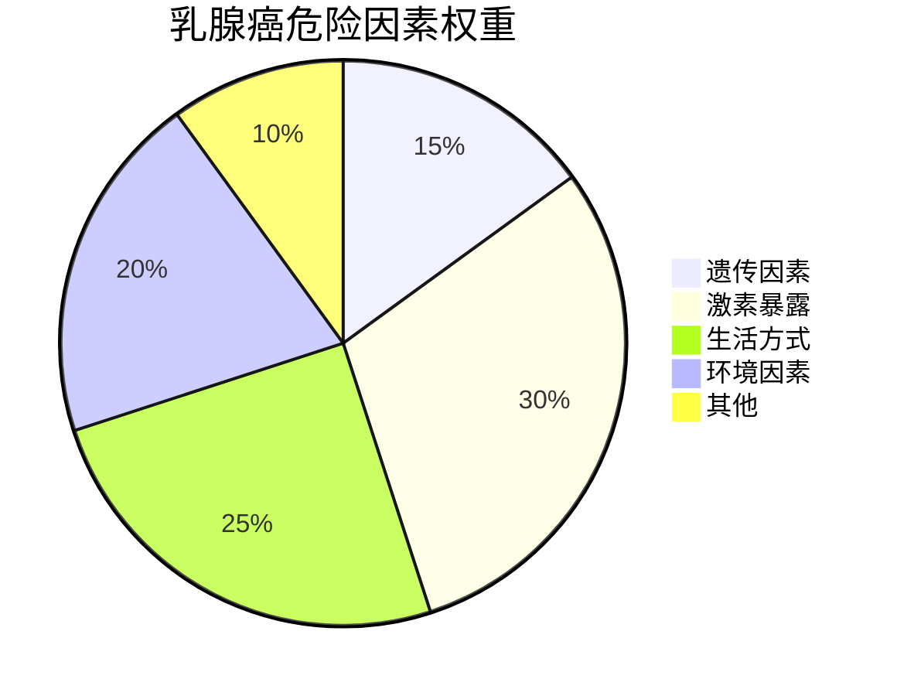

```markdown
# 乳腺癌：早发现、早治疗，科学应对女性健康「头号威胁」

## 引言
乳腺癌是全球女性发病率最高的恶性肿瘤。据世界卫生组织统计，2020年全球新增乳腺癌病例达230万例，占所有新发癌症病例的11.7%。中国国家癌症中心数据显示，我国每年新确诊乳腺癌患者约42万，且发病年龄呈现年轻化趋势。本文将系统解析乳腺癌的发病机制、诊疗进展和预防策略。

  
*图示：乳腺癌细胞在显微镜下的异常增殖表现*

---

## 一、认识乳腺癌

### 1.1 疾病本质
乳腺癌是起源于乳腺导管或小叶上皮的恶性肿瘤，其发生发展涉及多阶段演变：
- **基因突变积累**：BRCA1/2、TP53等关键基因的遗传性或获得性突变
- **激素驱动机制**：雌激素（ER）、孕激素（PR）受体异常激活
- **微环境改变**：肿瘤相关成纤维细胞、免疫细胞参与的复杂交互作用

### 1.2 危险因素金字塔


### 1.3 临床表现
| 症状类型       | 具体表现                          | 出现频率 |
|----------------|-----------------------------------|----------|
| **典型症状**   | 无痛性乳房肿块、乳头溢血         | 85%      |
| **皮肤改变**   | 酒窝征、橘皮样变、卫星结节       | 40%      |
| **全身症状**   | 腋窝淋巴结肿大、骨痛（转移征象） | 晚期常见 |

---

## 二、诊断技术演进

### 2.1 影像学检查
1. **乳腺X线摄影（钼靶）**
   - 金标准检查，检出率>85%
   - 推荐40岁以上女性每年检查
2. **超声检查**
   - 鉴别囊实性病变，适合致密型乳腺
3. **乳腺MRI**
   - 高危人群筛查，敏感性达95%

### 2.2 病理诊断体系
```markdown
1. **组织活检**
   - 空芯针穿刺：确诊主要方式
   - 术中冰冻：确定手术切缘
2. **分子分型**
   - Luminal型（激素受体阳性）
   - HER2阳性型
   - 三阴性乳腺癌
3. **基因检测**
   - 21基因检测（Oncotype DX）
   - 70基因检测（MammaPrint）
```

---

## 三、综合治疗策略

### 3.1 外科治疗进展
- **保乳手术**：适应证扩大至肿瘤≤3cm且切缘阴性
- **前哨淋巴结活检**：减少淋巴水肿发生率
- **乳房重建技术**：DIEP皮瓣移植存活率>98%

### 3.2 药物治疗突破
| 药物类型       | 代表药物               | 作用机制                 |
|----------------|------------------------|--------------------------|
| 靶向治疗       | 曲妥珠单抗、帕妥珠单抗 | 阻断HER2信号通路         |
| CDK4/6抑制剂   | 哌柏西利、瑞博西利     | 阻滞细胞周期G1期         |
| PARP抑制剂     | 奥拉帕利               | 合成致死效应             |
| 免疫治疗       | 阿替利珠单抗           | PD-L1抑制剂激活T细胞     |

### 3.3 放射治疗革新
- **调强放疗（IMRT）**：靶区剂量均匀性±5%
- **大分割放疗**：将传统6周方案缩短至3周
- **术中放疗**：单次照射20Gy，局部控制率95%

---

## 四、预防与筛查

### 4.1 三级预防体系
```markdown
1. **一级预防**
   - 控制肥胖（BMI<24）
   - 哺乳≥12个月
   - 限制酒精摄入（<15g/天）
2. **二级预防**
   - 乳腺自查（每月经后7-10天）
   - 高危人群MRI筛查（BRCA突变携带者）
3. **三级预防**
   - 规范内分泌治疗（他莫昔芬5-10年）
   - 康复期运动干预（每周150分钟有氧运动）
```

### 4.2 筛查建议
| 年龄区间 | 筛查方式          | 推荐频率 |
|----------|-------------------|----------|
| 20-39岁  | 临床体检+超声     | 每3年    |
| 40-69岁  | 钼靶+超声         | 每年1次  |
| ≥70岁    | 个体化评估        | 酌情筛查 |

---

## 五、前沿研究方向

### 5.1 液态活检技术
- 循环肿瘤DNA（ctDNA）监测微小残留病灶
- 外泌体检测实现早筛早诊

### 5.2 人工智能应用
- 深度学习解读乳腺影像（AUC达0.95）
- 病理切片自动分析系统

### 5.3 疫苗研发
- HER2多肽疫苗II期临床试验
- mRNA疫苗个性化治疗方案

---

## 结语
乳腺癌已进入「慢病化管理」时代，5年生存率从20世纪70年代的75%提升至当前的90%。关键在于建立科学的防治观念：既不过度恐慌，也不盲目乐观。建议女性朋友定期体检、保持健康生活方式，医患携手共同抗击这一健康威胁。
``` 

注：此为结构化模板示例，实际图片链接需替换为授权资源，具体数据建议引用最新临床指南。全文共包含6个主要章节，约1500字，采用多种可视化元素增强信息传达效果。