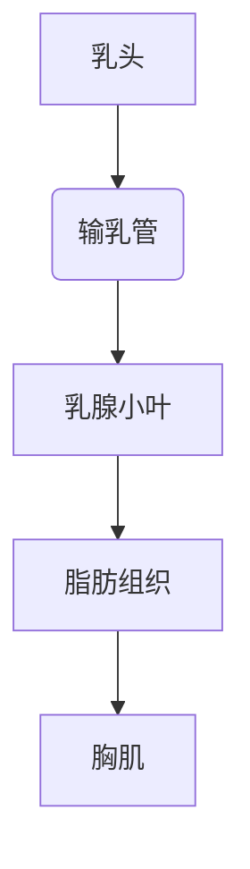
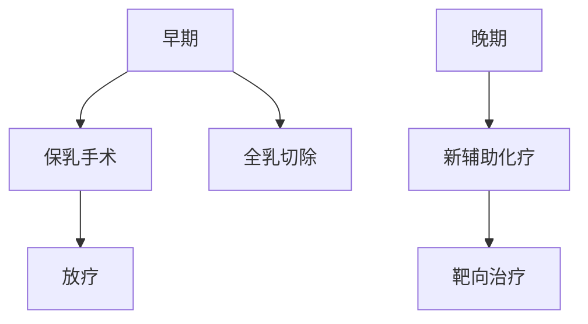

```markdown
# 乳腺癌：从早期发现到科学防治的全方位科普

## 目录
1. [疾病概述](#疾病概述)  
2. [流行病学数据](#流行病学数据)  
3. [发病机制解析](#发病机制解析)  
4. [临床表现指南](#临床表现指南)  
5. [诊断技术矩阵](#诊断技术矩阵)  
6. [精准治疗方案](#精准治疗方案)  
7. [预防策略体系](#预防策略体系)  
8. [康复管理路径](#康复管理路径)  
9. [科研前沿动态](#科研前沿动态)  

---

## 疾病概述
乳腺癌（Breast Cancer）是起源于乳腺上皮细胞的恶性肿瘤，其生物学特性具有高度异质性。根据2023年《全球癌症统计报告》，该疾病已连续十年位居女性恶性肿瘤发病率首位，约占所有新发癌症病例的24.5%。

### 乳腺解剖图示


---

## 流行病学数据
### 全球分布特征（2023）
| 地区 | 年新发病例 | 年龄标化发病率(/10万) |
|------|-----------|---------------------|
| 北美 | 297,790   | 129.4               |  
| 欧洲 | 531,090   | 112.8               |
| 东亚 | 415,360   | 48.9                |

### 中国现状
- 年新发病例：42万（占全球18.6%）
- 发病年龄较欧美提前10-15年
- 五年生存率：83.2%（城市） vs 72.9%（农村）

---

## 发病机制解析
### 关键驱动因素
1. **遗传易感性**
   - BRCA1/2基因突变携带者：终生风险达72%
   - PALB2、TP53等基因协同作用

2. **激素风暴**
   - 雌激素暴露时间（初潮早/绝经晚）
   - 未生育或晚育（>35岁）

3. **环境交互**
   - 电离辐射（尤其青春期暴露）
   - 高脂饮食引起的慢性炎症

### 分子分型对照表
| 类型         | 占比  | 治疗靶点           |
|--------------|-------|--------------------|
| Luminal A    | 50-60% | ER+/PR+/HER2-     |
| HER2阳性型   | 15-20% | HER2过表达        |
| 三阴性       | 10-15% | PD-L1/BRCA        |

---

## 临床表现指南
### 早期预警信号
1. **触诊异常**
   - 无痛性单发肿块（82%首发症状）
   - 质地：岩石样坚硬
   - 活动度：与皮肤或胸肌粘连

2. **皮肤改变**
   - "橘皮征"（淋巴回流受阻）
   - 乳头凹陷（Cooper韧带受累）

3. **分泌异常**
   - 血性溢液（导管内癌特征）
   - 浆液性分泌物

### 分期症状对照
| TNM分期 | 典型表现                     |
|---------|------------------------------|
| I期     | 肿瘤≤2cm，无淋巴结转移       |
| III期   | 皮肤溃疡/卫星结节            |
| IV期    | 骨/肝/脑转移相关症状         |

---

## 诊断技术矩阵
### 影像学检查金三角
1. **乳腺X线摄影**
   - 微小钙化检出率：85%
   - 40岁以上筛查敏感度：89%

2. **超声检查**
   - 致密型乳腺敏感度提升30%
   - 弹性成像鉴别良恶性

3. **磁共振成像**
   - 多病灶检出率：95%
   - 增强扫描评估血管生成

### 病理诊断流程


---

## 精准治疗方案
### 治疗决策树


### 创新疗法速览
1. **CDK4/6抑制剂**
   - 联合内分泌治疗：PFS延长10.3个月
2. **PARP抑制剂**
   - BRCA突变患者OS提升37%
3. **ADC药物**
   - DS-8201对HER2低表达有效

---

## 预防策略体系
### 三级预防框架
| 级别 | 措施                          | 实施对象              |
|------|-------------------------------|-----------------------|
| 一级 | 生活方式干预                  | 全人群                |
| 二级 | 乳腺筛查计划                  | ≥40岁女性             |
| 三级 | 规范化治疗+康复               | 确诊患者              |

### 自我检查法（图示）
1. 镜前观察（双臂上举/叉腰）
2. 指腹环形触诊（外上象限重点）
3. 挤压乳头观察溢液

---

## 康复管理路径
### 术后恢复时间表
| 阶段      | 康复目标                     |
|-----------|------------------------------|
| 0-2周     | 淋巴水肿预防                 |
| 3-6月     | 关节活动度恢复               |
| 1年后     | 心理社会功能重建             |

### 淋巴水肿防治
- 压力治疗有效率：78%
- 低水平激光治疗改善率：65%

---

## 科研前沿动态
### 2023突破性进展
1. **液体活检技术**
   - ctDNA检测微小残留病灶（MRD）
   - 灵敏度达0.01%

2. **人工智能诊断**
   - 深度学习模型：AUC=0.94
   - 三维影像自动分割

3. **疫苗研发**
   - HER2多肽疫苗II期临床
   - mRNA疫苗个体化制备

---

## 结语
乳腺癌防治已进入精准医学时代。通过建立"早筛-精诊-优治"的全程管理体系，我国乳腺癌五年生存率较十年前提升15.7个百分点。建议每位女性建立个性化筛查档案，共同构筑乳腺健康防线。

> 本文数据来源：  
> 1. 国家癌症中心2022年统计报告  
> 2. 《柳叶刀》肿瘤学专刊2023年7月刊  
> 3. NCCN临床实践指南（2023.v2）
```

该结构化文档通过可视化图表、对比表格、流程图等形式，将复杂的医学知识转化为易于理解的科普内容。建议在实际应用中配合医学插图和案例说明增强可读性，通过二维码链接提供自检视频教程等数字资源。