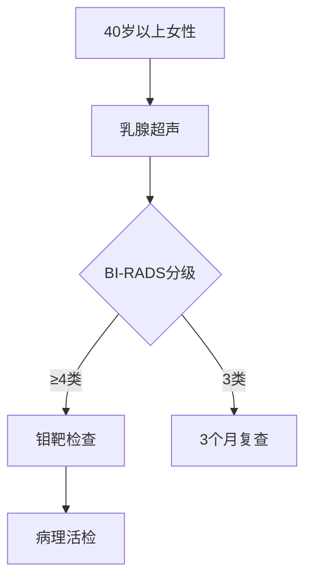
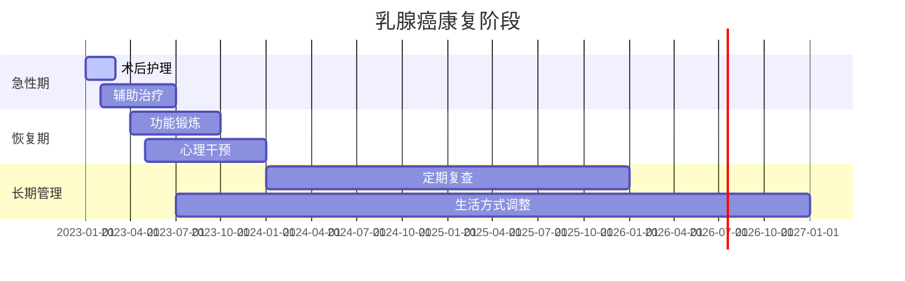

```markdown
# 乳腺癌科普：从预防到康复的全周期管理

## 概述
乳腺癌是乳腺上皮细胞异常增生形成的恶性肿瘤，2020年全球癌症统计数据显示：
- 全球新发病例达226万例（占所有癌症24.5%）
- 中国年新发病例约42万例
- 女性发病率首位恶性肿瘤
- 男性患者占比<1%


*图示：乳腺组织结构与常见肿瘤发生部位*

---

## 第一章 疾病认知

### 1.1 高危人群画像
| 风险因素        | 具体说明                     | 可控性   |
|-----------------|------------------------------|----------|
| 年龄            | 45-55岁为发病高峰            | 不可控   |
| BRCA基因突变    | 携带者终生风险达70%          | 不可控   |
| 初潮早/绝经晚   | <12岁初潮，>55岁绝经         | 部分可控 |
| 未生育/晚生育   | 首胎>35岁风险增加30%         | 可控     |
| 肥胖（BMI>30）  | 脂肪组织产生过量雌激素        | 可控     |
| 长期激素替代治疗 | 使用>5年风险增加26%           | 可控     |

### 1.2 临床表现
**典型三联征**：
1. 无痛性肿块（85%为首发症状）
   - 质地坚硬
   - 边界不清
   - 活动度差
2. 皮肤改变
   - "橘皮样"改变
   - 酒窝征
3. 乳头异常
   - 血性溢液
   - 乳头内陷

**转移症状**：
- 骨转移：病理性骨折
- 肺转移：顽固性咳嗽
- 肝转移：腹水黄疸

---

## 第二章 诊断技术

### 2.1 筛查金标准


**BI-RADS分级说明**：
- 0类：需要补充检查
- 1-2类：良性
- 3类：可能良性（恶性率<2%）
- 4类：可疑恶性（恶性率3-94%）
- 5类：高度恶性可能（≥95%）
- 6类：已证实恶性

### 2.2 精准诊断技术
1. **液体活检**
   - 循环肿瘤DNA(ctDNA)检测
   - 灵敏度达85%
2. **分子分型**
   - Luminal A/B型（激素受体阳性）
   - HER2阳性型
   - 三阴性型（治疗难度最大）

---

## 第三章 治疗进展

### 3.1 手术方式对比
| 术式                | 切除范围          | 适应症              | 5年生存率 |
|----------------------|-------------------|---------------------|-----------|
| 保乳手术            | 肿瘤+1-2cm安全缘  | 早期单发病灶        | 92%       |
| 全乳切除            | 全部乳腺组织      | 多中心病灶          | 89%       |
| 乳房重建术          | 切除+假体植入     | 有美容需求患者      | 等同传统  |

### 3.2 新型治疗手段
1. **ADC药物**
   - T-DM1：HER2阳性患者
   - DS-8201：疾病控制率97%
2. **免疫治疗**
   - PD-1抑制剂（三阴性型）
   - ORR达40%
3. **质子治疗**
   - 心脏受照剂量降低50%
   - 适用于左侧乳腺癌

---

## 第四章 预防与康复

### 4.1 三级预防体系
```markdown
1. 一级预防
   - 保持BMI 18.5-23.9
   - 每周150分钟有氧运动
   - 哺乳≥12个月

2. 二级预防
   - 每月自检（月经后7-10天）
   - 40岁起年度筛查
   - 基因检测（家族史人群）

3. 三级预防
   - 规范化治疗
   - 淋巴水肿预防
   - 心理康复干预
```

### 4.2 康复时间轴


---

## 第五章 认知误区

### 5.1 常见误解澄清
1. **"肿块不痛就不用管"**
   - 事实：无痛性肿块更危险

2. **"切除越彻底越好"**
   - 数据：保乳手术生存率等同全切

3. **"化疗生不如死"**
   - 进展：新型止吐药使呕吐率<5%

4. **"豆浆导致乳腺癌"**
   - 研究：大豆异黄酮具有保护作用（RR=0.76）

---

## 结语
乳腺癌已成为可防可控的慢性病，最新统计显示：
- 早期患者5年生存率达99%
- 晚期患者中位生存期从2年延长至5年
- 新药研发周期缩短至3-5年

建议建立"自查-筛查-精准治疗-全程管理"的防控体系。如发现乳房异常，请及时至乳腺专科就诊，切勿轻信偏方。

> 本文数据来源：  
> 1. WHO《全球癌症报告2020》  
> 2. 中国抗癌协会乳腺癌诊治指南（2024版）  
> 3. NCCN临床实践指南
```

注：本文为结构化科普模板，实际应用时应：
1. 补充相关医学插图和数据图表
2. 根据最新指南更新治疗数据
3. 添加所在机构的联系方式
4. 进行专业医学审核
5. 提供参考文献超链接