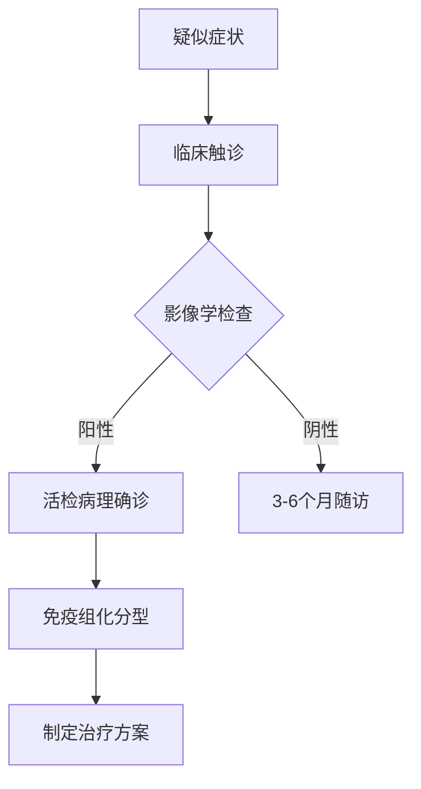
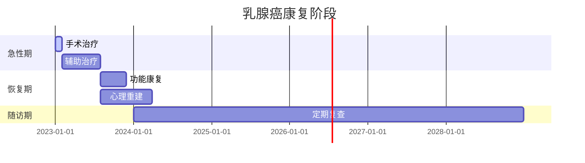

```markdown
# 乳腺癌：从病因到防治的全面科普

## 一、概述
### 1.1 什么是乳腺癌？
乳腺癌（Breast Cancer）是指乳腺上皮细胞在多种致癌因素作用下发生增殖失控的恶性肿瘤，其发病率居女性恶性肿瘤首位。全球每年新发病例超 **200万例**，中国乳腺癌发病率以每年 **3%-4%** 的速度递增，发病年龄较欧美国家提前约10年。

### 1.2 流行病学特征
- 女性发病率是男性的 **100倍** 以上
- 高发年龄：中国女性 **45-55岁** vs 欧美国家 **65岁以上**
- 地域差异：北美/北欧>亚洲>非洲
- 5年生存率：早期发现可达 **90%** 以上


## 二、病因与危险因素
### 2.1 不可控风险因素
| 风险因素 | 说明 |
|---------|------|
| 年龄增长 | 55岁以上风险显著增加 |
| 遗传突变 | BRCA1/2基因突变携带者风险高达 **70%** |
| 月经周期 | 初潮<12岁或绝经>55岁 |
| 乳腺密度 | 致密型乳腺风险增加 **4-6倍** |

### 2.2 可控风险因素
- **激素暴露**：长期使用雌激素替代疗法（HRT）
- **生活方式**：
  - 肥胖（BMI>30风险增加 **30%**）
  - 饮酒（每日增加10g酒精，风险升 **7-10%**）
- **生育因素**：
  - 未生育或首胎>35岁
  - 哺乳<6个月

## 三、临床表现与诊断
### 3.1 典型症状
1. **乳房改变**：
   - 无痛性肿块（80%为患者自检发现）
   - 皮肤"橘皮样"改变
   - 乳头凹陷或溢血
2. **转移症状**：
   - 骨痛（常见脊椎、骨盆）
   - 呼吸困难（肺转移）
   - 黄疸（肝转移）

### 3.2 诊断金标准


## 四、分子分型与治疗
### 4.1 分子分型体系
根据 **ER**、**PR**、**HER2** 状态分为：
1. **Luminal型**（60-70%）
   - 内分泌治疗敏感
   - 常用药物：他莫昔芬、AI类药物
2. **HER2阳性型**（15-20%）
   - 靶向治疗获益显著
   - 代表药物：曲妥珠单抗
3. **三阴性型**（10-15%）
   - 化疗为主
   - PD-1抑制剂新进展

### 4.2 综合治疗策略
```markdown
1. **手术治疗**
   - 保乳手术（肿瘤<3cm且单发）
   - 全乳切除+重建术

2. **放射治疗**
   - 保乳术后常规放疗
   - 三维适形放疗降低心脏损伤

3. **系统治疗**
   - 新辅助化疗（肿瘤降期）
   - CDK4/6抑制剂（HR+/HER2-晚期患者）
```

## 五、预防与筛查
### 5.1 三级预防体系
- **一级预防**：
  - 保持BMI 18.5-24.9
  - 每周≥150分钟中强度运动
  - 哺乳≥12个月

- **二级预防**：
  - 40岁起每年乳腺超声+每2年钼靶
  - BRCA突变者25岁起MRI监测

- **三级预防**：
  - 规范治疗后5年内每3-6个月复查
  - 骨密度监测（AI类药物副作用管理）

### 5.2 筛查建议
| 人群特征 | 筛查方案 |
|---------|---------|
| 一般风险 | 40岁起超声+钼靶联合筛查 |
| BRCA突变 | 25岁起MRI为主，每6-12个月交替检查 |
| 致密乳腺 | 超声补充检查 |

## 六、最新研究进展
1. **液体活检技术**
   - ctDNA检测实现复发监测
   - 灵敏度达 **85%**，早于影像学3-9个月

2. **人工智能应用**
   - 深度学习模型对钼靶片的诊断准确率达 **94.5%**
   - 自动风险评估系统预测5年发病概率

3. **疫苗研发**
   - HER2多肽疫苗进入II期临床试验
   - 三阴性乳腺癌新抗原疫苗初步显效

## 七、患者支持与康复
### 7.1 全程管理要点
- **心理干预**：确诊后焦虑抑郁发生率 **30-50%**
- **淋巴水肿管理**：术后发生率 **15-30%**
- **生育保护**：GnRH激动剂保护卵巢功能
- **营养支持**：蛋白质摄入需达 **1.2-1.5g/kg/d**

### 7.2 康复时间轴


## 结语
乳腺癌防治需要建立"早筛-规范治疗-全程管理"的完整体系。2023年NCCN指南特别强调：
> "个体化精准医疗时代，每个乳腺癌患者都应该获得基于分子分型的定制化治疗方案。"

建议所有女性：
1. 掌握正确自检手法（月经后7-10天为宜）
2. 定期参加规范筛查
3. 出现异常及时就诊

通过科学的认知和积极的预防，我们完全有能力将乳腺癌变成可防可控的慢性疾病。
```