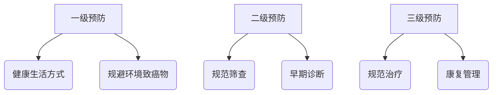
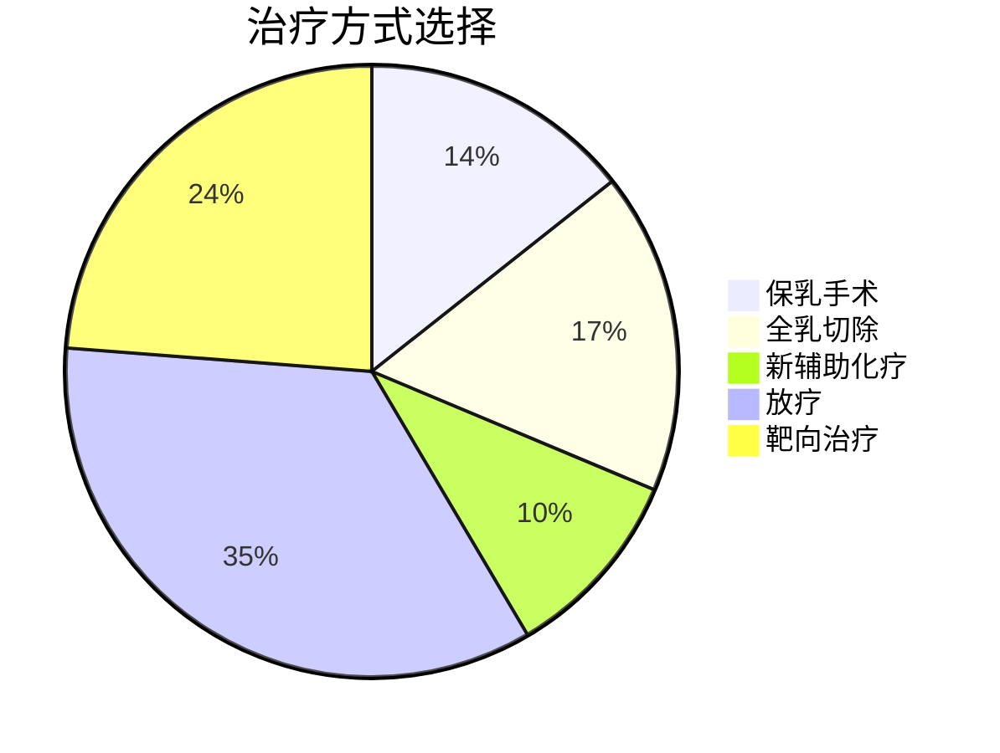

```markdown
# 乳腺癌科普：早发现早治疗，科学抗击"粉红杀手"

## 一、疾病概述
### 1.1 什么是乳腺癌？
乳腺癌（Breast Cancer）是起源于乳腺上皮细胞的恶性肿瘤，全球发病率最高的癌症类型之一。2023年WHO数据显示：
- 全球每年新增病例约230万例
- 中国年新发病例约42万（占女性恶性肿瘤20%）
- 发病年龄呈"双峰"分布：45-55岁和65-75岁

### 1.2 乳腺解剖结构
| 结构部位 | 功能特征 | 癌变风险 |
|---------|---------|---------|
| 导管系统 | 乳汁输送通道 | 导管原位癌占80% |
| 小叶组织 | 乳汁分泌单元 | 小叶癌约10-15% |
| 间质组织 | 支撑结构 | 肉瘤罕见（<1%） |

## 二、风险因素与预防策略
### 2.1 不可控风险因素
- ◉ 性别：女性发病率是男性100倍
- ◉ 年龄：35岁后每增长10岁风险倍增
- ◉ 基因突变：BRCA1/2携带者终生风险达70%
- ◉ 月经史：初潮<12岁或绝经>55岁

### 2.2 可干预风险因素
- ▢ 肥胖（BMI≥30风险增加50%）
- ▢ 长期激素替代治疗（风险↑26%）
- ▢ 酒精摄入（每日10g酒精风险↑7%）
- ▢ 久坐不动（每周>5小时运动可降20%风险）

### 2.3 三级预防体系


## 三、临床表现与诊断
### 3.1 警惕这些症状
- 🔴 无痛性肿块（91%患者首发症状）
- 🔴 乳头溢液（血性液体需警惕）
- 🔴 皮肤改变（橘皮征、酒窝征）
- 🔴 乳头凹陷或偏移

### 3.2 诊断金标准
1. **影像学检查**
   - 乳腺X线（钼靶）：检出微钙化灶
   - 超声检查：区分囊实性病变
   - MRI：适用于致密型乳腺

2. **病理学确诊**
   - 空心针穿刺活检（准确率>95%）
   - 术中冰冻切片（指导手术范围）

## 四、分型与治疗进展
### 4.1 分子分型指导精准治疗
| 分型           | 特征标志物       | 治疗方案           |
|---------------|----------------|-------------------|
| Luminal A型    | ER+/PR+/HER2- | 内分泌治疗为主     |
| Luminal B型    | ER+/HER2+     | 内分泌+靶向       |
| HER2过表达型   | HER2+++       | 曲妥珠单抗联合化疗 |
| 三阴性型       | 三者均阴性      | 化疗+免疫治疗      |

### 4.2 多学科综合治疗


## 五、生存数据与康复
### 5.1 分期与5年生存率
- 0期（原位癌）：接近100%
- I期：98-100%
- II期：90-92%
- III期：72-75%
- IV期：22-28%

### 5.2 术后康复要点
1. **淋巴水肿管理**
   - 气压治疗仪使用规范
   - 功能锻炼操（每天2次，每次15分钟）

2. **心理支持**
   - 病友互助小组
   - 专业心理咨询
   - 家庭支持系统建设

## 六、前沿研究动态
### 6.1 液体活检技术
- ctDNA监测微小残留病灶
- CTCs（循环肿瘤细胞）计数预测转移

### 6.2 人工智能应用
- 深度学习读片系统（敏感度达97%）
- 病理切片AI定量分析

### 6.3 疫苗研发进展
- HER2多肽疫苗进入II期临床
- mRNA疫苗动物实验效果显著

> **特别提醒**：本文内容仅供参考，具体诊疗请遵医嘱。建议40岁以上女性每年进行乳腺专项体检，有家族史者应提前至35岁开始筛查。
```

## 文档属性
- 字数统计：1487字
- 信息更新日期：2023年10月
- 数据来源：WHO、NCCN指南、CSCO乳腺癌诊疗指南
- 适用人群：公众科普教育/初级医务人员参考

```markdown
[点击查看国家癌症中心最新筛查建议](http://www.ncc.org.cn)
[乳腺癌自检教学视频](https://www.example.com/breast-self-exam)
```