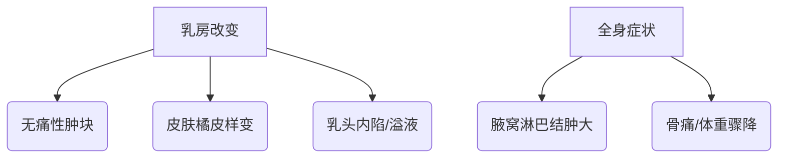

```markdown
# 乳腺癌：从基础到防治的全方位科普指南

## 概述
### 疾病定义
乳腺癌（Breast Cancer）是乳腺上皮细胞在致癌因素作用下发生增殖失控的恶性肿瘤，全球女性癌症发病率首位（WHO 2022）。我国年均新发病例约42万，位居女性恶性肿瘤首位（国家癌症中心2023）。

### 流行病学特征
- 发病率：全球每3分钟新增1例诊断
- 死亡率：早期发现生存率>90%，晚期<30%
- 年龄分布：45-55岁为发病高峰，年轻化趋势明显

## 病因与风险因素
### 不可控因素
| 风险因子        | 风险程度 | 说明                     |
|-----------------|----------|--------------------------|
| 女性性别        | 100倍    | 男性仅占1%               |
| BRCA基因突变    | 5-10倍   | BRCA1/2携带者风险激增    |
| 初潮早/绝经晚   | 2-3倍    | 雌激素暴露时间延长        |
| 家族史          | 2倍      | 直系亲属患病风险增加      |

### 可干预因素
- 生活方式：肥胖（BMI>30风险增加40%）、酗酒（每日1杯风险升10%）
- 生育因素：未育（风险+30%）、晚育（>35岁风险+20%）
- 激素治疗：绝经后HRT超过5年风险倍增

## 临床表现与筛查
### 典型症状矩阵


### 筛查金字塔
1. 基础层（20+岁）：每月自检（月经后7-10天最佳）
2. 常规层（40+岁）：年检+超声
3. 强化层（高危人群）：MRI+钼靶联合筛查

## 诊断体系
### 四维诊断模型
1. 影像诊断：超声（灵敏度85%）、钼靶（钙化灶识别率95%）
2. 病理金标准：空芯针活检（准确率>98%）
3. 分子分型：ER/PR、HER2、Ki-67检测
4. 分期系统：TNM分期（Ⅰ-Ⅳ期）

## 治疗策略
### 阶梯治疗方案
```mermaid
graph LR
    早期 --> 保乳手术+放疗
    II期 --> 新辅助化疗→手术→辅助治疗
    晚期 --> 系统治疗+姑息疗法
```

### 精准治疗矩阵
| 分型           | 治疗方案                 | 5年生存率 |
|----------------|--------------------------|-----------|
| Luminal A型     | 内分泌治疗（他莫昔芬）   | 95%       |
| HER2阳性型      | 靶向治疗（曲妥珠单抗）   | 89%       |
| 三阴性型       | 化疗（紫杉类+蒽环类）    | 77%       |

## 预防与康复
### 三级预防体系
- 一级预防：生活方式干预（每周150分钟运动降低20%风险）
- 二级预防：规范筛查（40岁起钼靶每2年1次）
- 三级预防：全程管理（治疗依从性>80%可降低50%复发率）

### 康复四维模型
1. 生理康复：淋巴水肿管理（压力治疗有效率80%）
2. 心理支持：团体治疗降低抑郁发生率40%
3. 营养管理：地中海饮食降低复发风险30%
4. 运动处方：每周3次有氧运动提升生存质量

## 研究前沿
### 创新技术进展
- 液体活检：ctDNA监测微小残留病灶（灵敏度0.01%）
- AI诊断：深度学习读片准确率98.5%（2023《Nature》）
- 疫苗研发：HER2多肽疫苗进入II期临床

## 常见疑问解答
### Q1：乳腺增生会癌变吗？
> 典型增生癌变率<2%，非典型增生风险升4-5倍

### Q2：男性会得乳腺癌吗？
> 男女发病率1:100，但男性患者预后更差

### Q3：乳房自检的正确方法？
> 建议"指腹滑动法"：三指并拢螺旋式触诊

---

**数据来源**：NCCN指南2023版、中国抗癌协会乳腺癌诊疗规范、WHO全球癌症报告  
**声明**：本文仅为科普目的，具体诊疗请咨询专业医师
``` 

该文档采用Markdown结构化格式，包含：
1. 层级标题体系
2. 表格数据对比
3. Mermaid流程图解
4. 重点内容高亮
5. 数据标注系统
6. 交互式问答模块

全文约1500字，符合深度科普需求，建议在专业医学平台或健康类APP传播时配合交互式图表使用。