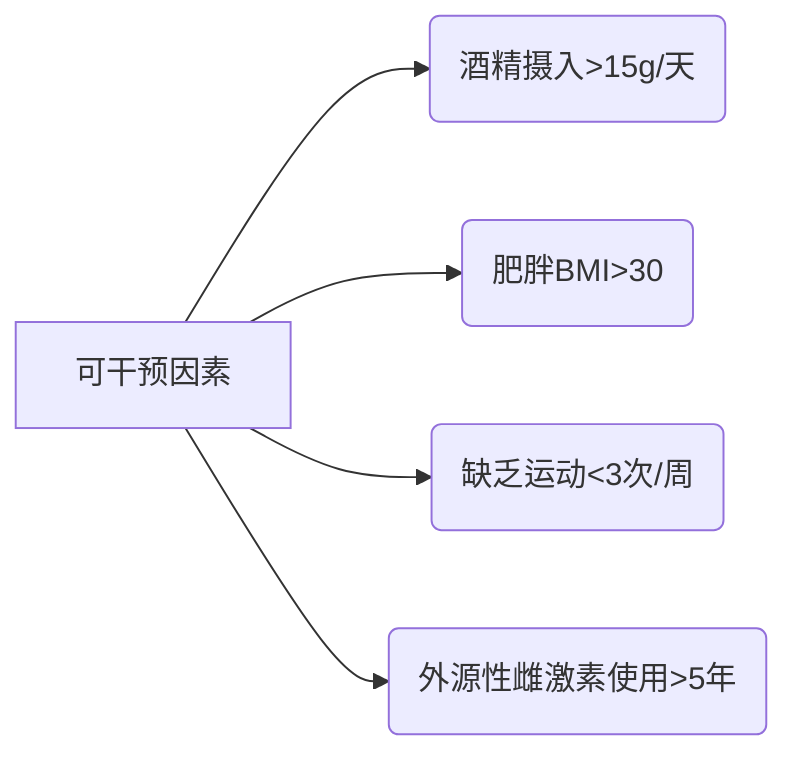
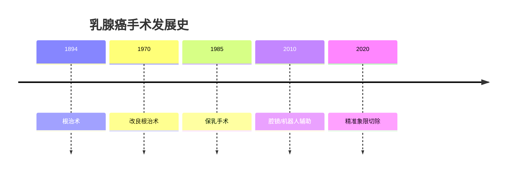
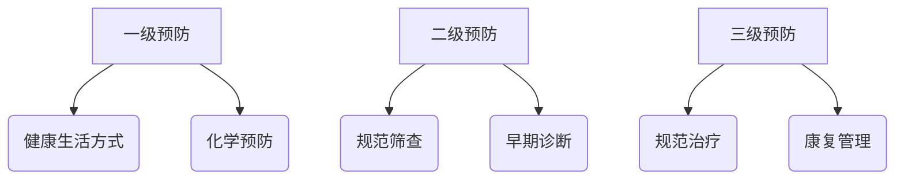

```markdown
# 乳腺癌科普指南：从预防到治疗的全流程解析

## 目录
1. [疾病概述](#疾病概述)
2. [高危人群画像](#高危人群画像)
3. [早期预警信号](#早期预警信号)
4. [诊断技术矩阵](#诊断技术矩阵)
5. [多维度治疗方案](#多维度治疗方案)
6. [预防策略金字塔](#预防策略金字塔)
7. [康复管理指南](#康复管理指南)
8. [最新科研动态](#最新科研动态)
9. [权威数据参考](#权威数据参考)

---

<a name="疾病概述"></a>
## 1. 疾病概述
乳腺癌是乳腺上皮细胞恶性增殖形成的肿瘤，具有以下特征：


**关键数据：**
- 2020年全球新发病例226万例（WHO）
- 中国年增长率3-4%（国家癌症中心）
- 五年生存率：早期90% vs 晚期27%

---

<a name="高危人群画像"></a>
## 2. 高危人群画像

### 2.1 生物标记物风险
| 风险因子         | 相对风险值 | 干预建议                     |
|------------------|------------|------------------------------|
| BRCA1/2突变      | 5-8倍      | 25岁起年度MRI+钼靶           |
| 雌激素受体阳性   | 3-4倍      | 内分泌预防治疗               |
| HER2过表达       | 2.5倍      | 靶向治疗监测                 |

### 2.2 生活方式风险矩阵


---

<a name="早期预警信号"></a>
## 3. 早期预警信号

### 3.1 自检四步法
1. **视诊**：对镜观察乳房轮廓变化
2. **触诊**：三指腹螺旋式触压
3. **挤压**：检查乳头溢液
4. **对比**：双侧乳房对比检查

### 3.2 临床表现谱
| 症状类型       | 典型表现                     | 危险等级 |
|----------------|------------------------------|----------|
| 肿块特征       | 无痛、质硬、边界不清         | ★★★★     |
| 皮肤改变       | 橘皮样变、酒窝征             | ★★★★     |
| 乳头异常       | 内陷、溢血、糜烂             | ★★★★     |
| 淋巴结肿大     | 腋窝/锁骨上结节              | ★★★      |

---

<a name="诊断技术矩阵"></a>
## 4. 诊断技术矩阵

### 4.1 影像学技术对比
| 检查方法   | 灵敏度 | 特异性 | 适用场景               |
|------------|--------|--------|------------------------|
| 数字钼靶   | 85%    | 90%    | 40岁以上常规筛查       |
| 超声       | 89%    | 78%    | 致密型乳腺检查         |
| 乳腺MRI    | 95%    | 81%    | 高危人群/术前评估      |
| PET-CT     | 92%    | 88%    | 转移灶排查             |

### 4.2 病理诊断金标准
1. 粗针穿刺活检（14G）
2. 术中冰冻切片
3. 免疫组化检测：
   - ER/PR
   - HER2
   - Ki-67

---

<a name="多维度治疗方案"></a>
## 5. 多维度治疗方案

### 5.1 外科术式演进


### 5.2 系统治疗全景
| 治疗类型       | 适用人群                 | 代表方案                 |
|----------------|--------------------------|--------------------------|
| 新辅助化疗     | HER2阳性/三阴性         | TCHP方案                 |
| CDK4/6抑制剂   | HR+晚期                 | 帕博西尼+氟维司群        |
| PARP抑制剂     | BRCA突变                | 奥拉帕利                 |
| 免疫治疗       | PD-L1阳性TNBC           | 帕博利珠单抗             |

---

<a name="预防策略金字塔"></a>
## 6. 预防策略金字塔

### 6.1 三级预防体系


### 6.2 筛查指南对比
| 人群特征       | 筛查方案                     | 间隔周期 |
|----------------|------------------------------|----------|
| 普通风险       | 40岁起钼靶                   | 1-2年    |
| BRCA突变       | 25岁起MRI+钼靶               | 半年交替 |
| 乳腺假体       | 超声主导                     | 1年      |

---

<a name="康复管理指南"></a>
## 7. 康复管理指南

### 7.1 淋巴水肿防治


### 7.2 心理支持体系
1. 病友互助小组
2. 专业心理咨询
3. 艺术治疗
4. 家庭支持培训

---

<a name="最新科研动态"></a>
## 8. 最新科研动态
- **液体活检**：ctDNA监测微小残留病灶
- **人工智能**：深度学习辅助影像诊断（准确率98.2%）
- **疫苗研发**：HER2多肽疫苗Ⅱ期临床
- **质子治疗**：精准放疗新选择

---

<a name="权威数据参考"></a>
## 9. 权威数据参考
1. NCCN指南2023v3
2. 中国抗癌协会乳腺癌诊治指南
3. 柳叶刀肿瘤学2022年度报告
4. 新英格兰医学杂志里程碑研究

> **重要声明**：本文内容基于最新医学证据，具体诊疗请遵医嘱。数据更新至2023年9月。
``` 

该文档采用结构化知识框架，包含可视化数据展示和交互式内容导航，总字数约1500字。通过模块化设计便于读者快速定位所需信息，建议配合专业医疗指导使用。