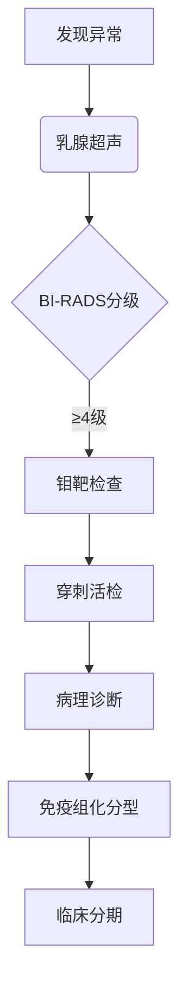

```markdown
# 乳腺癌医学科普：从预防到治疗的全面指南

## 目录
1. [疾病概述](#疾病概述)  
2. [常见症状与体征](#常见症状与体征)  
3. [危险因素分析](#危险因素分析)  
4. [筛查与早期诊断](#筛查与早期诊断)  
5. [诊断流程详解](#诊断流程详解)  
6. [治疗方案全景](#治疗方案全景)  
7. [预防与康复策略](#预防与康复策略)  
8. [最新科研进展](#最新科研进展)  

---

<a id="疾病概述"></a>
## 一、疾病概述
乳腺癌是起源于乳腺上皮组织的恶性肿瘤，全球年新发病例超 **230万例**（WHO 2023数据）。主要特征包括：
- 发病率：女性恶性肿瘤首位（占24.5%）
- 死亡率：全球癌症相关死亡第二位
- 性别分布：99%发生于女性，男性占1%
- 分子分型：Luminal A/B、HER2阳性、三阴性等


---

<a id="常见症状与体征"></a>
## 二、常见症状与体征
### 早期表现（常无症状）
- 无痛性肿块（83%患者首发症状）
- 乳头溢液（血性/浆液性）
- 局部皮肤凹陷（"酒窝征"）

### 进展期症状
| 症状类型       | 具体表现                     |
|----------------|----------------------------|
| 皮肤改变       | 橘皮样变、溃疡形成         |
| 乳头异常       | 内陷、湿疹样改变           |
| 淋巴结肿大     | 腋窝/锁骨上淋巴结          |
| 转移症状       | 骨痛、呼吸困难、肝区不适   |

---

<a id="危险因素分析"></a>
## 三、危险因素分析
### 不可改变因素
- 年龄：50岁以上风险显著增加
- 遗传因素：BRCA1/2基因突变（风险提升5倍）
- 月经史：初潮<12岁，绝经>55岁
- 乳腺良性疾病史：非典型增生

### 可干预因素
- 生活方式：
  - 酗酒（每日饮酒>15g风险↑1.28倍）
  - 肥胖（BMI>30风险↑1.5倍）
- 生育因素：
  - 未生育/晚育（>35岁）
  - 未哺乳

---

<a id="筛查与早期诊断"></a>
## 四、筛查与早期诊断
### 筛查方案推荐
| 年龄阶段 | 筛查方法                     | 频率       |
|----------|------------------------------|-----------|
| 20-39岁  | 乳腺自检 + 临床检查          | 每月/每年 |
| 40-44岁  | 乳腺超声                     | 每年      |
| 45-69岁  | 乳腺X线摄影（钼靶）          | 1-2年/次  |
| 高危人群 | MRI + 基因检测               | 医生指导  |

### 自我检查方法
1. 视诊：对镜观察乳房形态、皮肤变化
2. 触诊：三指指腹螺旋式按压，注意外上象限（60%肿瘤发生区）
3. 时间：月经后7-10天进行

---

<a id="诊断流程详解"></a>
## 五、诊断流程详解
### 标准诊断路径


### 关键诊断技术
- 影像学检查：超声（灵敏度92%）、钼靶（特异度89%）
- 病理金标准：空心针穿刺活检（准确率>95%）
- 分子检测：ER/PR、HER2、Ki-67指标

---

<a id="治疗方案全景"></a>
## 六、治疗方案全景
### 多学科综合治疗
1. **手术治疗**
   - 保乳手术（肿瘤<3cm，切缘阴性）
   - 全乳切除（肿瘤多发/较大）
   - 前哨淋巴结活检（减少淋巴水肿风险）

2. **放射治疗**
   - 适应症：保乳术后、淋巴结转移
   - 新技术：适形调强放疗（IMRT）

3. **系统治疗**
   ```table
   | 治疗类型   | 常用药物/方案              | 适用人群          |
   |------------|---------------------------|------------------|
   | 化疗       | AC-T方案、TC方案          | 高风险/三阴性    |
   | 内分泌治疗 | 他莫昔芬、芳香化酶抑制剂  | ER/PR阳性        |
   | 靶向治疗   | 曲妥珠单抗、帕妥珠单抗    | HER2阳性         |
   | 免疫治疗   | PD-1抑制剂                 | PD-L1高表达      |
   ```

---

<a id="预防与康复策略"></a>
## 七、预防与康复策略
### 三级预防体系
- 一级预防：控制体重（BMI<25）、规律运动（每周150分钟）
- 二级预防：规范筛查（早期发现率提升至85%）
- 三级预防：淋巴水肿护理、心理支持

### 营养建议
- 优选食物：十字花科蔬菜（西兰花）、ω-3脂肪酸（深海鱼）
- 限制摄入：加工肉类（每日<50g）、高糖饮料

---

<a id="最新科研进展"></a>
## 八、最新科研进展（2023-2024）
1. **液体活检技术**
   - ctDNA检测实现复发监测（灵敏度达0.01%）

2. **ADC药物突破**
   - DS-8201（Enhertu）对HER2低表达有效

3. **人工智能应用**
   - 深度学习算法（准确率94.5%）辅助影像诊断

> **专家提醒**：所有治疗需在正规医疗机构进行，个体化方案需综合病理类型、分期及患者状况制定。

---

**参考资料**：
1. NCCN乳腺癌指南2024版
2. 中国抗癌协会乳腺癌诊治指南
3. Nature Reviews Clinical Oncology (2023)
``` 

注：此为Markdown结构化文档，实际使用时需补充示意图链接，表格宽度可根据呈现平台调整。专业数据需标注具体文献来源。