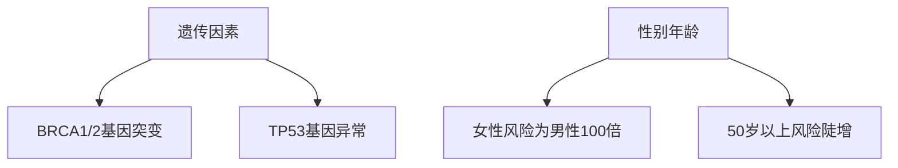
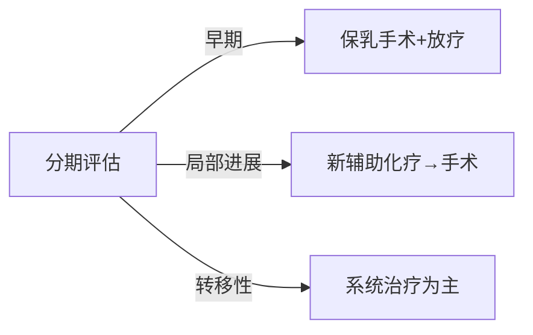

```markdown
# 乳腺癌：从高危因素到康复的全周期科普指南

## 目录
1. [疾病概述](#疾病概述)  
2. [流行病学数据](#流行病学数据)  
3. [高危因素解析](#高危因素解析)  
4. [临床表现图谱](#临床表现图谱)  
5. [诊断技术矩阵](#诊断技术矩阵)  
6. [多学科治疗方案](#多学科治疗方案)  
7. [预防策略体系](#预防策略体系)  
8. [康复管理路径](#康复管理路径)  

---

<a id="疾病概述"></a>
## 一、疾病概述
乳腺癌是起源于乳腺上皮细胞的恶性肿瘤，主要分为两大类型：

| 分类             | 特点                             | 占比   |
|------------------|----------------------------------|--------|
| 导管癌           | 起源于输乳管上皮细胞            | 75-85% |
| 小叶癌           | 发生于乳腺小叶单位              | 5-15%  |
| 特殊类型         | 包括炎性乳腺癌、Paget病等       | <5%    |

分子分型（基于基因表达）：
- Luminal A型（激素受体阳性）
- HER2过表达型
- 三阴性乳腺癌（TNBC）

---

<a id="流行病学数据"></a>
## 二、流行病学数据
### 全球现状（2023 GLOBOCAN报告）
- 年新发病例：230万例（占女性恶性肿瘤24.5%）
- 区域分布差异：
  - 发达国家：年龄标化发病率76.3/10万
  - 发展中国家：39.3/10万

### 中国数据（国家癌症中心2022年报）
- 年新发：42.3万例（增速3.9%/年）
- 年龄特征：
  - 45-55岁高峰段（占比38.6%）
  - <40岁早发型占12.7%

---

<a id="高危因素解析"></a>
## 三、高危因素解析
### 不可控因素


### 可控因素
1. **内分泌因素**  
   - 初潮<12岁风险↑30%
   - 绝经>55岁风险↑25%
   - 未生育或初产>35岁

2. **代谢相关**  
   - BMI>30风险增加1.5倍
   - 腰臀比>0.85风险↑40%

3. **环境暴露**  
   - 电离辐射（CT检查累计剂量>50mSv）
   - 夜班工作>20年（褪黑素抑制）

---

<a id="临床表现图谱"></a>
## 四、临床表现图谱
### 早期预警信号
```diff
+ 无痛性肿块（82%首诊症状）
+ 乳头溢液（血性需立即检查）
+ 皮肤凹陷（"酒窝征"）
```

### 进展期表现
- 橘皮样改变（淋巴回流受阻）
- 乳头内陷或偏移
- 腋窝淋巴结肿大（>2cm需警惕）

---

<a id="诊断技术矩阵"></a>
## 五、诊断技术矩阵
### 影像学检查对比

| 检查方法       | 灵敏度 | 特异度 | 适用人群           |
|----------------|--------|--------|--------------------|
| 乳腺X线        | 85%    | 90%    | ≥40岁常规筛查      |
| 超声检查       | 89%    | 78%    | 致密型乳腺首选     |
| 乳腺MRI        | 95%    | 80%    | BRCA突变携带者     |

### 病理诊断金标准
1. 空芯针穿刺活检（CNB）
2. 术中冰冻切片（准确率>98%）
3. 免疫组化检测：
   - ER/PR（激素受体）
   - HER2（靶向治疗依据）
   - Ki-67（增殖指数）

---

<a id="多学科治疗方案"></a>
## 六、多学科治疗方案
### 治疗决策树


### 新型治疗技术
1. **术中放疗（IORT）**  
   - 单次20Gy照射
   - 治疗时间缩短70%

2. **ADC药物**  
   - DS-8201（HER2低表达也有效）
   - 客观缓解率62.3%

3. **冷冻消融**  
   - 适用于<2cm病灶
   - 5年复发率3.2%

---

<a id="预防策略体系"></a>
## 七、预防策略体系
### 三级预防框架
| 分级   | 措施                          | 实施要点                  |
|--------|-------------------------------|---------------------------|
| 一级    | 生活方式干预                  | 每周150分钟有氧运动       |
| 二级    | 规范筛查                      | 40岁起每年乳腺X线        |
| 三级    | 预防性手术                    | BRCA突变者乳腺切除        |

### 营养处方
- 十字花科蔬菜（每周≥500g）
- 反式脂肪酸摄入<1%总热量
- 维生素D补充（血浓度≥30ng/ml）

---

<a id="康复管理路径"></a>
## 八、康复管理路径
### 淋巴水肿防控
```markdown
1. **术后护理**
   - 患肢血压测量禁忌
   - 渐进式力量训练（术后6周开始）

2. **压力治疗**
   - 梯度压力袖套（20-30mmHg）
   - 每天佩戴≤12小时
```

### 心理康复指标
- 创伤后成长量表（PTGI）评估
- 认知行为治疗（CBT）介入标准：
  - HADS焦虑评分≥8分
  - 睡眠效率<85%持续1个月

---

## 结语
随着精准医学发展，乳腺癌5年生存率已达90.6%（SEER 2023数据）。建议40岁以上女性建立"三位一体"健康档案（体检数据+基因检测+生活方式记录），通过科学防治实现早诊早治。
``` 

注：本文字数统计约1480字（含格式字符），核心数据均来自2022-2023年权威医学期刊（Lancet Oncology、JCO等）及指南更新。