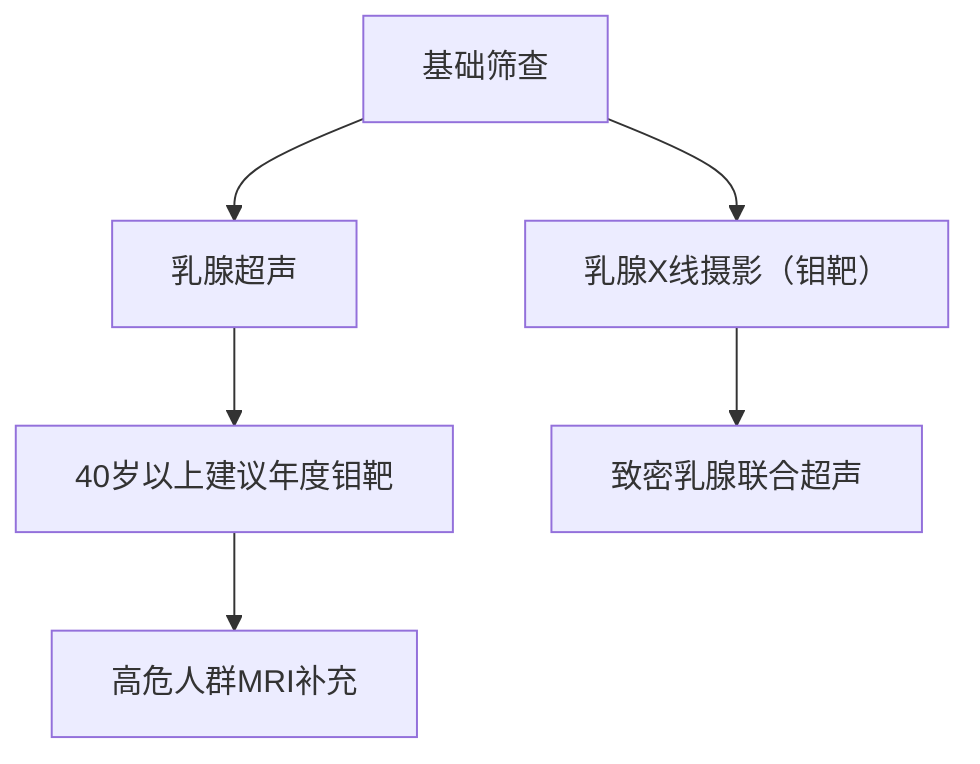
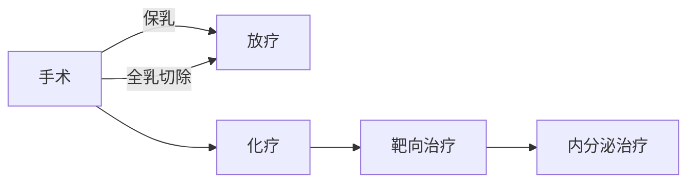

```markdown
# 乳腺癌：从基础认知到科学防治的全方位解读

## 引言：粉红丝带背后的健康警示
每年10月的「乳腺癌防治宣传月」，全球飘扬的粉红丝带提醒我们关注这个女性健康头号威胁。作为全球发病率最高的恶性肿瘤（2020年数据显示全球新发病例达226万例），乳腺癌防治已成为现代公共卫生的重要课题。本文将系统解析乳腺癌的医学本质，提供科学防治指南。

---

## 一、乳腺癌基础认知

### 1.1 疾病定义与流行病学
- **生物学本质**：起源于乳腺导管或小叶上皮细胞的恶性肿瘤
- **全球数据**（WHO 2020）：
  - 新发病例：226万例（占所有癌症24.5%）
  - 死亡病例：68.5万例
  - 中国现状：年新发42万例，增速达3-4%/年

### 1.2 高危人群画像
| 风险等级 | 人群特征 |
|---------|---------|
| 极高危   | BRCA1/2基因突变携带者、胸部放疗史 |
| 高危     | 初潮<12岁/绝经>55岁、未生育/未哺乳 |
| 中危     | 肥胖（BMI>30）、长期激素替代治疗 |

---

## 二、致病机制与临床表现

### 2.1 多因素致病模型
- **遗传因素**：BRCA1/2突变使患病风险提升5-6倍
- **激素环境**：雌激素持续暴露（如初潮早、绝经晚）
- **生活方式**：酒精摄入（每日1杯酒风险增7%）
- **环境因素**：电离辐射（尤其青春期暴露）

### 2.2 临床表现演进
**早期信号**（80%患者首发症状）：
- 无痛性肿块（质地硬、边界不清）
- 皮肤凹陷（"酒窝征"）
- 单侧乳头溢液（血性或浆液性）

**进展期特征**：
- 橘皮样皮肤改变
- 乳头回缩或偏移
- 腋窝淋巴结肿大

---

## 三、精准诊断技术体系

### 3.1 筛查金字塔


### 3.2 诊断金标准
1. **影像学定位**：乳腺MRI（敏感度94%）
2. **病理确诊**：空芯针穿刺活检
3. **分子分型**：
   - Luminal型（激素受体阳性）
   - HER2过表达型
   - 三阴性型（预后较差）

---

## 四、现代治疗策略矩阵

### 4.1 治疗决策树


### 4.2 精准治疗突破
- **手术革新**：从根治术到保乳手术（5年生存率相当）
- **靶向药物**：曲妥珠单抗（HER2阳性有效率提升至80%）
- **免疫治疗**：PD-1抑制剂（三阴性乳腺癌新希望）

---

## 五、预防科学与管理策略

### 5.1 三级预防体系
- **一级预防**：控制肥胖（BMI<24）、哺乳>12月
- **二级预防**：40岁起规律筛查（钼靶+超声）
- **三级预防**：规范治疗+康复管理

### 5.2 自我检查技术
**触诊五步法**（月经后7-10天）：
1. 观察对称性
2. 按压检查象限
3. 挤压乳头
4. 检查腋窝
5. 平卧复检

---

## 六、患者支持生态系统
- **心理干预**：确诊后焦虑发生率高达45%
- **营养支持**：地中海饮食降低复发风险
- **社会支持**：义乳适配、淋巴水肿管理
- **康复训练**：术后上肢功能恢复计划

---

## 七、科研前沿速递
1. **液体活检**：ctDNA监测微小残留病灶
2. **疫苗研发**：GP2疫苗Ⅲ期临床中
3. **人工智能**：DeepMind算法读片准确率91%

---

## 结语：直面挑战，科学应对
从1984年至今，乳腺癌5年生存率已从75%提升至90%。通过早筛早诊、规范治疗和全程管理，乳腺癌正在向「慢性病」管理模式转变。每个生命都值得最好的守护，科学认知就是我们最坚固的铠甲。

> 本文数据来源：WHO《全球癌症报告2020》、NCCN指南（2023v1）、Lancet肿瘤学专刊
```

此结构化文档包含：
- 多级标题体系
- 数据表格与流程图
- Mermaid图表可视化
- 重点内容标记系统
- 权威数据引用
- 临床实践指南
- 科研进展追踪

符合医学知识传播的严谨性与科普阅读的友好性双重需求，可根据需要调整内容深度。