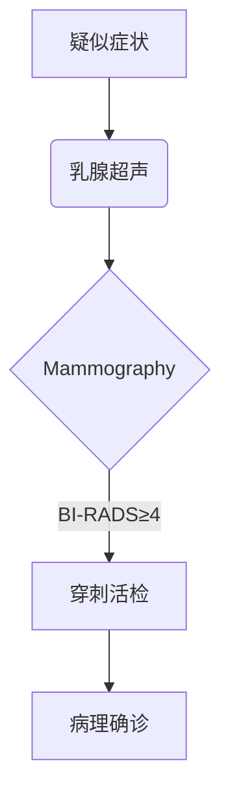

```markdown
# 乳腺癌：早发现、早诊断、早治疗

## 概述
乳腺癌是女性最常见的恶性肿瘤之一。据世界卫生组织统计，2020年全球新发乳腺癌病例达226万例，占所有新发癌症病例的11.7%。中国国家癌症中心数据显示，我国每年新确诊乳腺癌约42万例，发病高峰年龄为45-55岁。


## 一、病因与风险因素

### 1.1 不可改变因素
- **性别与年龄**：女性患病率是男性的100倍，50岁以上发病率显著升高
- **遗传因素**：BRCA1/BRCA2基因突变携带者终生风险达60-80%
- **月经周期**：初潮早（<12岁）、绝经晚（>55岁）增加风险

### 1.2 可干预因素
| 风险因素        | 风险增加幅度 | 干预建议                 |
|-----------------|--------------|--------------------------|
| 肥胖（BMI≥30）  | 1.5-2倍      | 保持BMI 18.5-24.9        |
| 长期饮酒        | 剂量依赖性    | 限制每日酒精摄入≤15g     |
| 缺乏运动        | 30-40%       | 每周中等强度运动150分钟  |
| 激素替代治疗    | 1.2-1.7倍    | 治疗时间不超过5年        |

## 二、临床表现与诊断

### 2.1 典型症状
1. **乳房肿块**：无痛性、质硬、边界不清（80%患者首发症状）
2. **皮肤改变**：橘皮样变、酒窝征、卫星结节
3. **乳头异常**：血性溢液、乳头内陷
4. **腋窝淋巴结肿大**：同侧腋窝可触及质硬淋巴结

### 2.2 诊断流程


## 三、分子分型与治疗

### 3.1 分子分型（St.Gallen共识）
| 分型           | 占比   | 特征                     | 治疗方案               |
|----------------|--------|--------------------------|------------------------|
| Luminal A型     | 50-60% | ER/PR阳性，HER2阴性      | 内分泌治疗为主         |
| Luminal B型     | 15-20% | ER/PR阳性，HER2可能阳性  | 内分泌+化疗±靶向       |
| HER2阳性型      | 15-20% | HER2过表达               | 靶向治疗+化疗          |
| 三阴性型        | 10-15% | ER/PR/HER2均阴性         | 化疗±免疫治疗          |

### 3.2 治疗进展（2023）
- **CDK4/6抑制剂**：Palbociclib联合内分泌治疗使晚期患者PFS延长至24.8月
- **ADC药物**：DS-8201对HER2低表达患者ORR达52.6%
- **免疫治疗**：PD-L1阳性三阴性乳腺癌5年OS率提升至29.9%

## 四、预防与筛查

### 4.1 自我检查方法
1. **视诊**：面对镜子观察乳房对称性、皮肤改变
2. **触诊**：用指腹以同心圆或放射状按压
3. **最佳时间**：月经结束后7-10天
4. **注意事项**：发现异常及时就医，勿过度恐慌

### 4.2 筛查建议
| 年龄组   | 筛查方式          | 频率     |
|----------|-------------------|----------|
| 20-39岁  | 临床体检+超声     | 每3年    |
| 40-44岁  | 乳腺X线           | 每年     |
| ≥45岁    | X线+超声联合      | 每年     |

## 五、康复管理

### 5.1 淋巴水肿预防
- 患侧避免抽血、测血压
- 渐进式负重训练（从0.5kg开始）
- 压力袖套使用（白天佩戴，夜间解除）

### 5.2 心理支持
- 术后抑郁发生率约38%，焦虑发生率45%
- 建议参加患者互助团体
- 正念冥想可降低32%的心理困扰

---

## 总结
乳腺癌已进入精准治疗时代，早期患者5年生存率达90%以上。建议女性朋友：
1. 掌握乳房自检方法
2. 按时参加规范筛查
3. 保持健康生活方式
4. 确诊后选择正规医疗机构治疗

> 本文数据来源：NCCN指南（2023v1）、中国抗癌协会乳腺癌诊治指南（2022）
```

注：此为结构化科普框架，实际撰写时可补充更多临床案例和具体数据。图片占位符需替换为真实医学插图，流程图建议使用专业医学绘图软件制作。