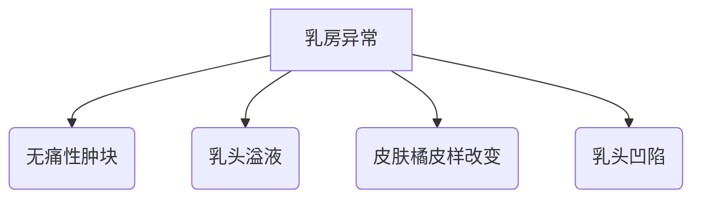

```markdown
# 乳腺癌科普：从预防到治疗的全面解读

## 概述
### 疾病定义
乳腺癌是乳腺上皮细胞在多种致癌因素作用下发生的恶性肿瘤，全球女性癌症发病率首位（WHO 2022数据）

### 流行病学数据
- 全球年新发病例：230万例
- 中国年新发病例：42万（2020国家癌症中心）
- 发病年龄双高峰：45-55岁（围绝经期）、65-75岁
- 男女比例：1:100

## 发病机制
### 危险因素矩阵
| 不可控因素         | 可控因素               |
|--------------------|----------------------|
| 女性性别           | 肥胖（BMI>30风险↑40%）|
| 初潮早（<12岁）    | 酒精摄入（日＞15g风险↑10%）|
| 绝经晚（＞55岁）   | 缺乏运动（风险↑20-40%）|
| BRCA1/2基因突变    | 激素替代治疗（＞5年风险↑30%）|

### 分子分型（2023 CSCO指南）
1. Luminal A型（ER+/PR+/HER2-）
2. Luminal B型（ER+/PR±/HER2±）
3. HER2过表达型
4. 三阴性型（TNBC）

## 临床表现
### 早期预警信号


### 进展期症状
- 卫星结节（皮肤表面多个硬结）
- 铠甲胸（肿瘤浸润胸壁）
- 炎性乳腺癌（乳房红肿热痛）

## 诊断体系
### 影像学检查金字塔
1. 基础筛查：超声（敏感性85%）
2. 精准诊断：钼靶（40岁以上首选）
3. 高级评估：乳腺MRI（多病灶检测敏感性95%）

### 病理诊断流程
```markdown
1. 粗针穿刺活检（CNB）
2. 免疫组化检测：
   - ER/PR（激素受体）
   - HER2（免疫评分/基因扩增）
   - Ki-67（增殖指数）
3. 分子检测：
   - 21基因检测（Oncotype DX）
   - 70基因检测（MammaPrint）
```

## 治疗策略
### 多学科诊疗（MDT）方案
```table
| 分期       | 手术方案          | 系统治疗                |
|-----------|------------------|------------------------|
| 0期（DCIS）| 保乳手术+放疗    | 他莫昔芬（ER+患者）    |
| I-II期    | 改良根治术       | AC-T化疗+靶向（HER2+）|
| III期      | 新辅助治疗后手术 | PD-1抑制剂（TNBC）     |
| IV期       | 姑息手术         | CDK4/6抑制剂（HR+）    |
```

### 精准治疗突破
- HER2阳性：曲妥珠单抗（生存率提高30%）
- BRCA突变：PARP抑制剂（奥拉帕利PFS延长7个月）
- PD-L1阳性：阿替利珠单抗（死亡风险降低33%）

## 预防管理
### 筛查建议
```markdown
- 40-44岁：高危人群年检
- 45-69岁：每1-2年钼靶
- BRCA携带者：25岁起MRI监测
```

### 风险控制
1. 生活方式干预：
   - 每周150分钟中等强度运动
   - 地中海饮食（乳腺癌风险↓15%）
2. 药物预防：
   - 他莫昔芬（高风险人群发病率↓50%）
3. 手术预防：
   - 预防性乳房切除（BRCA突变者风险↓90%）

## 预后数据
### 5年生存率分层
- 0期：接近100%
- I期：98-100%
- II期：90-92%
- III期：72-75%
- IV期：29-31%

### 复发监测
- 每3-6个月临床检查（前3年）
- 年度钼靶/MRI（保乳术后）
- 骨密度监测（AI治疗期间）

## 最新进展
### 2023研究亮点
1. 人工智能：Google Health AI 读片准确率超放射科医生11.5%
2. 疫苗研发：Alpha-lactalbumin疫苗进入II期临床
3. 液体活检：ctDNA检测微小残留病灶灵敏度达0.01%

### 未来方向
- 空间转录组学解析肿瘤微环境
- PROTAC技术降解ER蛋白
- CAR-NK细胞疗法突破

```

> **特别提示**：本文数据截至2023年8月，具体诊疗请遵医嘱。定期乳腺自查（建议月经后7-10天）可提高早期发现率，推荐使用「三点触诊法」：用指腹平压，按外上→外下→内下→内上→中央区顺序检查。
```