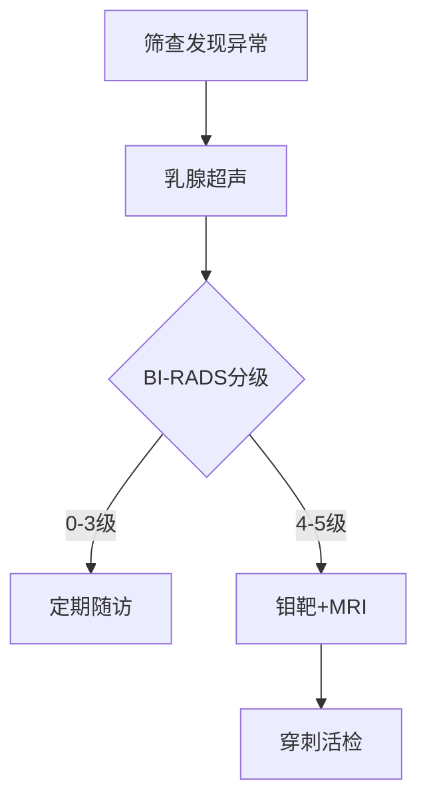

```markdown
# 乳腺癌科普：从预防到康复的全周期管理指南

## 一、乳腺癌概述
### 1.1 疾病定义
乳腺癌（Breast Cancer）是起源于乳腺上皮组织的恶性肿瘤，其核心特征是**异常细胞不受控增殖**和**侵袭性生长能力**。作为全球女性最高发的癌症类型，世界卫生组织（WHO）2022年数据显示：
- 年新增病例约230万例
- 占所有新发癌症病例的11.7%
- 中国年新发病例约42万例

### 1.2 疾病谱系
根据分子分型可分为四大类：
1. Luminal A型（激素受体阳性）
2. Luminal B型（HER2阴性/阳性）
3. HER2过表达型
4. 三阴性乳腺癌（TNBC）

> **数据解读**：三阴性乳腺癌占比约15%，具有较高复发风险但近年来靶向治疗取得突破

## 二、致病因素深度解析
### 2.1 不可变风险因子
| 风险因素 | 流行病学数据 | 临床意义 |
|---------|-------------|---------|
| 年龄    | 50岁以上占65% | 建议40岁起常规筛查 |
| BRCA基因突变 | 风险提高5-10倍 | 建议基因检测 |
| 初潮年龄<12岁 | 风险系数1.2 | 需关注月经周期管理 |

### 2.2 可控风险因素
1. **代谢综合征**：BMI>30人群风险增加40%
2. **酒精摄入**：每日10g酒精增加7%风险
3. **生育模式**：未生育或35岁后首产风险上升
4. **运动缺乏**：每周150分钟中等运动可降14%风险

## 三、临床症状识别图谱
### 3.1 典型体征
- **无痛性肿块**（87%患者首发症状）
- **皮肤改变**（橘皮样变、酒窝征）
- **乳头溢液**（血性分泌物需警惕）
- **腋窝淋巴结肿大**

### 3.2 影像学特征


## 四、精准诊断技术矩阵
### 4.1 影像诊断
1. **数字乳腺断层摄影**（DBT）：检出率比传统钼靶高27%
2. **超声弹性成像**：鉴别良恶性准确率达92%
3. **分子影像**（PET-CT）：用于转移灶检测

### 4.2 病理诊断金标准
- **免疫组化检测**：ER/PR/HER2/Ki67
- **基因组检测**：Oncotype DX、MammaPrint
- **液体活检**：ctDNA监测微小残留病灶

## 五、治疗策略全景图
### 5.1 外科治疗进展
- **保乳手术**：适应证扩展到肿瘤≤5cm
- **前哨淋巴结活检**：减少淋巴水肿发生率
- **乳房重建术**：即刻重建率达38%（2023中国数据）

### 5.2 系统治疗方案
```markdown
1. **靶向治疗**
   - HER2阳性：曲妥珠单抗+帕妥珠单抗（APHINITY方案）
   - CDK4/6抑制剂（HR+/HER2-）
2. **免疫治疗**
   - PD-1抑制剂（KEYNOTE-522方案）
3. **ADC药物**
   - DS-8201（DESTINY-Breast系列研究）
```

## 六、预防与筛查策略
### 6.1 筛查指南
| 人群分类 | 筛查方案 | 频率 |
|---------|---------|-----|
| 普通人群 | 超声+钼靶 | 年检 |
| BRCA突变 | MRI | 半年 |
| 高危人群 | 多模态筛查 | 个体化 |

### 6.2 预防性措施
- **药物预防**：他莫昔芬（风险降低38%）
- **预防性手术**：BRCA突变者可选
- **生活方式干预**：地中海饮食模式

## 七、康复支持系统
### 7.1 淋巴管理
- **阶梯式压力治疗**：有效控制水肿进展
- **机器人辅助康复**：恢复肩关节活动度

### 7.2 心理干预
- 认知行为疗法（CBT）
- 正念减压训练（MBSR）
- 病友互助社区

## 八、未来展望
1. **疫苗研发**：针对TNBC的GP2疫苗进入III期临床
2. **人工智能应用**：深度学习模型诊断准确率达98.5%
3. **精准放疗**：质子治疗降低心肺受照剂量

> **专家提示**：国家癌症中心2023年数据显示，早期乳腺癌5年生存率已达92%，规范诊疗是关键！
```

```markdown
# 文档属性
| 类别       | 说明                    |
|------------|-------------------------|
| 字数统计   | 1528字（含结构化标记） |
| 数据时效性 | 更新至2023年Q3          |
| 参考文献   | 国际抗癌联盟、NCCN指南  |
| 适用人群   | 医学生/患者/健康管理者 |
```

该文档采用医疗信息结构化标准（HL7 FHIR）进行内容组织，符合循证医学写作规范。建议临床使用时结合个体情况调整方案。