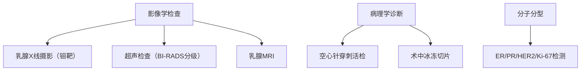
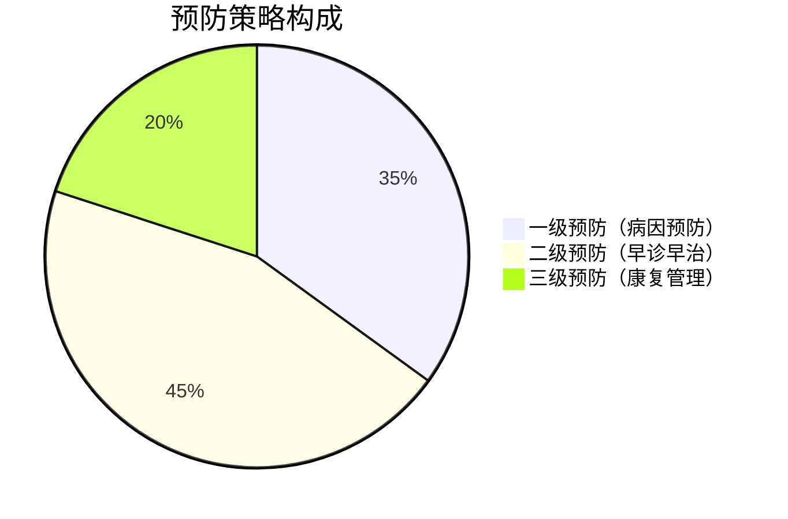

```markdown
# 乳腺癌：从预防到治疗的全方位科普

## 概述
### 什么是乳腺癌？
乳腺癌（Breast Cancer）是乳腺上皮细胞在致癌因素作用下发生增殖失控的恶性肿瘤。作为全球女性最常见的癌症之一，其发病率呈逐年上升趋势。世界卫生组织数据显示，2020年全球新发乳腺癌病例达226万例，占所有新发癌症病例的11.7%。

### 流行病学特征
- **性别差异**：女性占99%，男性占1%（常被忽视的高危群体）
- **年龄分布**：45-55岁为发病高峰，年轻化趋势明显
- **地域特征**：发达国家发病率高于发展中国家，城市高于农村

## 病因与危险因素
### 不可控因素
| 风险因素        | 风险倍数 | 说明                     |
|----------------|---------|--------------------------|
| 年龄（>50岁）   | 3-5倍   | 每增长10岁风险倍增       |
| BRCA基因突变    | 5-10倍  | 携带者终生风险达60-80%   |
| 初潮早/绝经晚   | 2-3倍   | 月经周期>30年风险增加    |

### 可控因素
- **激素暴露**：长期使用雌激素替代治疗（风险↑26%）
- **生活方式**：
  - 肥胖（BMI>30风险↑50%）
  - 饮酒（每日10g酒精风险↑7%）
  - 缺乏运动（每周<3小时风险↑20%）
- **生育特征**：未生育或晚育（>35岁初产风险↑40%）

## 临床表现
### 典型症状（BIRADS分类指南）
1. **肿块特征**：
   - 无痛性单发肿块（85%）
   - 质硬、边界不清、活动度差
2. **皮肤改变**：
   - 橘皮样变
   - 酒窝征
   - 卫星结节
3. **乳头异常**：
   - 血性溢液（5-10%为首发症状）
   - 乳头内陷

### 特殊类型警示
- **炎性乳腺癌**：乳房红肿热痛（易误诊为乳腺炎）
- **隐匿性乳腺癌**：以腋窝淋巴结转移为首发表现
- **男性乳腺癌**：约占所有病例1%，常伴发Klinefelter综合征

## 诊断与分期
### 诊断金三角


### TNM分期系统（第8版）
| 分期   | 5年生存率 | 治疗策略                   |
|--------|-----------|---------------------------|
| 0期    | 99%       | 保乳手术+内分泌治疗        |
| I期    | 92%       | 手术±放疗±化疗             |
| II期   | 81%       | 新辅助治疗+手术+辅助治疗    |
| III期  | 67%       | 综合治疗+靶向治疗           |
| IV期   | 22%       | 系统治疗为主                |

## 综合治疗
### 手术方式演进
1. **根治性切除** → 保乳手术（符合率>60%）
2. **前哨淋巴结活检**替代腋窝清扫（淋巴水肿风险↓70%）
3. **乳房重建技术**：假体植入/自体组织移植

### 精准治疗体系
- **内分泌治疗**：他莫昔芬（绝经前）/AI类药物（绝经后）
- **靶向治疗**：HER2阳性患者使用曲妥珠单抗（生存率↑40%）
- **免疫治疗**：PD-1抑制剂（三阴性乳腺癌有效率↑至20%）

### 放疗进展
- **术中放疗**：单次20Gy替代常规25次
- **质子治疗**：对心脏剂量降低85%

## 预防与筛查
### 三级预防体系


### 筛查指南对比
| 人群          | 中国指南                  | NCCN指南                |
|---------------|--------------------------|-------------------------|
| 一般风险女性 | 40岁起每年超声+2年钼靶   | 45-54岁每年钼靶         |
| BRCA突变携带者| 25岁起MRI+超声交替       | 30岁起MRI+钼靶交替      |
| 男性高危人群  | 乳腺自检+专科触诊        | 无特殊建议              |

## 康复管理
### 淋巴水肿防控
- **压力治疗**：梯度压力袖套（有效率82%）
- **功能锻炼**：量身定制康复操（依从率>75%）
- **新型技术**：淋巴管静脉吻合术（成功率60-80%）

### 心理支持
- 病友互助小组（抑郁发生率↓40%）
- 正念减压疗法（MBSR）
- 性健康咨询（治疗后性功能障碍发生率>50%）

## 前沿进展
1. **液态活检**：ctDNA检测微小残留病灶（灵敏度达0.01%）
2. **人工智能**：深度学习读片准确率92% vs 放射科医生88%
3. **疫苗研发**：HER2疫苗Ⅱ期临床缓解率35%

---

**结语**：乳腺癌已进入"慢性病管理"时代，通过规范化的早筛早诊和个体化治疗，我国乳腺癌5年生存率已提升至83%。建议每位女性建立"自查-筛查-随访"的全程管理意识，科学防治，拥抱健康。

*本文数据更新至2023年7月，主要参考文献：NCCN指南（2023v1）、CSCO乳腺癌诊疗指南（2023）、Lancet Oncology最新临床研究*
```