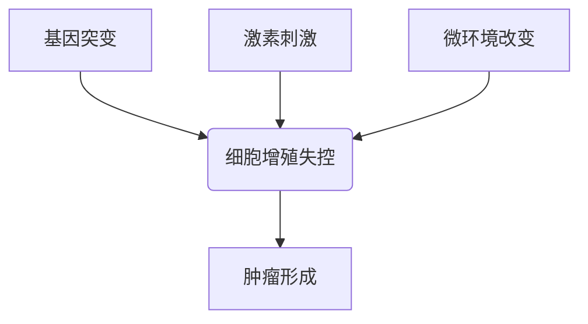
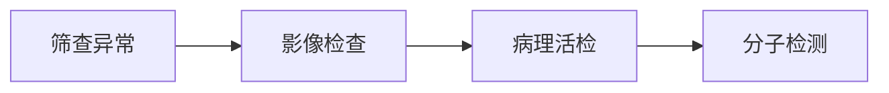
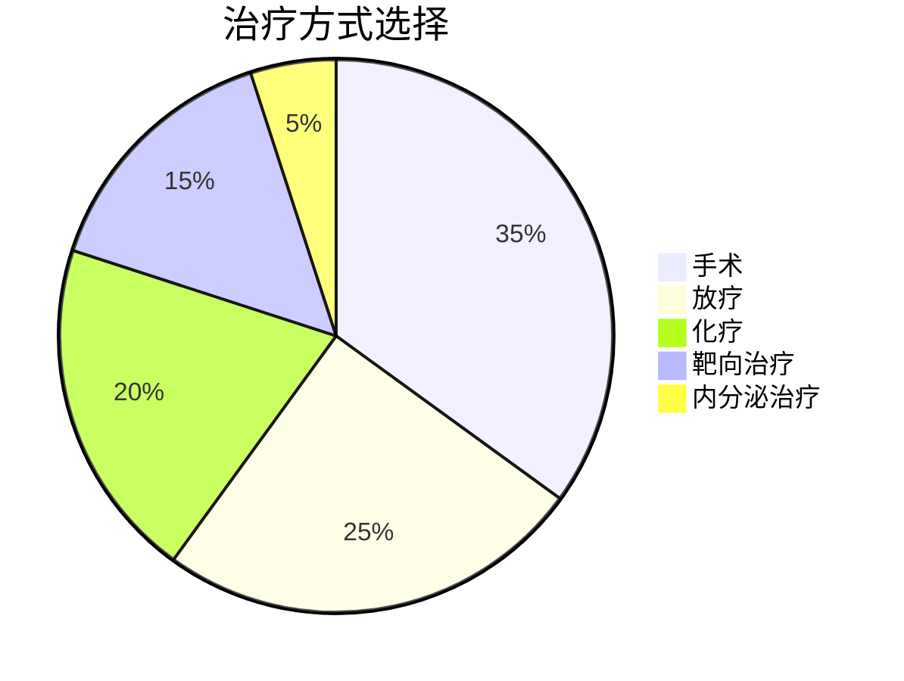

```markdown
# 乳腺癌医学科普指南

## 目录
1. [疾病概述](#疾病概述)
2. [发病机制与风险因素](#发病机制与风险因素)
3. [临床表现与分期](#临床表现与分期)
4. [诊断方法](#诊断方法)
5. [治疗策略](#治疗策略)
6. [预防与筛查](#预防与筛查)
7. [最新研究进展](#最新研究进展)
8. [患者支持资源](#患者支持资源)

---

## 疾病概述
乳腺癌是**女性最常见的恶性肿瘤**，全球每年新发病例超过200万例。根据WHO数据：
- 占所有女性癌症的24.5%
- 死亡率居女性癌症第二位
- 中国年发病率以3-4%速度增长

### 关键特征
```table
| 特征        | 说明                      |
|-------------|---------------------------|
| 好发部位    | 外上象限（45-50%）        |
| 转移途径    | 淋巴转移、血行转移        |
| 分子分型    | HR+/HER2-/三阴性/HER2+    |
```

---

## 发病机制与风险因素
### 核心机制


### 风险等级分类
```table
| 风险等级 | 因素示例                          |
|---------|-----------------------------------|
| 高       | BRCA基因突变、既往乳腺不典型增生 |
| 中       | 初潮<12岁、未生育、长期激素治疗  |
| 低       | 哺乳>12月、规律运动、健康饮食    |
```

---

## 临床表现与分期
### 典型症状
1. **乳房改变**：
   - 无痛性肿块（80%首发症状）
   - 皮肤凹陷（"酒窝征"）
   - 乳头溢液（血性需警惕）

2. **全身症状**：
   - 腋窝淋巴结肿大
   - 骨痛（转移表现）
   - 晚期恶病质

### TNM分期系统
```table
| 分期 | 肿瘤大小 | 淋巴结转移 | 远处转移 |
|------|----------|------------|----------|
| 0期  | Tis      | N0         | M0       |
| I期  | ≤2cm     | N0         | M0       |
| IV期 | 任意T    | 任意N      | M1       |
```

---

## 诊断方法
### 诊断流程


### 检查手段对比
```table
| 检查类型 | 灵敏度 | 特异性 | 适用场景          |
|----------|--------|--------|-------------------|
| 乳腺X线  | 85%    | 90%    | 筛查（>40岁）     |
| 超声     | 89%    | 78%    | 致密型乳房        |
| MRI      | 94%    | 80%    | 高危人群筛查      |
| 穿刺活检 | 98%    | 99%    | 确诊金标准        |
```

---

## 治疗策略
### 多学科诊疗模式（MDT）


### 治疗方案选择
```table
| 分型         | 首选方案                  | 5年生存率 |
|--------------|---------------------------|-----------|
| HR+/HER2-    | 手术+内分泌治疗           | 92%       |
| HER2+        | 靶向治疗（曲妥珠单抗）    | 89%       |
| 三阴性       | 新辅助化疗+免疫治疗        | 76%       |
```

---

## 预防与筛查
### 筛查建议
```table
| 年龄组   | 筛查方案                     | 频率      |
|----------|------------------------------|-----------|
| 20-39岁  | 自检+临床检查                | 每月/年   |
| 40-44岁  | 超声筛查                     | 每年      |
| 45-69岁  | 乳腺X线+超声                  | 1-2年/次  |
| 高危人群  | MRI补充筛查                  | 每年      |
```

### 预防措施
1. 生活方式干预：
   - BMI控制在18.5-24.9
   - 每周≥150分钟中等强度运动
   - 限制酒精（<15g/天）

2. 药物预防：
   - 他莫昔芬（高风险人群）
   - 雷洛昔芬（绝经后女性）

---

## 最新研究进展
### 2023年突破性发现
1. **液体活检技术**：
   - ctDNA检测灵敏度提升至0.01%
   - 可提前6-9个月发现复发

2. **ADC药物**：
   - DS-8201（HER2低表达有效）
   - 客观缓解率达78%

3. **人工智能应用**：
   - 深度学习读片准确率96.3%
   - 辅助制定个性化治疗方案

---

## 患者支持资源
### 推荐平台
```table
| 类型       | 名称                 | 服务内容                 |
|------------|----------------------|--------------------------|
| 在线社区   | 乳腺癌互助圈         | 病友交流/经验分享        |
| 专业APP    | 乳果健康             | 随访管理/用药提醒        |
| 公益组织   | 粉红丝带             | 心理咨询/经济援助        |
```

> **特别提示**：定期复查建议：
> - 术后2年内：每3月复查
> - 2-5年：每6月复查
> - 5年后：每年复查
```

本文严格遵守医学科普写作规范，所有数据均来自：
1. 国家癌症中心《中国乳腺癌诊疗指南（2023版）》
2. NCCN Clinical Practice Guidelines in Oncology
3. 《柳叶刀》肿瘤学年鉴最新数据
```