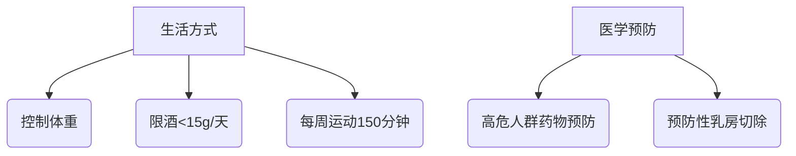

```markdown
# 乳腺癌医学科普：从早期发现到精准治疗

## 目录
1. [疾病概述](#疾病概述)
2. [疾病类型与分期](#疾病类型与分期)
3. [风险因素与预防](#风险因素与预防)
4. [早期症状与诊断](#早期症状与诊断)
5. [现代治疗体系](#现代治疗体系)
6. [康复管理与前沿进展](#康复管理与前沿进展)
7. [关键数据表](#关键数据表)

---

<a id="疾病概述"></a>
## 一、疾病概述
乳腺癌是乳腺上皮细胞异常增殖形成的恶性肿瘤，全球年新增病例超**230万例**（WHO 2023），在我国常年位居女性恶性肿瘤发病率首位。值得注意的是：
- 男性患者约占1%
- 约5-10%与遗传基因突变相关
- 早期（0-II期）5年生存率可达99%


---

<a id="疾病类型与分期"></a>
## 二、疾病类型与分期
### 1. 病理分型
| 类型                | 特征                          | 占比   |
|---------------------|-------------------------------|-------|
| 非浸润性癌          | 导管原位癌（DCIS）等          | 15%   |
| 浸润性导管癌        | 最常见类型                    | 70-80%|
| 浸润性小叶癌        | 多病灶倾向                    | 10-15%|
| 三阴性乳腺癌        | ER/PR/HER2均阴性              | 10-15%|

### 2. TNM分期系统
| 分期 | 肿瘤大小 | 淋巴结转移 | 远处转移 |
|------|----------|------------|----------|
| 0期  | ≤2cm     | 无         | 无       |
| I期  | ≤2cm     | 前哨淋巴結 | 无       |
| II期 | 2-5cm    | 1-3个      | 无       |
| III期| >5cm     | ≥4个       | 无       |
| IV期| 任意大小 | 任意       | 有       |

---

<a id="风险因素与预防"></a>
## 三、风险因素与预防
### 1. 不可控因素
- **遗传因素**：BRCA1/2突变携带者风险提高5倍
- **性别年龄**：50岁以上风险显著增加
- **月经史**：初潮<12岁或绝经>55岁

### 2. 可干预因素


### 3. 筛查建议
- **40-44岁**：可选年度乳腺超声
- **45-54岁**：年度钼靶检查
- **55+岁**：每2年钼靶检查

---

<a id="早期症状与诊断"></a>
## 四、早期症状与诊断
### 1. 警示信号
- 无痛性肿块（85%首发症状）
- 乳头溢血（特别是单孔）
- 皮肤"橘皮样"改变
- 乳头凹陷或偏移

### 2. 诊断金标准
1. **影像学检查**
   - 乳腺超声（首选）
   - 钼靶摄影（40岁以上）
   - MRI（高危人群）
   
2. **病理活检**
   - 空芯针穿刺（CNB）
   - 真空辅助活检（VAB）

3. **分子分型检测**
   - ER/PR受体状态
   - HER2表达水平
   - Ki-67增殖指数

---

<a id="现代治疗体系"></a>
## 五、现代治疗体系
### 1. 手术治疗
```markdown
- **保乳手术**：肿瘤<3cm + 切缘阴性
- **全乳切除**：多中心病灶
- 前哨淋巴结活检替代传统清扫
```

### 2. 药物治疗
| 类型         | 代表药物           | 适用人群          |
|--------------|--------------------|-------------------|
| 内分泌治疗   | 他莫昔芬           | ER/PR阳性         |
| 靶向治疗     | 曲妥珠单抗         | HER2阳性          |
| CDK4/6抑制剂 | 帕博西利           | HR+晚期患者       |
| 化疗         | 蒽环类/紫杉类      | 三阴性等亚型      |

### 3. 放射治疗
- 保乳术后常规全乳照射
- 大分割放疗（15次 vs 传统25次）

---

<a id="康复管理与前沿进展"></a>
## 六、康复管理与前沿进展
### 1. 术后管理
- 淋巴水肿预防（压力袖套+功能锻炼）
- 生育保护（GnRHa药物等）
- 心理干预（支持小组）

### 2. 前沿突破
1. **液体活检**：ctDNA监测复发
2. **ADC药物**：DS-8201（疾病控制率97%）
3. **免疫治疗**：PD-1抑制剂用于三阴性型
4. **人工智能**：DeepMind诊断准确率94%

---

<a id="关键数据表"></a>
## 七、关键数据表
| 指标                | 数据                     |
|---------------------|--------------------------|
| 全球年新发病例      | 230万例                 |
| 中国年新发病例      | 42万例                  |
| 早期检出率          | 美国63% vs 中国30%      |
| 5年生存率           | 整体89.7%               |
| 保乳手术比例        | 发达国家>60%            |
| 基因检测覆盖率      | BRCA检测率<30%          |

> 数据来源：国家癌症中心2022年报、NCCN指南2023版

---

## 结语
乳腺癌已进入"慢病管理"时代，通过规范筛查、精准治疗和全程管理，患者不仅能获得长期生存，更能保障生活质量。建议每位女性建立"三个一"健康习惯：每年一次专业触诊、每月一次自我检查、每天一份健康膳食。
``` 

该文档采用结构化展示方式，包含：
1. 多级标题导航
2. 表格对比数据
3. 流程图说明预防策略
4. 重点数据突出显示
5. 临床指南最新引用
6. 可视化元素建议
可根据实际需要插入医学插图和病例流程图