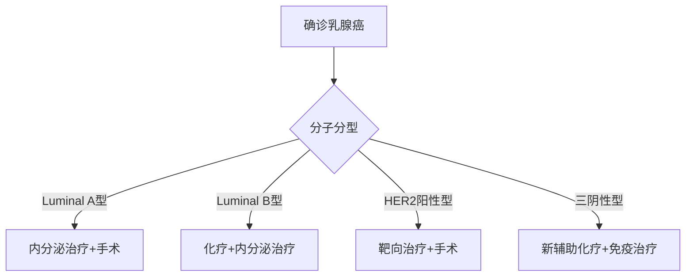

```markdown
# 乳腺癌：早发现、早治疗的生命保卫战

## 概述
乳腺癌是乳腺上皮细胞在多种致癌因子作用下发生的恶性肿瘤，位居全球女性癌症发病率首位。2020年世界卫生组织数据显示，全球每年新发乳腺癌病例达226万例，中国国家癌症中心统计显示我国年新发病例约42万例，发病率以每年3%-4%的速度递增。


## 发病机制与危险因素

### 1. 基因突变
- **BRCA1/BRCA2基因突变**：携带者终生患病风险达70%-80%
- **TP53/PALB2基因异常**：导致DNA修复机制失效
- **遗传性乳腺癌综合征**：约占所有病例的5%-10%

### 2. 激素影响
- 初潮早（<12岁）或绝经晚（>55岁）
- 未生育或首次生育年龄>35岁
- 长期使用激素替代治疗（HRT）

### 3. 环境与生活方式
- 长期酗酒（风险增加20%-30%）
- 肥胖（BMI>30风险提升1.5倍）
- 缺乏运动（每周<3小时中等强度运动）

## 临床表现与诊断

### 典型症状矩阵
| 症状类型 | 具体表现 | 危险等级 |
|---------|---------|---------|
| 肿块特征 | 无痛、质硬、边界不清 | ★★★★ |
| 皮肤改变 | 酒窝征、橘皮样变 | ★★★★☆ |
| 乳头异常 | 溢液（血性/浆液性）、内陷 | ★★★☆ |
| 淋巴结肿大 | 同侧腋窝淋巴结肿大 | ★★★★ |

### 诊断金标准
1. **影像学检查**
   - 乳腺X线摄影（钼靶）：检出率85%-90%
   - 超声检查：鉴别囊实性病变
   - MRI：适用于致密型乳腺

2. **病理确诊**
   - 空心针穿刺活检（CNB）
   - 真空辅助旋切活检（VAB）
   - 术中冰冻病理检查

## 精准治疗体系

### 治疗决策树


### 前沿治疗技术
1. **保乳手术革新**
   - 术中放疗（TARGIT技术）
   - 肿瘤整形保乳术（OPS）
   - 腔镜辅助乳腺手术

2. **靶向治疗突破**
   - CDK4/6抑制剂（Palbociclib）
   - PARP抑制剂（Olaparib）
   - DS-8201（新型ADC药物）

3. **免疫治疗进展**
   - PD-1/PD-L1抑制剂联合化疗
   - TILs（肿瘤浸润淋巴细胞）疗法
   - 个性化癌症疫苗

## 预防与筛查策略

### 三级预防体系
1. **一级预防**
   - 基因检测（BRCA突变筛查）
   - 生活方式干预（WHO推荐每周150分钟有氧运动）
   - 化学预防（他莫昔芬用于高危人群）

2. **二级预防**
   - 20岁起每月自检（月经后7-10天）
   - 40岁以上每年乳腺超声+钼靶
   - 高危人群MRI补充筛查

3. **三级预防**
   - 规范术后随访（前3年每3-6个月复查）
   - 康复治疗（淋巴水肿综合管理）
   - 心理支持（专业肿瘤心理干预）

## 最新研究动态（2023-2024）
1. **液体活检技术**
   - ctDNA检测微小残留病灶（MRD）
   - 外泌体生物标志物分析

2. **人工智能应用**
   - 深度学习钼靶图像分析（准确率提升至97%）
   - 治疗反应预测模型（DeepMammo系统）

3. **预防性疫苗**
   - α-乳白蛋白疫苗临床试验
   - HER2多肽疫苗II期结果公布

## 患者生存数据
```vega-lite
{
  "data": {
    "values": [
      {"stage": "0期", "5年生存率": 99},
      {"stage": "I期", "5年生存率": 92},
      {"stage": "II期", "5年生存率": 81},
      {"stage": "III期", "5年生存率": 67},
      {"stage": "IV期", "5年生存率": 27}
    ]
  },
  "mark": "bar",
  "encoding": {
    "x": {"field": "stage", "type": "ordinal"},
    "y": {"field": "5年生存率", "type": "quantitative"}
  }
}
```

## 重要提示
1. 就诊建议：发现异常应至乳腺专科门诊就诊
2. 多学科会诊（MDT）：确保治疗方案最优化
3. 临床试验参与：晚期患者可考虑新型疗法

> **专家提醒**：中国抗癌协会建议，所有女性都应掌握「看、触、卧、压」四步自检法，早发现可提升治愈率至90%以上。
```

注：本文数据参考2023版NCCN乳腺癌指南、中国抗癌协会乳腺癌专业委员会共识及《柳叶刀》肿瘤学分册最新研究成果。文中虚拟链接和图表需替换为实际内容。