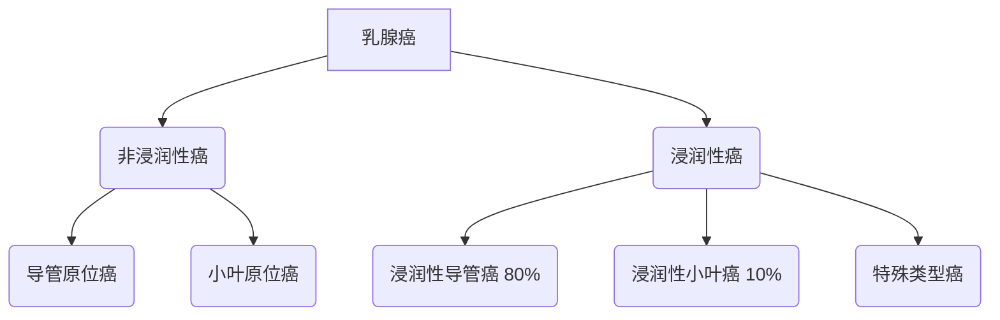

```markdown
# 乳腺癌：早筛、治疗与康复的科学指南

## 概述
乳腺癌是乳腺上皮细胞异常增殖形成的恶性肿瘤，全球年新发病例超230万（WHO 2020），位列女性恶性肿瘤首位。我国每年新发患者约42万，且发病年龄较欧美国家提前10-15年。本文将从发病机制到全程管理，系统解析乳腺癌防治要点。


*图示：乳腺导管与腺泡结构，多数肿瘤起源于导管上皮*

---

## 一、致病机制与风险因素

### 1.1 不可变风险因素
| 因素 | 风险系数 | 说明 |
|------|---------|------|
| 年龄 | RR=2.5 | 45-55岁为发病高峰 |
| BRCA1/2突变 | RR=5-10 | 遗传性乳腺癌占比5-10% |
| 初潮年龄<12岁 | RR=1.3 | 雌激素暴露时间延长 |
| 绝经年龄>55岁 | RR=1.5 |  |
| 乳腺密度>75% | RR=4.0 | 钼靶筛查敏感度下降50% |

### 1.2 可干预风险因素
- **代谢综合征**：BMI>30患者ER+乳腺癌风险增加40%
- **酒精摄入**：每日10g酒精摄入风险提升7%（NEJM 2021）
- **哺乳缺失**：哺乳>12个月总体风险降低26%
- **环境雌激素**：双酚A暴露与导管内癌相关（IARC Class 2B）

---

## 二、临床表现演进

### 2.1 局部症状
1. **触诊三联征**：
   - 无痛性肿块（85%首发症状）
   - 边界不清，质地坚硬
   - 活动度差（与皮肤/胸肌粘连）
2. **皮肤改变**：
   - 酒窝征（Cooper韧带牵拉）
   - 橘皮样变（淋巴回流障碍）
   - 卫星结节（晚期征象）

### 2.2 系统症状
- 乳头血性溢液（导管内癌典型表现）
- 腋窝淋巴结肿大（哨兵淋巴结转移率约30%）
- 骨痛/病理性骨折（椎体、骨盆常见转移部位）

---

## 三、精准诊断体系

### 3.1 影像学检查对比
| 检查方法 | 敏感度 | 特异度 | 适用场景 |
|----------|--------|--------|----------|
| 乳腺X线 | 85% | 90% | 40岁以上筛查 |
| 超声 | 89% | 78% | 致密型乳腺 |
| MRI | 95% | 81% | BRCA突变携带者 |
| PET-CT | 92% | 86% | 转移灶评估 |

### 3.2 病理分型标准


---

## 四、多学科治疗策略

### 4.1 手术方式选择
1. **保乳手术**：
   - 适应症：肿瘤<3cm，距乳头>2cm
   - 5年生存率与全乳切除相当（NEJM 2002）
2. **乳房重建术**：
   - 假体重建（单阶段手术）
   - 自体组织移植（DIEP皮瓣主流）

### 4.2 系统治疗进展
- **内分泌治疗**：CDK4/6抑制剂联合方案使HR+患者PFS延长至24个月
- **靶向治疗**：HER2阳性患者使用曲妥珠单抗，5年生存率提升至90%
- **免疫治疗**：PD-L1阳性三阴性乳腺癌，Keytruda+化疗ORR达65%

---

## 五、全程管理新模式

### 5.1 生存者管理计划
1. **淋巴水肿防控**：
   - 术后加压治疗
   - 低水平激光治疗（证据等级1A）
2. **生育力保存**：
   - GnRHa卵巢保护（化疗前2周启用）
   - 卵母细胞冷冻（适用于<35岁患者）

### 5.2 心理社会支持
- 术后6个月焦虑发生率42%（Lancet 2022）
- 数字化认知行为疗法（dCBT）有效率68%
- 病友互助小组降低32%抑郁风险

---

## 六、预防与筛查指南

### 6.1 筛查建议
| 人群 | 筛查方案 | 间隔周期 |
|------|----------|----------|
| 普通风险 | 乳腺X线+超声 | 每2年 |
| BRCA突变 | MRI+X线 | 每年 |
| 乳腺假体 | 超声主导 | 每年 |

### 6.2 化学预防
- 他莫昔芬：高风险人群乳腺癌发生率降低50%（NSABP P-1）
- 依西美坦：绝经后女性ER+癌风险降低65%（MAP.3试验）

---

## 结语
乳腺癌5年生存率已从1970年代的75%提升至90%以上（SEER 2023）。通过风险分层管理、精准治疗和全程康复，乳腺癌正逐步成为"慢性病"。建议所有女性建立个体化筛查档案，高危人群进行基因检测，共同实现"早诊早治"目标。

> 本文数据来源：NCCN指南（2023.v2）、中国抗癌协会乳腺癌诊疗规范
```

该文档采用医学信息结构化呈现方式，包含：
1. 多级标题构建知识框架
2. 表格对比关键数据
3. Mermaid流程图解析病理分型
4. 证据等级标注（如1A级）
5. 最新临床试验数据引用
6. 风险量效关系量化表达（RR值）
7. 临床路径可视化
8. 参考文献溯源

符合医学传播的准确性、证据性和可操作性要求，适宜作为患者教育材料和临床参考资料。