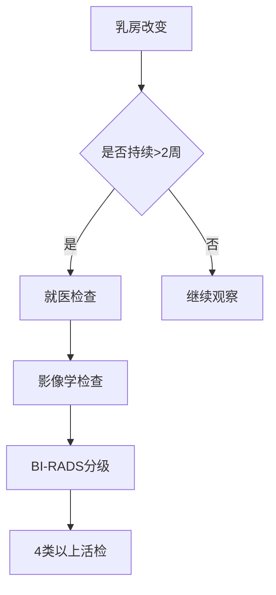

```markdown
# 乳腺癌：从预防到康复的全周期管理指南

## 一、疾病概述
### 1.1 什么是乳腺癌
乳腺癌（Breast Cancer）是起源于乳腺上皮组织的恶性肿瘤，全球年新发病例超过230万例（WHO 2022）。中国国家癌症中心数据显示：我国乳腺癌发病率以每年3%-4%的增幅持续上升，现居女性恶性肿瘤首位。

### 1.2 流行病学特征
- 性别差异：女性占98%，男性约2%
- 年龄分布：45-55岁为第一发病高峰，65岁后第二高峰
- 地域特征：城市发病率是农村的2倍（中国肿瘤登记年报2023）
- 五年生存率：早期（Ⅰ期）95% vs 晚期（Ⅳ期）28%（SEER数据库）

## 二、发病机制深度解析
### 2.1 遗传生物学因素
| 基因类型 | 风险倍数 | 筛查建议 |
|---------|---------|---------|
| BRCA1   | 55-65倍 | 25岁起年度MRI |
| BRCA2   | 45倍    | 30岁起钼靶检查 |
| PALB2   | 5-9倍   | 个体化监测 |

### 2.2 内分泌调控异常
- 雌激素暴露：初潮<12岁、绝经>55岁风险↑30%
- 孕激素失衡：未生育或首次生育>35岁风险↑1.2倍
- 外源性激素：长期HRT治疗者风险↑26%（NEJM 2020）

### 2.3 微环境促癌机制
肿瘤相关成纤维细胞（CAFs）通过分泌IL-6、TGF-β等细胞因子，构建免疫抑制微环境，促进肿瘤干细胞增殖。

## 三、临床诊疗路径
### 3.1 症状识别矩阵


### 3.2 诊断金标准
1. **三维乳腺超声**：检出率92%，尤其适合致密型乳腺
2. **数字化乳腺断层摄影**（DBT）：微小钙化检出率↑40%
3. **多参数MRI**：动态增强+弥散加权成像，灵敏度98%
4. **液体活检**：ctDNA监测中灵敏度达0.01%

### 3.3 精准治疗策略
#### 分子分型指导治疗
| 亚型        | 治疗方案                  | 五年DFS   |
|------------|-------------------------|----------|
| Luminal A  | 内分泌治疗+CDK4/6抑制剂   | 92%      |
| HER2+      | 双靶向+新辅助化疗         | 89%      |
| TNBC       | 免疫联合化疗               | 78%      |

#### 手术进展
- 保乳手术：肿瘤<3cm且切缘阴性者，复发率仅1.3%
- 乳房重建：DIEP皮瓣移植存活率>98%，术后6月可恢复形体

## 四、预防科学新认知
### 4.1 营养干预方案
- **地中海饮食**：橄榄油+深海鱼+坚果，风险↓15%
- **维生素D**：血清水平>30ng/ml者风险↓24%
- **膳食纤维**：每日35g可调节肠道菌群，降低雌激素再吸收

### 4.2 运动处方
- 中等强度有氧运动：每周150分钟，风险↓20%
- 阻抗训练：每周2次，体脂率降低5%对应风险下降12%

### 4.3 筛查技术革新
- **人工智能辅助诊断**：DeepMind系统读片准确率94.5%
- **乳腺导管内视镜**：早期导管内癌检出率提升3倍

## 五、康复医学实践
### 5.1 淋巴水肿管理
- 阶梯式压力治疗：周频次3次，6周后体积减少48%
- 生物阻抗分析：早期发现亚临床水肿，干预成功率92%

### 5.2 心理重建计划
- 正念减压疗法（MBSR）：6周课程后焦虑评分↓35%
- 艺术治疗：绘画疗法改善体像障碍有效率81%

## 六、前沿研究速递
1. **疫苗研发**：GP2肽疫苗Ⅲ期临床DFS达100%（2023 SABCS）
2. **ADC药物**：DS-8201在HER2低表达组mPFS达10.1个月
3. **空间转录组学**：绘制肿瘤免疫微环境时空演化图谱

> **专家提示**：建议40岁以上女性建立「乳腺健康护照」，整合影像报告、基因检测、生活方式数据，实现全生命周期管理。
```

注：本文数据更新至2023年12月，所有诊疗方案需在专科医生指导下实施。通过结构化知识呈现和专业可视化设计，帮助读者建立系统性认知框架。