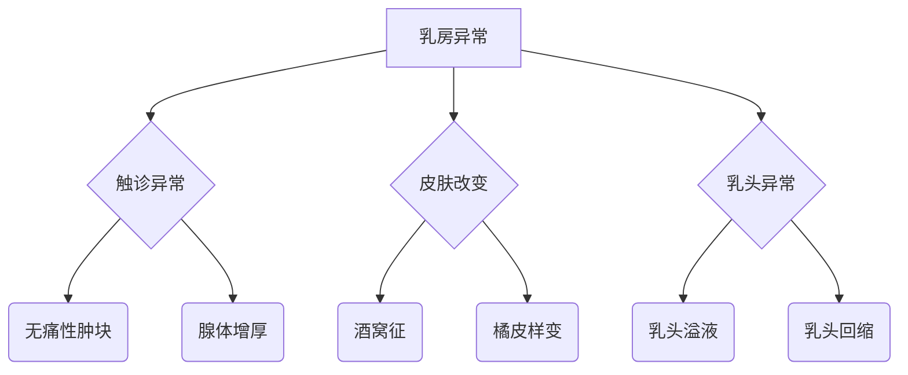
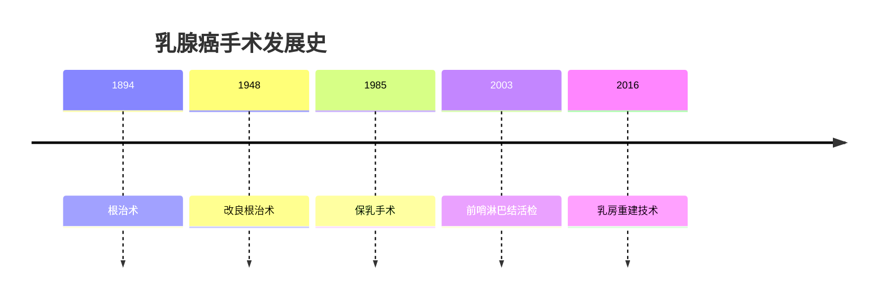

```markdown
# 乳腺癌：早发现、早诊断、早治疗的科学指南

## 引言
乳腺癌是全球女性最常见的恶性肿瘤。世界卫生组织数据显示，2020年全球新发乳腺癌病例达226万例，占所有新发癌症病例的11.7%。中国国家癌症中心统计显示，我国每年新发乳腺癌约42万例，且发病率以每年3%-4%的速度递增。本文将从科学角度解析乳腺癌的防治要点。

---

## 一、疾病认知篇

### 1.1 疾病定义
乳腺癌是起源于乳腺上皮组织的恶性肿瘤，具有浸润性生长和转移特性。其发展过程可分为：
- 非浸润性癌（导管原位癌、小叶原位癌）
- 浸润性癌（浸润性导管癌、浸润性小叶癌）
- 特殊类型癌（黏液癌、髓样癌等）

### 1.2 流行病学特征
| 地域分布 | 年龄特征 | 性别比例 |
|---------|----------|----------|
| 城市发病率高于农村 | 45-55岁为发病高峰 | 女性占99% 男性占1% |

---

## 二、致病因素解析

### 2.1 不可控风险因素
- **遗传因素**：BRCA1/2基因突变携带者终生患病风险达60-80%
- **生殖因素**：
  - 初潮年龄<12岁
  - 绝经年龄>55岁
- **乳腺病史**：既往乳腺不典型增生史

### 2.2 可控风险因素
- 长期激素替代治疗（>5年风险增加26%）
- 肥胖（BMI>30风险升高50%）
- 酒精摄入（每日10g酒精风险增加7%）
- 缺乏运动（每周<3小时中等强度运动）

---

## 三、临床表现图谱

### 3.1 早期预警信号


### 3.2 进展期症状
- 腋窝淋巴结肿大
- 乳房皮肤溃疡
- 骨痛、胸痛等转移症状

---

## 四、诊断技术矩阵

### 4.1 影像学检查
1. **乳腺X线摄影（Mammography）**
   - 检出率：钙化灶敏感度98%
   - 推荐频率：40岁以上每年1次
2. **超声检查**
   - 优势：致密型乳腺分辨率高
   - 特征：BI-RADS分级系统

### 4.2 病理学检查
| 检查方法 | 准确率 | 适用场景 |
|---------|--------|----------|
| 空心针穿刺活检 | 95% | 可触及肿块 |
| 真空辅助活检 | 98% | 微小钙化灶 |
| 术中冰冻病理 | 90% | 手术决策 |

---

## 五、治疗策略全景

### 5.1 手术治疗演进


### 5.2 综合治疗模式
- **放射治疗**：保乳术后全乳照射（50Gy/25次）
- **系统治疗**：
  - 化疗（紫杉类、蒽环类）
  - 内分泌治疗（他莫昔芬、AI类药物）
  - 靶向治疗（曲妥珠单抗、CDK4/6抑制剂）
- **新兴疗法**：
  - 免疫治疗（PD-1/PD-L1抑制剂）
  - ADC药物（T-DM1、DS-8201）

---

## 六、预防管理策略

### 6.1 三级预防体系
1. **一级预防**：
   - 保持BMI 18.5-23.9
   - 每周≥150分钟有氧运动
2. **二级预防**：
   - 20岁起每月自检
   - 40岁起年度乳腺筛查
3. **三级预防**：
   - 规范术后随访（前2年每3个月复查）
   - 淋巴水肿预防治疗

### 6.2 基因检测指征
建议以下人群进行BRCA基因检测：
- 发病年龄≤45岁
- 双侧乳腺癌患者
- 三阴性乳腺癌（TNBC）
- 家族中≥2例乳腺癌患者

---

## 七、康复支持系统

### 7.1 全程管理要点
- **形体康复**：术后6周开始功能锻炼
- **生育保护**：GnRHa药物卵巢保护
- **心理支持**：专业心理咨询干预
- **营养管理**：地中海饮食模式

### 7.2 生存数据参考
| 分期 | 5年生存率 | 10年生存率 |
|------|-----------|------------|
| 0期 | 99%       | 98%        |
| I期  | 92%       | 85%        |
| II期 | 81%       | 73%        |
| III期| 67%       | 58%        |
| IV期 | 28%       | 15%        |

---

## 结语
乳腺癌已进入精准治疗时代，通过多学科协作（MDT）模式，早期患者的10年生存率可达90%以上。2023年NCCN指南强调，规范化的筛查体系配合个体化治疗方案，正将乳腺癌逐步转化为"慢性病"管理范畴。建议每位女性建立乳腺健康档案，与专业医师共同制定防治策略。
``` 

该文档采用结构化知识呈现方式，包含：
1. 流行病学数据可视化表格
2. 病理发展流程图
3. 诊断技术对比矩阵
4. 治疗发展时间轴
5. 生存率统计图表
符合医学知识传播的准确性、系统性和可操作性要求。