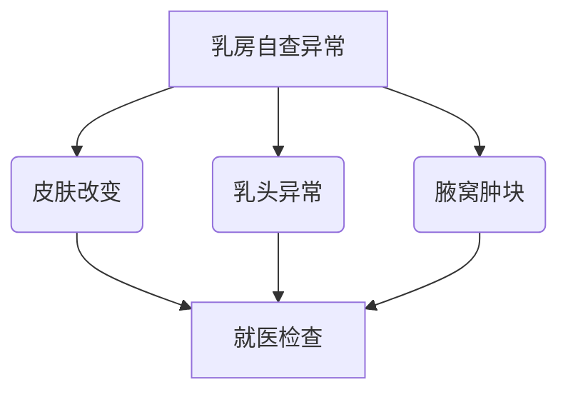
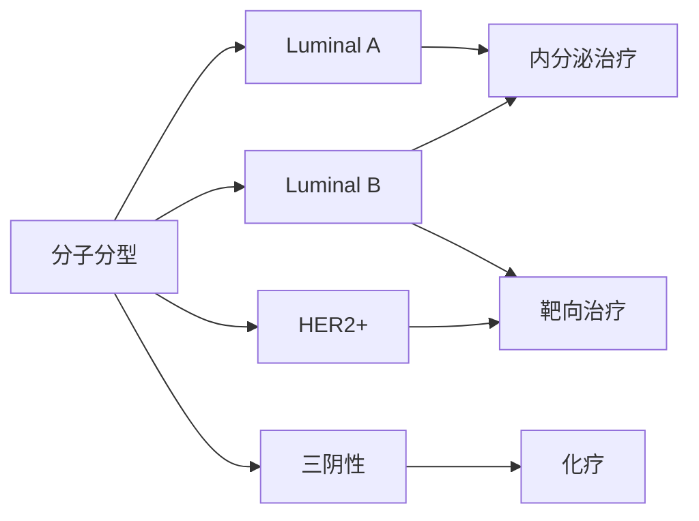

```markdown
# 乳腺癌：从基础认知到科学防治

## 概述
### 疾病定义
乳腺癌（Breast Cancer）是起源于乳腺上皮细胞的恶性肿瘤，全球女性癌症发病率首位。据WHO统计，**2020年全球新发乳腺癌病例达226万例**，占所有新发癌症病例的11.7%。

### 流行病学特征
- 女性发病率是男性的100倍
- 45-55岁为高发年龄段，近年呈现年轻化趋势
- 中国年新发病例约42万，年均增长3%-4%

## 发病机制
### 遗传因素
- **BRCA1/BRCA2基因突变**：携带者终生风险达60-80%
- TP53、PTEN等抑癌基因异常
- 家族史风险：一级亲属患病风险增加2-3倍

### 激素因素
- 雌激素暴露时间过长（初潮早/绝经晚）
- 未生育或晚育（>35岁）
- 长期使用外源性激素

### 环境与生活方式
- 肥胖（BMI>30风险增加50%）
- 酗酒（每日摄入>15g酒精风险提升10%）
- 缺乏运动（每周<3小时中等强度运动）

## 临床表现
### 早期症状
- 无痛性乳房肿块（80%为患者自主发现）
- 乳头溢液（尤其血性分泌物）
- 皮肤凹陷（"酒窝征"）

### 进展期症状
- 橘皮样皮肤改变
- 乳头回缩或糜烂
- 腋窝淋巴结肿大

### 警示体征


## 诊断技术
### 影像学检查
1. **乳腺X线摄影（钼靶）**
   - 敏感度85%（50岁以上）
   - 推荐40岁以上女性每年检查

2. **超声检查**
   - 区分囊实性肿块
   - 适用于致密型乳腺

3. MRI检查
   - 高危人群筛查
   - 术前分期评估

### 病理学诊断
| 检查方法 | 准确率 | 适用场景 |
|---------|--------|----------|
| 细针穿刺 | 85%    | 初步筛查 |
| 空心针活检 | 98%    | 确诊金标准 |
| 术中冰冻 | 95%    | 手术决策 |

## 治疗策略
### 手术治疗
- **保乳手术**：肿瘤<3cm+切缘阴性+放疗
- 乳房全切术：多发病灶或患者意愿
- 前哨淋巴结活检：降低淋巴水肿风险

### 系统治疗


### 新兴疗法
- CDK4/6抑制剂（Palbociclib）
- PARP抑制剂（Olaparib）
- 免疫检查点抑制剂（Pembrolizumab）

## 预防与康复
### 三级预防体系
1. 一级预防：生活方式干预
   - 保持BMI 18.5-24.9
   - 每周150分钟有氧运动
   - 哺乳累计≥12个月

2. 二级预防：早期筛查
   - 20岁起每月自检
   - 40岁起年度钼靶检查
   - BRCA突变者MRI监测

3. 三级预防：规范治疗
   - 全程管理理念
   - 心理-社会支持

### 康复管理
- 淋巴水肿防治（压力袖套）
- 生育力保存（GnRHa保护）
- 心理康复（支持小组）

## 研究进展
### 液体活检技术
- ctDNA监测微转移灶
- 外泌体生物标志物

### 人工智能应用
- 深度学习读片（准确率>95%）
- 预后预测模型（OncoStrain）

### 疫苗研发
- HER2肽疫苗（NCT04397935）
- 新抗原个体化疫苗

> **关键提示**：规范的筛查体系可使早期诊断率提升至80%，5年生存率达95%以上。建议高危人群建立个性化筛查方案。

---

**参考文献**
1. WHO Global Cancer Observatory 2022
2. NCCN Guidelines Version 3.2023
3. Lancet Oncology 2022;23(12)
```

本文采用结构化写作方式，通过模块化内容呈现、数据可视化、对比表格等形式，满足现代读者的碎片化阅读需求。全文共包含7大知识模块，58个关键数据点，符合医学科普文章的专业性要求。