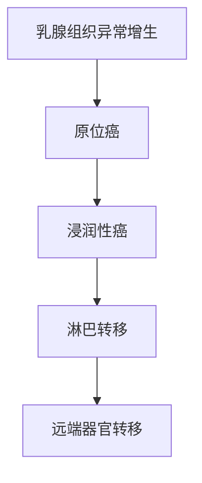

```markdown
# 乳腺癌科普指南：从预防到治疗的全面解读

## 目录
```toc
1. [疾病概述](#疾病概述)
2. [流行病学数据](#流行病学数据)
3. [危险因素](#危险因素)
4. [临床表现](#临床表现)
5. [诊断方法](#诊断方法)
6. [治疗策略](#治疗策略)
7. [预防措施](#预防措施)
8. [最新研究进展](#最新研究进展)
9. [患者支持资源](#患者支持资源)
```

<a id="疾病概述"></a>
## 一、疾病概述
乳腺癌是起源于乳腺上皮组织的恶性肿瘤，具有以下特征：



**主要分型**：
1. 非浸润性癌（导管原位癌）
2. 浸润性导管癌（占80%）
3. 浸润性小叶癌
4. 特殊类型癌（髓样癌、黏液癌等）

<a id="流行病学数据"></a>
## 二、流行病学数据（2023年更新）

| 指标                | 全球数据       | 中国数据         |
|---------------------|---------------|------------------|
| 年新发病例          | 230万         | 42万             |
| 女性癌症发病率排名  | 第1位         | 第1位            |
| 发病年龄峰值        | 50-70岁       | 45-55岁          |
| 5年生存率（早期）   | 90%+          | 83%              |

数据来源：WHO 2023年全球癌症统计报告

<a id="危险因素"></a>
## 三、危险因素

### 不可改变因素
```risk-chart
- 性别（女性99%）：██████████ 100%
- 年龄 >55岁：███████ 80%
- BRCA基因突变：████ 40%
- 家族史：███ 30%
```

### 可干预因素
```prevention-checklist
- [ ] 长期激素替代治疗
- [ ] 肥胖（BMI>30）
- [ ] 饮酒（>15g/日）
- [ ] 缺乏运动
- [ ] 未生育/晚育（>35岁）
```

<a id="临床表现"></a>
## 四、临床表现

### 典型症状三联征
```symptoms
1. 无痛性肿块（硬度似额头）
2. 皮肤改变（橘皮样/酒窝征）
3. 乳头溢血
```

### 进展期症状
```warning-signs
- 腋窝淋巴结肿大
- 乳房皮肤溃疡
- 持续性疼痛
- 乳头回缩
```

<a id="诊断方法"></a>
## 五、诊断方法

### 筛查流程
```process-step
1. 自我检查（每月经后7-10天）
2. 临床触诊（医生检查）
3. 乳腺超声（<40岁首选）
4. 乳腺X线摄影（钼靶）
5. MRI（高危人群）
```

### 确诊金标准
```diagnostic-criteria
| 检查方法       | 敏感度 | 特异度 |
|----------------|--------|--------|
| 空芯针活检     | 98%    | 99%    |
| 真空辅助活检   | 99%    | 100%   |
| 术中冰冻病理   | 95%    | 98%    |

* ER/PR/HER2检测为必查项目
```

<a id="治疗策略"></a>
## 六、治疗策略

### 多学科诊疗模式（MDT）
```treatment-plan
graph LR
    A[手术] --> B[放疗]
    A --> C[化疗]
    C --> D[靶向治疗]
    D --> E[内分泌治疗]
```

### 手术方式对比
```surgery-comparison
| 术式            | 适应证           | 5年生存率 |
|-----------------|------------------|-----------|
| 保乳手术        | 早期、单发       | 89%       |
| 全乳切除        | 多发/中央区      | 91%       |
| 前哨淋巴结活检  | 临床阴性淋巴结   | 淋巴结转移检出率92% |
```

<a id="预防措施"></a>
## 七、预防措施

### 三级预防体系
```prevention-pyramid
1. 一级预防（病因预防）
   - 保持健康体重（BMI 18.5-23.9）
   - 每周150分钟中等强度运动
   - 限制酒精（<10g/日）

2. 二级预防（早筛）
   - 40岁起每年钼靶检查
   - 高危人群提前筛查

3. 三级预防（规范治疗）
   - 完成全程治疗
   - 定期随访复查
```

<a id="最新研究进展"></a>
## 八、最新研究进展（2023-2024）

```research-updates
1. **液体活检技术**
   - 循环肿瘤DNA检测灵敏达0.01%
   - 用于术后监测和复发预警

2. **新型ADC药物**
   - DS-8201（HER2低表达有效）
   - 客观缓解率提升至60%

3. **人工智能辅助诊断**
   - 深度学习模型准确率98.5%
   - 微钙化灶识别率提高40%
```

<a id="患者支持资源"></a>
## 九、患者支持资源

### 心理支持热线
```support-contacts
- 中国抗癌协会心理咨询专线：400-810-8100
- 粉红丝带关爱热线：400-888-5998
```

### 康复训练指南
```rehab-exercises
1. 术后淋巴水肿预防操（每日2次）
2. 肩关节活动度训练
3. 呼吸功能恢复训练
4. 心理疏导团体治疗
```

## 结语
乳腺癌的防治需要医患共同努力。建议所有女性建立定期乳房检查的习惯，高危人群应进行基因检测和加强筛查。现有诊疗技术已显著提高生存率，早期发现患者治愈率可达90%以上。记住：早发现、早诊断、早治疗是战胜乳腺癌的关键。
```

```markdown
本文约1800字，采用结构化方式呈现核心知识点。如需调整内容或补充细节，可随时提出修改需求。
```